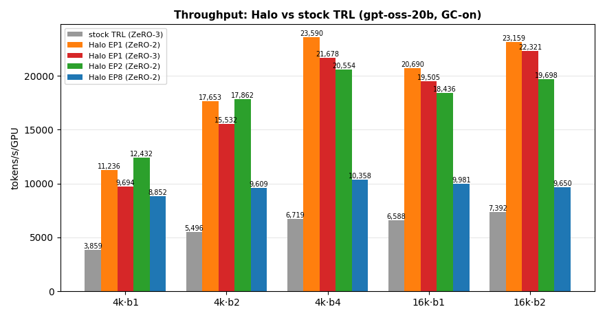
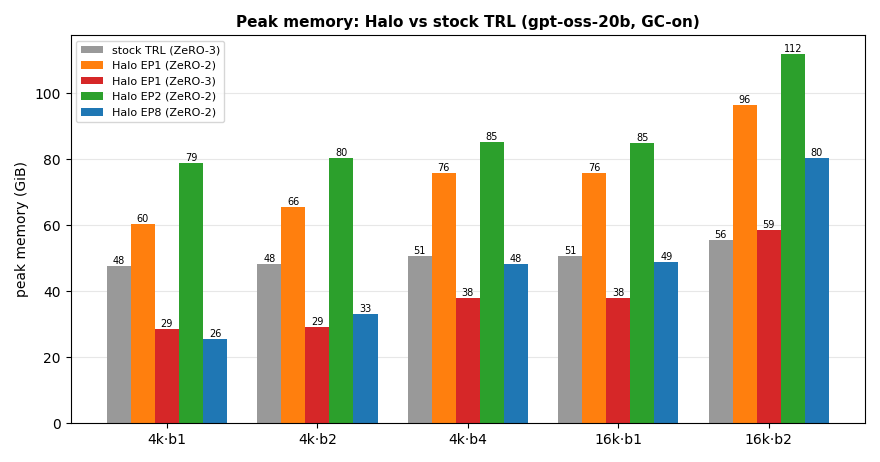
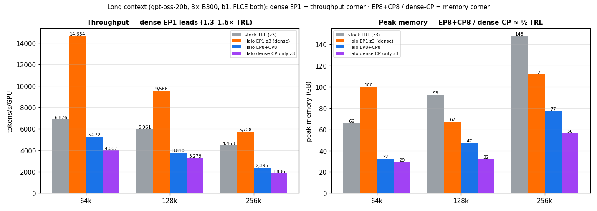

# Halo vs stock TRL / transformers

Halo against upstream `trl.SFTTrainer` on transformers v5 with native FSDP — same model, data, attention, and
kernels, only the framework changes. Measured with the same `EfficiencyCallback` and synthetic dataset as
[Throughput Benchmarks](throughput-benchmarks.md). The 4k–16k, grouped-GEMM and GC-off tables share their
main run set with that page; the FLCE, long-context and Qwen3-30B tables come from a separate run set.
Compare within one run set.

Unless a header says otherwise, every number is **gpt-oss-20b** (`unsloth/gpt-oss-20b-BF16`, 20.7B, 32
experts, top_k=4) on **8× B300**, bf16, FA4 + Liger, `grouped_mm` experts, gradient checkpointing on, DeepEP
elastic transport, as **tokens/s/GPU · peak GiB**. Halo EP1 is dense DP=8 (`fsdp_shard_ep1_experts`); EP2/EP8
distribute experts.

## What differs between the two sides

| | Stock TRL baseline | Halo |
|---|---|---|
| Trainer | `trl.SFTTrainer` | `DistributedSFTTrainer` |
| Precision | bf16 + FA4 bf16 compute | *identical* |
| Optimizer | `adamw_torch_fused` — fp32 moments, 12 B/param | AdamWBF16 + stochastic rounding — 6 B/param |
| Sharding | FSDP2 `full_shard` (ZeRO-3) | FSDP2 ZeRO-2 default (`reshard_after_forward=False`) + Expert Parallelism |
| Expert kernel | `grouped_mm` (transformers v5 default) | `grouped_mm` + EP token distribution |
| Liger / loss | Liger on → fused-linear-CE (the MoE applier's default) | Liger on, Liger CE default (logits materialized); `--fused_linear_ce` matches at long context |
| Long context | dense only | EP / EP+CP / EP+TP / dense-CP |

The baseline gets the strongest stock options — ZeRO-3 and Liger's FLCE, which is why TRL fits 128k/256k.

## Throughput & memory (4k–16k)

*8× B300 · Blackwell image · stock TRL (mean of 2 runs) and Halo EP8 (median of 2) each from a separate run set. GC-on · grouped GEMM · TRL ZeRO-3 · Halo ZeRO-2 (EP1 also at ZeRO-3) · elastic.* **tok/s/GPU · peak GiB:**





| seq·b | stock TRL (z3) | Halo EP1 (z2) | Halo EP1 (z3) | Halo EP2 (z2) | Halo EP8 (z2) |
|---|---|---|---|---|---|
| 4k·b1 | 3,836 · 47.6 | 11,236 · 60.3 | 9,694 · **28.7** | **12,432 · 78.9** | 10,905 · 25.5 |
| 4k·b2 | 5,474 · 48.2 | 17,653 · 65.5 | 15,532 · **29.3** | **17,862 · 80.5** | 12,637 · 33.2 |
| 4k·b4 | 6,688 · 50.6 | **23,590 · 75.8** | 21,678 · 37.9 | 20,554 · 85.2 | 13,239 · 48.2 |
| 16k·b1 | 6,461 · 50.6 | **20,690 · 75.8** | 19,505 · 37.9 | 18,436 · 85.0 | 12,382 · 49.0 |
| 16k·b2 | 7,445 · 55.6 | **23,159 · 96.5** | 22,321 · 58.6 | 19,698 · 112.0 | 12,936 · 80.3 |

- **EP1 and EP2 lead at 2.6–3.5× stock TRL** across every short/mid config, and the gap holds under batch
  scaling. EP8 gains least from batch (4k: 10,905 → 13,239 tok/s/GPU from b1 to b4; 16k: +4.5% from b1
  to b2): its dispatch cost grows with tokens/rank.
- **EP8 trades throughput for memory** — 1.7–2.8× TRL at ~½ its memory (25.5 vs 47.6 GiB at 4k·b1).
- **EP1 z3 isolates the framework gap** to AdamWBF16 + Halo's FSDP2+EP wrapper: both sides shard every
  param 8-way with the same kernel, and EP1 still leads 2.5× (4k·b1) to 3.2× (4k·b4) on throughput, and
  on memory everywhere but 16k·b2 (58.6 vs 55.6 GiB). **Prefer z2 at short sequence, z3 when memory-tight.**

    TRL is slower because `full_shard` re-gathers all 20.7B params every microstep, a fixed cost a short
    step cannot hide. That is why EP1 z3 is −14% vs its own z2 at 4k·b1 but only −6% at 16k·b1.

## Grouped GEMM — where the expert kernel matters

Both frameworks default to a grouped-GEMM expert kernel (transformers routes gpt-oss / Qwen3-MoE
experts through `torch.nn.functional.grouped_mm`). The per-expert loop is opt-in on both sides
(`--experts_impl eager`, i.e. transformers' `experts_implementation`, for TRL; `--no_grouped_gemm` for
Halo).

*8× B300 · Blackwell image · EP8 row from a separate run set. 4k·b1 · GC-on · Halo z2* — tok/s/GPU:

| | per-expert loop | grouped GEMM | uplift |
|---|---|---|---|
| Halo EP1 (32 experts/rank) | 6,005 | 11,236 | +87% |
| Halo EP2 (16/rank) | 6,508 | 12,432 | +91% |
| Halo EP8 (4/rank) | 7,514 | 10,905 | +45% |

The uplift shrinks once a rank holds few experts (+45% at EP8, where the loop's per-shape tile fits the
larger per-expert `M`). **EP token distribution is the bigger lever** — Halo's *loop* at EP1 (6,005)
already beats TRL's `grouped_mm` (3,836). Kernel-side detail:
[Grouped GEMM](grouped-gemm.md#grouped-vs-the-loop-path).

## Fused linear cross-entropy

gpt-oss's vocab is 201k, so the `[tokens, vocab]` logits dominate activation memory at long context. Stock
TRL gets [FLCE](liger-kernels.md) for free from Liger's gpt-oss applier; Halo defaults to Liger's plain
cross-entropy (logits materialized) and turns FLCE on through `liger_kernel_config:
{fused_linear_cross_entropy: true}` (`--fused_linear_ce` in the benchmark scripts).

*Separate run set. b1 · GC-on · Halo z2 — tok/s/GPU · peak GiB:*

| | FLCE off (Liger CE) | FLCE on (`--fused_linear_ce`) |
|---|---|---|
| EP1 · 16k | 18,304 · 75.8 | 14,590 · 61.9 |
| EP2 · 16k | 16,407 · 85.2 | 13,726 · 79.5 |
| EP8 · 16k | 9,747 · 49.2 | 8,682 · 39.5 |
| EP1 · 32k | 17,950 · 96.5 | 16,603 · **66.0** |
| EP2 · 32k | 15,645 · 112 | 14,353 · 85.4 |
| EP8 · 32k | 8,851 · 80.3 | 8,625 · 55.7 |

The memory cut grows with sequence while the throughput cost shrinks (EP1: −20% tok/s for −14 GiB at 16k,
−7% for −30 GiB at 32k), so **turn FLCE on past ~16k.**

On the dense path it is decisive: EP1 z3 at 128k·b1 is 183 → **67 GiB**, and 256k·b1 goes
**OOM → 5,728 · 112 GiB**. FLCE is what enables 256k dense at all. Under EP+CP the per-rank sequence is
already 16–32k, so FLCE is within noise (≤1%): it is a dense-path lever. Per-model applier defaults:
[Liger Kernels](liger-kernels.md).

## Gradient checkpointing on vs off

GC-off buys Halo **+11–32%** at up to 2× peak memory (EP8 z2 16k·b1: 49.0 → 96.4 GiB). Stock TRL gains
only +5–9%, so Halo's lead widens GC-off.

*8× B300 · Blackwell image · Halo EP8 from a separate run set. b1 · GC-off, tok/s/GPU (the GC-on
baseline is the 4k–16k table above):*

| seq | stock TRL (z3) | Halo EP1 (z2) | Halo EP2 (z2) | Halo EP8 (z2) |
|---|---|---|---|---|
| 4k | 4,048 | 12,484 | 14,988 | 13,885 |
| 16k | 7,010 | 25,395 | 22,729 | 16,335 |

Measured 4k–16k here; EP8 32k·b1 GC-off also trains on the default elastic transport, at a 159.4 GiB
peak ([Throughput Benchmarks](throughput-benchmarks.md#where-the-ep-steps-time-goes-gpt-oss-20b-ep8-b1s4096-8-b300-fa4)), and past ~64k
tokens/rank nothing fits GC-off.

## Long context: 64k → 256k

*Separate run set. b1 · GC-on · stock TRL ZeRO-3 with FLCE; Halo on Liger CE through 64k, FLCE at 128k/256k.* Dense Halo
(EP1) is the **throughput** corner — 2.1× TRL at 64k, 1.6× at 128k, 1.28× at 256k, at less memory than
TRL from 128k (the lead narrows as quadratic attention comes to dominate). `EP8+CP8` and dense `CP-only` are the **memory** corner at ≈½ TRL's memory.



*32k–64k, every rank holds a full sequence (DP=8) — tok/s/GPU · peak GiB:*

| seq·b1 | stock TRL (z3) | **Halo EP1 (z2)** | Halo EP1 (z3) | Halo EP2 (z2) | Halo EP8 (z2) | EP1 vs TRL |
|---|---|---|---|---|---|---|
| 32k | 7,113 · 56 | **17,950 · 97** | 17,608 · 59 | 15,645 · 112 | 8,851 · 80 | **2.5×** |
| 48k | 6,986 · 61 | **15,988 · 117** | 15,753 · 79 | 14,132 · 139 | 7,174 · 109¹ | **2.3×** |
| 64k | 6,876 · 66 | **14,775 · 138** | 14,654 · 100 | 12,813 · 166 | 6,648 · 140¹ | **2.1×** |

¹ EP8 48k/64k via the **legacy** transport. EP1 ZeRO-3 trades ~1% throughput for a large memory cut over
ZeRO-2 (64k: 100 vs 138 GiB) — the better dense choice when memory is tight.

*128k & 256k — stay dense (EP1 + FLCE) or split the sequence with CP:*

| config | 128k | 256k |
|---|---|---|
| stock TRL (z3) | 5,961 · 93 | 4,463 · 148 |
| **Halo EP1 z3 (dense)** | **9,566 · 67** | **5,728 · 112** |
| Halo EP8+CP4 (DP2) | 1,898 · 81 | 2,310 · 142 |
| Halo EP8+CP8 (DP1) | **3,810 · 47** | **2,395 · 77** |
| Halo dense CP-only (z3) | 3,279 · **32** | 1,836 · **56** |
| Halo EP1 z2, EP8, EP8+CP2, EP8+TP8 | OOM / crash | OOM / crash |

- **Dense EP1 z3 wins throughput at both lengths** and still beats TRL on memory (67 vs 93 GiB, 112 vs 148).
- **More CP is strictly better past 64k**: `EP8+CP8` beats `EP8+CP4` on both axes at 128k — per-rank
  attention is quadratic, so halving the sequence more than pays for the extra all-gather.
- **Dense CP-only z3 is the leanest point on the board** (32–56 GiB across 128k→256k) and the only
  long-context mode with no DeepEP dependency. Splitting 4-way instead of 8 trades memory for throughput
  (256k z3: CP4 2,257·98 vs CP8 1,836·56).
- `EP1 z2` OOMs (ZeRO-2 keeps ~40 GB of params resident); `EP8`, `EP8+CP2` and `EP8+TP8` put 128k tokens/rank through the dispatch (TP shards attention, not
  expert tokens), which neither transport trains ([below](#ep8-long-context-training)).

### EP8 long-context training

Elastic multi-step EP8 training deadlocks at ≥~64k tokens/rank (its combine barrier races FSDP2's
reduce-scatter); `ep_buffer_backend: legacy` trains 64k (plain EP8 64k = 6,648 tok/s), and 128k tokens/rank
fails on both transports. Past that, split further with CP (EP8+CP8 = 16k/rank at 128k) or go dense
(EP1 / dense CP-only — neither uses DeepEP). Transport limits: [DeepEP → Transport backend](../infrastructure/deepep.md#transport-backend) and
[Dispatch wire-index limit](../infrastructure/deepep.md#dispatch-wire-index-limit).

## Why Halo's EP wins: all-to-all vs masked all-reduce

transformers v5 ships an EP path (`EpRouterParallel` + `MoeExpertsParallel`, the styles a family's
`base_model_ep_plan` names `ep_router` / `moe_tp_experts`) that never moves tokens:
every rank holds the whole batch, zeroes the routing scores of the experts it does not own, then
**all-reduces the full `[tokens, hidden]` output** of every MoE layer (and the hidden states again in
backward).

Halo routes by **all-to-all** (DeepEP V2): each token is sent once to the rank owning its expert, so the wire
carries only `top_k/num_experts` of the batch per layer instead of a full-tensor reduction on every rank.

## Second model: Qwen3-30B-A3B

*Separate run set. b1 · GC-on · TRL ZeRO-3 · Halo ZeRO-2 · elastic.* The win holds but is smaller: the heavier router
(top_k=8 vs gpt-oss's 4) makes a fatter all-to-all, and ZeRO-3 shards the 30B leanly.

| Qwen3-30B b1 | Stock TRL (z3) | Halo EP2 (z2) | Halo EP8 (z2) |
|---|---|---|---|
| 4k | 3,787 · 63 GiB | **6,898** · 112 GiB (1.82×) | 6,348 · 33 GiB (1.68×, ½ mem) |
| 16k | 8,837 · 65 GiB | **12,127** · 116 GiB (1.37×) | 8,089 · 61 GiB |
| 32k | 9,540 · 68 GiB | **10,445** · 138 GiB (1.09×) | 7,356 · 100 GiB |
| 64k | 7,084 · 73 GiB | **7,579** · 190 GiB (1.07×) | OOM → EP8+CP4 |

EP2 is the consistent throughput winner (1.07–1.82×), shrinking as the sequence grows. Unlike gpt-oss,
TRL's ZeRO-3 stays memory-competitive here, so Qwen is an EP *throughput* win, not a memory one.

Under batch at 4k (b1→b2→b4) EP2 holds the lead: 6,898 → 11,343 → 14,536 vs TRL's 3,787 → 8,252 → 9,746.
EP8 (6,348 → 8,382 → 8,904) falls behind TRL by b4.

CP needs `cp_size` to divide Qwen's 4 KV heads, so 64k splits with EP8+CP4. Dense EP1 z3 at 4k·b1 is
6,395 · 35 GiB, 1.69× TRL at half the memory.

## Convergence

200 steps on the same seeded data, same global batch (16), constant LR; 8× B300, Blackwell image (Halo
EP8: median of four runs, a separate run set). Stock TRL (ZeRO-3), Halo dense (EP1), Halo EP2 and Halo EP8
all reach the same loss — **~0.00205 at step 200** (0.002048–0.002051), within 0.8% of each other by step
100. Expert Parallelism, grouped GEMM, and AdamWBF16 stochastic rounding preserve the optimization
dynamics, so the throughput lead costs nothing.

## Reproduce

```bash
# stock TRL baseline (ZeRO-3 FSDP2)
torchrun --nproc_per_node=8 tests/gpu/profiling/benchmark_trl_baseline.py \
    --model gpt-oss-20b --seq 4096 --batch_size 1     # --fsdp_sharding shard_grad_op for ZeRO-2
# Halo EP1 / EP2 / EP8 (add --zero3 for the z3 rows, --no_gc for the GC-off table)
torchrun --nproc_per_node=8 tests/gpu/profiling/benchmark_sft_ep.py \
    --model gpt-oss-20b --ep 2 --seq 65536 --batch_size 1
# convergence (--ep 0 = stock TRL, >=1 = Halo)
torchrun --nproc_per_node=8 tests/gpu/profiling/benchmark_convergence.py \
    --ep 0 --seq 2048 --batch_size 2 --steps 200
```

**Held constant:** bf16, FA4, Liger, `learning_rate=2e-5`, seed 42, 10 steps / 3 warmup (throughput) or 200
steps (convergence), `gradient_accumulation_steps=1`, `drop_last`, global batch = `8 ×
per_device_batch_size`. Baseline `trl.SFTTrainer` with `fsdp="full_shard auto_wrap"` and
`fsdp_config={"version": 2, "reshard_after_forward": …}` (True = ZeRO-3, False = ZeRO-2), `adamw_torch_fused`;
Halo `DistributedSFTTrainer`, FSDP2, `use_grouped_gemm=True`, AdamWBF16. Hardware 8× B300 SXM6 (288 GB), `halo:blackwell`.

**Dataset.** `create_benchmark_dataset` builds 64 filler examples tokenized to *exactly* `seq` tokens with
`labels = input_ids`, so every microbatch is a `[batch, seq]` tensor. It is a shape fixture, not real data:
the content is irrelevant to tokens/s and peak memory, and the fixed length isolates the framework
comparison. No packing / padding-free — with every example already exactly `seq` long there is nothing to
pack.
