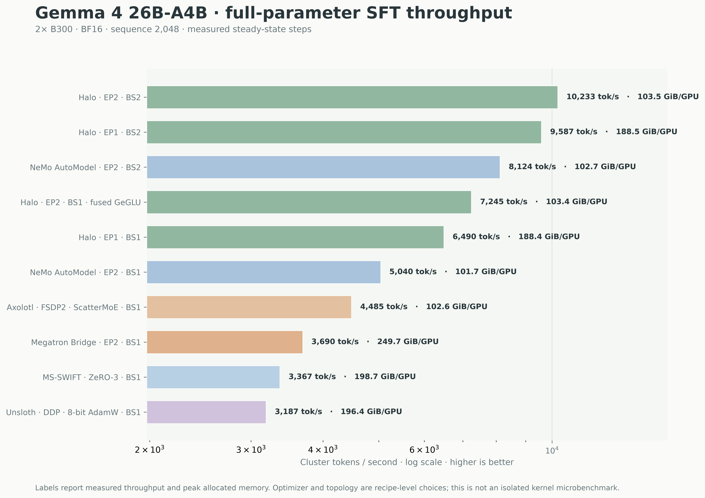
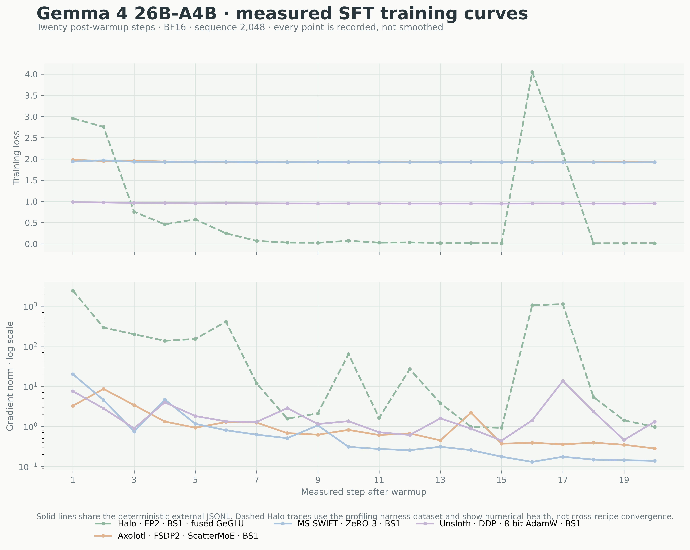
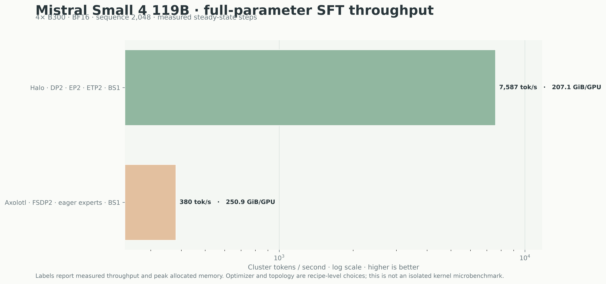
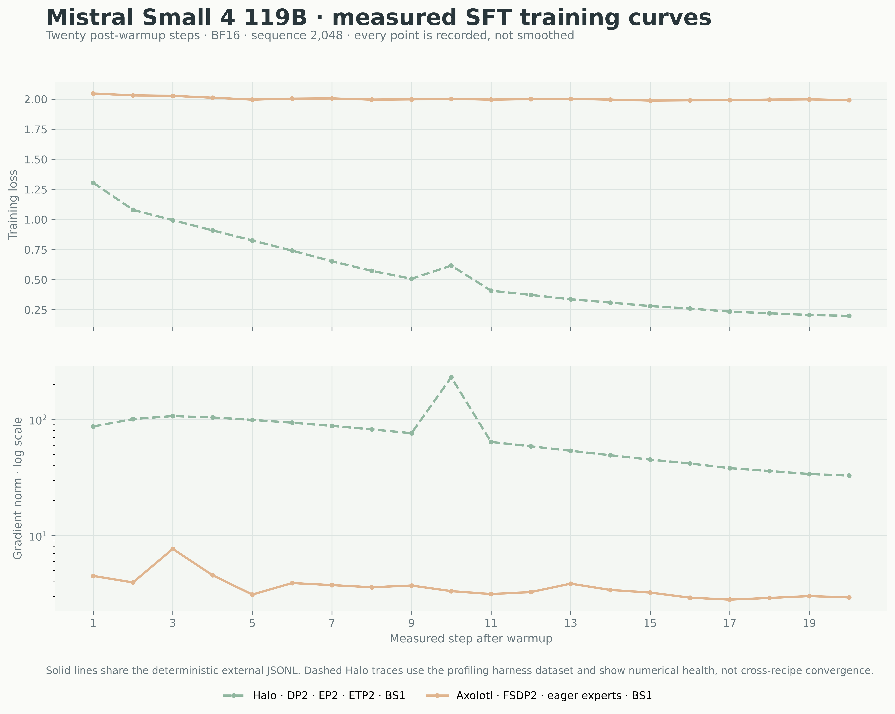

# Throughput Benchmarks

Throughput (tokens/s/GPU) and achieved-TFLOPS benchmarks on **8× NVIDIA B300** (multi-GPU) or **1× B300** (single-GPU) as labeled. tokens/s/GPU is the headline metric (hardware- and sparsity-independent); achieved TFLOPS is the diagnostic. Hopper is a supported build target but is not benchmarked here. What MFU measures and why MoE complicates it: [GPU Training Theory §11](../reference/gpu-training-theory.md#mfu-and-why-moe-complicates-it).

## Setup

- **GPU**: B300 SXM6 (288 GB HBM3e, 148-SM die). Peak TFLOPS from the toolkit's registry (`src/hardware.py`): bf16 **2250 TF**, fp8 4500 TF, fp4 9000 TF; the measured best large square bf16 GEMM is ~1800 TF (80% of peak). The peak scales the MFU/S-MFU percentages only — the tok/s/GPU and achieved-TFLOPS columns below do not use it.
- **Framework**: PyTorch 2.11+cu130 + DeepEP + Flash Attention + Liger. The Blackwell image ships FA2 and FA4 co-installed; `--attn_implementation` defaults to `None` in `tests/common/benchmark_args.py`, which auto-selects `flash_attention_4`. **All tables are FA4 unless a row says otherwise.** FA4 is ≈ +13% end-to-end for MoE/EP but 1.1–2.3× for dense long-context — see [Flash Attention](flash-attention.md).
- **Optimizer**: AdamWBF16 with stochastic rounding (6 bytes/param). **Gradient checkpointing** on unless a row says "GC off".
- **Config**: 3 warmup + 7 measured steps (defaults `--warmup 3 --steps 10`); throughput is the warm-step average from `EfficiencyCallback`.

## Full-parameter SFT framework comparison

Recipe-level runs on 2× B300 (Gemma 4) and 4× B300 (Mistral Small 4): BF16, sequence length 2,048,
batch size 1 per GPU, 25 total steps, mean of all 20 post-warmup steps. They compare complete
training stacks, so optimizer, data pipeline, attention, expert implementation, and parallel layout
are part of each result.

| model | framework | topology | cluster tok/s | peak GiB/GPU |
|---|---|---|---:|---:|
| Gemma 4 26B-A4B | Halo | EP2 | **7,245** | 103.4 |
| Gemma 4 26B-A4B | NeMo AutoModel | EP2 | 5,040 | **101.7** |
| Gemma 4 26B-A4B | Axolotl 0.18.0 | FSDP2, ScatterMoE | 4,485 | 102.6 |
| Gemma 4 26B-A4B | Megatron Bridge | EP2 | 3,690 | 249.7 |
| Gemma 4 26B-A4B | MS-SWIFT 4.4.1 | ZeRO-3 | 3,367 | 198.7 |
| Gemma 4 26B-A4B | Unsloth 2026.7.5 | DDP, 8-bit AdamW | 3,187 | 196.4 |
| Mistral Small 4 119B | Halo | DP2, EP2, ETP2 | **7,587** | **207.1** |
| Mistral Small 4 119B | Axolotl 0.18.0 | FSDP2, eager experts | 380 | 251.0 |

The external-backend curves use one deterministic high-entropy JSONL; Halo's profiling harness uses
synthetic tokens, so its dashed loss and gradient-norm traces are numerical-health evidence, not a
convergence comparison. Raw 20-point traces and protocol metadata (Halo, Axolotl, MS-SWIFT, Unsloth)
are in `agent-docs/assets/benchmarks/runs/`; the NeMo AutoModel and Megatron Bridge rows are
throughput/memory only.









## Metrics

All metrics computed by `EfficiencyCallback` (`src/callbacks/efficiency.py`).

**Achieved TFLOPS** = `(tokens_per_gpu × (6·N_trainable + 4·N_frozen + 12·L·S·H / tp_size)) / step_time` (PaLM/Megatron
FLOP count). The linear-projection term is `6·N` for trainable params (2N forward + 4N backward) and `4·N`
for frozen ones (forward + input-gradient backward, no weight gradient — a LoRA base or frozen layers);
`12·L·S·H` is the attention-score term (QKᵀ and Attn·V, forward + backward, per layer). For full fine-tuning
`N_frozen = 0` and the linear term is the usual `6·N_local`.

`N` counts all params physically on this GPU (DTensor-aware for TP); `L` is this rank's own decoder-layer
count, so under PP ([not yet available](../parallelism/pipeline-parallelism.md)) each stage's attention
term would match its real slice of the layer list. The attention term is divided by `tp_size`
explicitly, since `H` is read from the config and stays global on every rank unlike `N`. `tokens_per_gpu` =
`num_input_tokens_seen / world_size`, further divided by `cp_size` (each CP rank receives the full
`input_ids`; the wrapper splits inside forward).

**S-MFU** (sparsity-aware utilization) is the meaningful roofline fraction for MoE: it scales the *expert*
FLOP term by `(top_k / num_experts) × ep_size` before dividing by `step_time × peak_gpu_flops`, so it does
not credit experts that never fired. Shared experts, router and attention params count at full weight;
`expert_tp_size` does not appear, since it already divides the local expert params. The `ep_size` factor is
not a sharding correction — a rank holds `num_experts / ep_size` experts but serves the whole EP group's
tokens, so per-rank active FLOPs/token is ep-invariant and S-MFU stays comparable across EP degrees. With
`num_full_model_params` set, the full expert bank is reconstructed as
`local_expert_params × ep_size × expert_tp_size`, so pure ETP is counted too. If top-k is not detected the
sparsity factor stays 1.0 and S-MFU silently collapses to plain MFU — check the
`S-MFU: N experts, top_k=K` startup line.

Compare configs with tok/s/GPU and achieved TFLOPS; reach for S-MFU only when you need a roofline fraction
(see [Why MoE utilization reads low](#why-moe-utilization-reads-low)).

**Cluster throughput** = `per_gpu_tps × dp_actual × cp_size`, where
`dp_actual = world_size / (pp_size × max(tp_size, cp_size, expert_tp_size))` (`ParallelismConfig.data_parallel_size`). `ep_size` is
excluded (EP ⊥ DP, each EP rank processes a distinct batch); `expert_tp_size` and `pp_size` are included
(their ranks share one input).

## GPT-OSS-20B (8× B300)

**Model**: `unsloth/gpt-oss-20b-BF16` (20.7B total, 32 experts, top_k=4, 3.5B active). Setup: FA4, liger on, grouped-GEMM on (default), AdamWBF16/bf16, GC on, seq 4096 batch 1 unless noted.

### EP-only (batch scaling)

EP distributes experts; DP = world_size = 8. Small-batch pure EP is **communication-bound** — the all-to-all is a fixed per-step cost, so raising batch is the dominant throughput lever:

| EP | batch | tok/s/GPU | TFLOPS | peak mem | step |
|----|-------|:---------:|--------|----------|------|
| 1 | 1 | 9,401 | 1,212 | 148.3 GB | 0.44s |
| 2 | 1 | 10,551 | 755 | 77.3 GB | 0.39s |
| 2 | 4 | 17,874 | 1,279 | 91.5 GB | 0.92s |
| 8 | 1 | 8,225 | 235 | 25.3 GB | 0.50s |
| 8 | 4 | 10,051 | 287 | 57.1 GB | 1.63s |

Rows are the grouped-GEMM path (default); the ep1 rows here hold experts replicated per rank (`fsdp_shard_ep1_experts: false`) — the fixed config the b1 golden baselines in `tests/baselines/` measure. Nothing reads those files automatically: `tokens_per_second` and `peak_allocated_gb` are diffed by hand ([Golden performance baselines](../contributing/index.md#golden-performance-baselines)).

`fsdp_shard_ep1_experts` (the ep1 default) shards the replicated experts across the DP group, cutting ep1 b1 to **8,414 tok/s/GPU · 60.3 GB** (−59% memory for −10.6% throughput at b1; the all-gather overlaps better at larger batch — −3.5% at b4) — the dense-EP1 config in the [achieved-TFLOPS table](#maximizing-achieved-tflops).

Grouped beats the per-expert loop (`use_grouped_gemm: false`) at low EP and at high EP up to moderate batch; the loop edges ahead only at high EP with large batches. The crossover is set by local experts per rank, modulated by batch — the authoritative A/B is in [grouped-gemm](grouped-gemm.md#when-the-loop-path-wins).

!!! danger "No ep4 row: single-node `ep_size=4` on 8 GPUs is rejected at config time"
    Two 4-rank dispatch groups on one node race FSDP2's DP-wide NCCL and hang. Benchmark 8 GPUs at **ep2 or ep8**, or ep4 on exactly 4 GPUs; for a 4-way expert split across all 8 use `ep4 + etp2`. Mechanism and the full rule: [Expert Parallelism](../parallelism/expert-parallelism.md#single-domain-multi-group-ep-races-and-hangs).

### EP+CP (long context)

CP splits sequences via Ulysses attention. ep8 + CP=8 (DP=1), GC on:

| SeqLen | tok/s/GPU | TFLOPS | peak mem | step |
|--------|-----------|--------|----------|------|
| 16,384 | 5,460 | 211 | 23.6 GB | 0.38s |
| 32,768 | 6,042 | 316 | 26.5 GB | 0.68s |
| 65,536 | 5,231 | 416 | 33.9 GB | 1.57s |

Achieved TFLOPS rises with sequence length (longer sequences amortize the Ulysses all-to-all); memory stays near-flat (24–34 GB) from 16k to 64k. CP trades per-GPU throughput for cheap long context.

### EP+TP

TP shards attention (Q/K/V/O) via DTensor; EP distributes experts. **EP+TP requires `ep_size` to be a multiple of `tp_size`** — each EP group must span whole TP groups (the validator rejects `ep_size % tp_size != 0`). On one 8-GPU node, full-EP (`ep8`) combines with `tp2`, `tp4`, or `tp8` (all valid); `ep2tp8`/`ep4tp8` are rejected (ep < tp). The table below is `ep8tp8` (one TP group of 8). DP=1, so tok/s/GPU equals cluster throughput.

| SeqLen | tok/s/GPU | TFLOPS | peak mem | step |
|--------|-----------|--------|----------|------|
| 4,096 | 7,641 | 192 | 33.0 GB | 0.54s |
| 16,384 | 9,557 | 338 | 70.7 GB | 1.71s |
| 32,768 | 10,247 | 502 | 122.3 GB | 3.20s |

Achieved TFLOPS rises with sequence length (amortizes the TP all-gather/reduce-scatter). TP width is a minor lever: at s4096 the three widths are within ~1% (`ep8tp2` 7,715 ≈ `ep8tp4` 7,714 > `ep8tp8` 7,641 tok/s/GPU); at s16384 `ep8tp4` leads (10,009 vs `ep8tp2` 9,559, `ep8tp8` 9,557).

### Why MoE utilization reads low {#why-moe-utilization-reads-low}

It is not idle hardware. gpt-oss-20b fires top-4 of 32 experts (3.5B active of 20.7B), so a sparse MoE cannot
approach a dense model's plain MFU. Higher EP also shrinks `N_local` (ep2 = 11.36B → ep8 = 4.19B) at similar
throughput: ep8 trades per-GPU utilization for memory, not compute waste.

Levers to raise it: lower EP (more local params), longer sequence (the EP-independent `12·L·S·H` term),
larger batch.

### Maximizing achieved TFLOPS

Keep more params local (low EP), then drop GC if activations fit, then add batch and sequence (8× B300, FA4, liger, best config per topology):

| model | topology | config | tok/s/GPU | TFLOPS | peak mem |
|-------|----------|--------|-----------|--------|----------|
| gpt-oss-20b | ep1 (dense FSDP, sharded experts) | b4, s4096, GC-off | **24,456** | **3,152** | 136.0 GB |
| gpt-oss-20b | ep1 (dense FSDP, sharded experts) | b4, s4096, GC-on | 20,174 | 2,600 | 80.6 GB |
| gpt-oss-20b | ep2 | b6, s8192 (loop) | 16,624 | 1,246 | 157.6 GB |
| gpt-oss-20b | ep8 | b2, s16384 (loop) | 10,041 | 389 | 96.0 GB |
| qwen3.5-35b-a3b | ep2 | b4, s4096 | 12,584 | 1,435 | 138.5 GB |
| qwen3.5-35b-a3b | ep8 | b8, s4096 | 10,012 | 416 | 132.9 GB |

- **Local params decide the ceiling.** ep1 keeps all 20.7B local and tops the table; ep2 ~11.4B; ep8 ~4.2B;
  qwen3.5-35b ep2 ~17.5B. Choose the lowest EP that fits. (The ep1 row counts every local expert as active,
  so it over-reads as a utilization fraction for sparse MoE.)
- **Sequence length raises ep8's floor** but does not close the gap to ep1/ep2 — ep8 is the memory topology.
- **Drop GC where activations fit** — the largest single throughput lever. Past the GC-off memory wall, the
  largest batch that fits under GC-on is the recipe.

Picking a corner: **ep2 b4** for maximum throughput, **ep8 b4** for balanced throughput/memory, **ep8 b1**
for minimum memory, **ep8+cp8** for 32–64k context.

## Maximizing throughput: sequence & batch

Throughput is dominated by the effective per-GPU token count `M = per_device_batch_size × sequence_length` —
bigger `M` amortizes fixed per-step costs (kernel launches, all-to-all latency, optimizer step) until a
memory wall. **Target `M` ≥ ~8k on B300 MoE before judging throughput**; below that you are latency-bound.
Cross-node EP is pinned to `M ≤ 8192` by the Gin dispatch ceiling
([DeepEP → EFA](../infrastructure/deepep.md#expert-parallelism-over-aws-efa)) — the floor of this range by
construction.

1. **Push `max_length` as high as data/memory allow, and pack** (`packing: true` / padding-free collator —
   raises tokens/expert = `M × top_k × ep_size / num_experts`). Use
   [Context Parallelism](../parallelism/context-parallelism.md) when a sequence won't fit one GPU.
2. **Raise `per_device_train_batch_size` until just below OOM** with gradient checkpointing on — the ~20–30%
   recompute usually pays for itself through the bigger `M`.
3. **Fill with `gradient_accumulation_steps`, not more parallelism** — global batch at near-zero memory cost.
4. **Keep DP large** — EP is orthogonal to DP; reach for TP/CP only when a model/sequence won't fit.
5. **Measure**: `enable_efficiency_metrics: true` logs per-step tokens/s/GPU (add
   `report_mfu_diagnostics: true` for achieved-TFLOPS and S-MFU); sweep `(seq, batch)` until it plateaus.

### Where the EP step's time goes (gpt-oss-20b ep8, b1/s4096, 8× B300, FA4) {#measured-bottleneck-case-study--gpt-oss-20b-ep-on-8-b300}

The per-MoE-layer CUDA self-time at b1/s4096 (serialized attribution via `benchmark_sft_ep.py --comm_profile`) is **dispatch all-to-all 88%, expert GEMM 6.6%, combine all-to-all 5.5%** — communication is ~93% of the layer step.

The dispatch all-to-all is a near-fixed per-step latency (~49 ms here), so it dominates at small `M`. The
expert GEMM is a minority because the model is very sparse (per-expert GEMM stays small-`M` /
weight-bandwidth-bound), which is also why utilization reads low. Raising batch or sequence grows the compute
term against the fixed comm cost — throughput plateaus around b4 (b8 only adds memory). At these shapes EP
matches dense-FSDP throughput at ~6× less local memory (26 vs 148 GB).

**Feature A/B at the optimal point (ep8 b4 s4096):**

| feature | tok/s/GPU | vs bf16 | note |
|---|---|---|---|
| bf16 + FA4 + grouped + GC | 10,051 | 1.00× | production recipe |
| **GC off** | **12,971** | **1.29×** | when the batch fits (121 GB here) |
| grouped GEMM off (loop) | 10,215 | 1.02× | loop edges grouped at ep8-b4 (fused-SwiGLU grouped path) |
| flex attention | 1,916 | 0.19× | FA4 ~5.2× faster; flex runs the unfused math path |
| fp8 / fp4 | net-slower | — | bf16 is the throughput path at these shapes ([low-precision](low-precision-moe-kernels.md)) |

`sdpa` silently drops GptOss attention sinks, so `validate_attn_implementation` orders it below flex and FA
in the fallback chain — use FA4 or flex. The roofline crossover (gpt-oss expert K=N=2880: weight-bandwidth-
bound below ≈256–512 tokens/expert, compute-bound above; ridge AI ≈ 275 on B300) is why bf16 stays optimal —
the small-`M` experts sit in the bandwidth-bound regime where fp8/fp4 quant overhead only loses.
`CUDA_DEVICE_MAX_CONNECTIONS=1` (baked into the image) is free as a default — neutral on dense/ep2, **+9.7%
on ep8** ([DeepEP](../infrastructure/deepep.md#environment-variables)).

> **Profiling EP.** `torch.profiler` (CUPTI) does not complete a step of a multi-GPU EP run with Flash
> Attention active (the FA4 CuTe-DSL JIT interacts badly with CUPTI). Use `--attn_implementation sdpa`, a
> single GPU, or a smaller model; for the memory-vs-compute question use
> `tests/gpu/profiling/benchmark_roofline.py`.

**EP throughput vs sequence length (ep8, b1, liger + FA4):**

| seq | GC-on tok/s/GPU | GC-on mem | GC-off tok/s/GPU | GC-off mem |
|---|---|---|---|---|
| 4,096 | 8,225 | 25 GB | 10,505 | 41 GB |
| 8,192 | 9,336 | 35 GB | 11,876 | 67 GB |
| 16,384 | 9,894 | 52 GB | 12,607 | 117 GB |
| 32,768 | 8,626 | 83 GB | — (OOM) | — |
| 49,152 | 8,088 | 108 GB | — (OOM) | — |
| 65,536 | 6,045 † | 135 GB | — (OOM) | — |

† s65536 GC-on uses `ep_buffer_backend=legacy` (DeepEP CUDA-IPC). The default elastic transport completes the forward but its ep8 backward combine all-gather races the DeepEP NVLink barrier at 65,536 tokens/rank and faults (`symmetric.hpp` Cuda 719); legacy's token-count-independent intranode buffer trains it clean. s49152 trains on either transport.

GC-off is +27–28% but ~2× memory; it fits to 16k (117 GB) and **does not fit 32k**. Use GC-off for max
throughput at ≤16k; GC-on for long context — pure ep8 GC-on streams to 64k (135 GB) without Context
Parallelism, tapering past 32k as the per-rank sequence grows.

Because the dispatch is near-fixed (~47–49 ms across s4096→s16384), its share of the MoE-layer step **falls**
as sequence grows while the expert GEMM gets more compute-efficient at larger per-expert `M` (gpt-oss-20b ep8
GC-off: communication ≈93% @ s4096 → ≈88% @ s16384). Compute–comm overlap would pay off most at long context.

## Qwen3.5-35B-A3B MoE (8× B300)

**Model**: `Qwen/Qwen3.5-35B-A3B` (35B total, 256 experts, top_k=8, ~3B active). liger on, grouped-GEMM on, AdamWBF16/bf16, GC on. Attention runs **SDPA**: the FA4 backward emits NaN gradients on Qwen3.5's head_dim-256 partial-rotary attention (QK-norm + output gate), so `load_distributed_model` auto-falls back to SDPA — see [Flash Attention](flash-attention.md#model-specific-handling).

### EP scaling (seq 4096)

| EP | batch | tok/s/GPU | TFLOPS | peak mem | step |
|----|-------|-----------|--------|----------|------|
| 2 | 1 | 5,964 | 680 | 127.9 GB | 0.69s |
| 2 | 4 | **12,584** | 1,435 | 138.5 GB | 1.30s |
| 8 | 1 | 6,401 | 266 | 41.1 GB | 0.64s |
| 8 | 4 | 9,408 | 391 | 81.0 GB | 1.74s |

ep2 keeps ~17.5B params local and reaches **1,435 TFLOPS at batch 4** — the highest of the MoE rosters here, consistent with [local params setting the ceiling](#maximizing-achieved-tflops). ep8 trades achieved TFLOPS for memory: 41 GB at batch 1 vs 128 GB for ep2. Batch is the dominant lever (ep2 b1→b4 = 2.1×; ep8 b1→b4 = 1.5×), since small-batch pure EP is all-to-all-bound.

At ep2 batch 4 the per-MoE-layer step splits ≈ **77% DeepEP dispatch all-to-all / 21% expert GEMM / 2% combine** (`--comm_profile`) — dispatch-bound on the top_k=8 token-count exchange. Raising sequence to 8192 amortizes the all-to-all to **13,484 tok/s/GPU** (b4).

Two kernels are load-bearing here: [grouped GEMM](grouped-gemm.md) is **2.4× over the per-expert loop** (128 local experts/rank) and [Liger](liger-kernels.md) (RMSNorm + CE; SwiGLU/RoPE are off under EP / partial-rotary) adds **+6.6% throughput and −15 GB**. Attention runs SDPA at no throughput cost (it ties FA4 on MoE); FLCE trades −7% throughput for −7 GB at long context.

### EP throughput vs sequence length (ep8, b1, GC on)

| seq | tok/s/GPU | peak mem |
|-----|-----------|----------|
| 4,096 | 6,401 | 41.1 GB |
| 8,192 | 8,129 | 52.2 GB |
| 16,384 | 8,375 | 74.5 GB |

Longer sequences amortize the all-to-all at modest memory growth — ep8 is the long-context / memory-efficient topology, ep2 batch 4 the throughput one.

## Single-GPU dense (1× B300)

`Qwen/Qwen3-4B-Instruct-2507` (4.02B, hidden 2560) and `Qwen/Qwen3-8B` (8.2B, hidden 4096), both 36 layers and dense. liger on, AdamWBF16/bf16, FA4. The FA4/FA2/SDPA/flex comparison lives in [Flash Attention](flash-attention.md#fa4-vs-fa2-vs-sdpa-on-blackwell).

| Model | peak (no GC) | s4096 b1 GC | s32768 b1 GC | b4 no-GC memory |
|---|---|---:|---:|---|
| Qwen3-4B | **39,931** tok/s @ b8×s2048 | 25,459 | 16,835 | 102 GB @ s4096 · 181 GB @ s8192 |
| Qwen3-8B | **24,620** tok/s @ b8×s4096 | 18,533 | 13,118 | 140 GB @ s4096 · 235 GB @ s8192 |

Batch is the dominant lever — raise it with GC off while it fits (Qwen3-4B b1→b8 at s4096: 25,459 → 38,307). At batch 1 a short sequence is overhead-bound. b8 no-GC OOMs at s8192 on both models, so 16k and longer are batch-1 GC-on. The 8B runs at roughly ⅔ the 4B's tok/s (more FLOPs/token) while saturating the tensor cores better.

## GPT-OSS-120B notes

**Model**: `unsloth/gpt-oss-120b-BF16` (120B total, 128 experts, top_k=4). On B300 (288 GB) it fits with **EP=8 + GC**: local params = 16.47B → ~99 GB model + AdamWBF16 state, plus ~33 GB bf16 gradients + activations, comfortable at 8K sequence (it does not fit a 141 GB H200). EP+TP further reduces local params (attention sharded across the TP group); multi-node raises aggregate memory.

## Using EfficiencyCallback

Set `enable_efficiency_metrics: true` in any YAML; every standard training script wires the callback through `build_perf_callbacks`, deriving EP/TP/CP sizes from `ParallelismConfig` and setting `include_num_input_tokens_seen="all"`. Off by default because multi-sequence trainers (DPO / SMPO / Reward / Distillation) report a misleading utilization. See [Performance & Balancing Flags](../reference/configuration-reference.md#performance-balancing-flags).

For benchmark scripts outside `build_perf_callbacks`, construct `EfficiencyCallback` directly (`src/callbacks/efficiency.py`) with the run's `ParallelismConfig` plus `num_full_model_params` (the expert count and top-k come from the model config); read `callback.tps.avg_tokens_per_second`, `callback.mfu.avg_tflops_per_sec`, `callback.memory.peak_allocated_gb`.

## Running benchmarks

```bash
# EP-only (ep2 or ep8 on 8 GPUs — ep4 multi-group races)
torchrun --nproc_per_node=8 \
    tests/gpu/profiling/benchmark_sft_ep.py \
    --model gpt-oss-20b --ep 2 --seq 4096 --steps 10 --warmup 3
# add --no_grouped_gemm to A/B the loop; --no_gc to drop gradient checkpointing

# EP+CP (long context)
torchrun --nproc_per_node=8 \
    tests/gpu/profiling/benchmark_sft_ep_cp.py \
    --model gpt-oss-20b --ep 8 --cp 8 --seq 32768 --steps 10 --warmup 3

# EP+TP (ep8 with tp2/tp4/tp8 all valid on 8 GPUs; ep must be a multiple of tp)
torchrun --nproc_per_node=8 \
    tests/gpu/profiling/benchmark_sft_ep_tp.py \
    --model gpt-oss-20b --ep 8 --tp 8 --seq 16384 --steps 10 --warmup 3

# Single-GPU dense (defaults: seq 8192, FA4, bs=1, GC on; --model defaults to gpt-oss-20b)
torchrun --nproc_per_node=1 \
    tests/gpu/profiling/benchmark_sft_dense.py \
    --model qwen3-4b --attn_implementation flash_attention_4 \
    --no_grad_checkpoint --batch_size 2
```

`tests/gpu/profiling/run_all_benchmarks.sh` is the master runner across all throughput/TFLOPS benchmarks. `tests/gpu/profiling/run_mfu_benchmarks.sh` sweeps seq 4096/8192/16384 for the SFT/SMPO benchmarks (defaults `GPUS=2 EP=2`; parses `--gpus=`, `--ep=`, `--steps=`, `--warmup=`):

```bash
./tests/gpu/profiling/run_all_benchmarks.sh
./tests/gpu/profiling/run_mfu_benchmarks.sh --gpus=8 --ep=8
```
