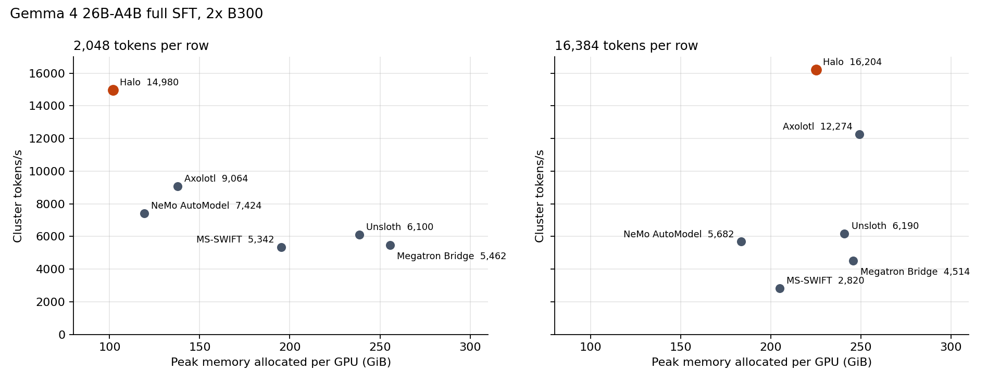
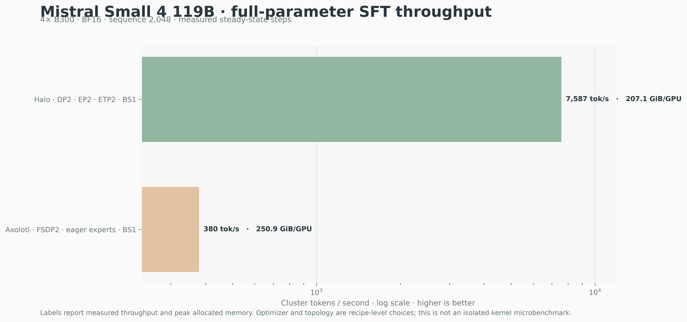
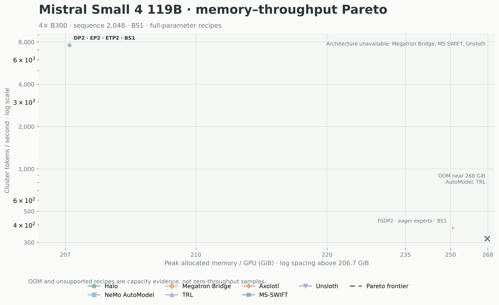
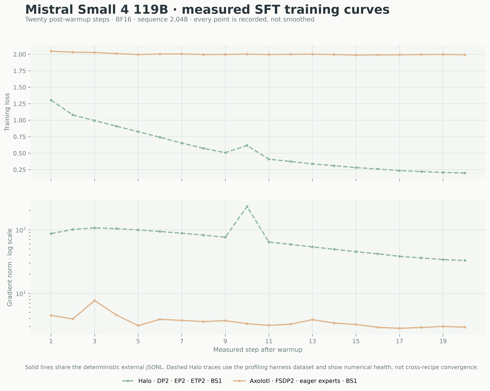

# Throughput Benchmarks

Throughput (tokens/s/GPU) and achieved-TFLOPS benchmarks on **NVIDIA B300** (GPU count per section). tokens/s/GPU is the headline metric (hardware- and sparsity-independent); achieved TFLOPS is the diagnostic. Hopper numbers are not included here. What MFU measures and why MoE complicates it: [GPU Training Theory §11](../reference/gpu-training-theory.md#mfu-and-why-moe-complicates-it).

## Setup

- **GPU**: B300 SXM6 (288 GB HBM3e, 148-SM die). Peak TFLOPS from the toolkit's registry (`src/hardware.py`): bf16 **2250 TF**, fp8 4500 TF, fp4 9000 TF; the measured best large square bf16 GEMM is ~1800 TF (80% of peak).

    The peak scales the MFU/S-MFU percentages only; the tok/s/GPU and achieved-TFLOPS columns below do not use it.

- **Framework**: PyTorch 2.11+cu130 + DeepEP + Flash Attention + Liger. The Blackwell image ships FA2 and FA4 co-installed; `--attn_implementation` defaults to `None` in `tests/common/benchmark_args.py`, which auto-selects `flash_attention_4`. **All tables are FA4 unless a row says otherwise.**

    FA4's end-to-end gain is small on MoE/EP and grows with sequence length on dense; see [Flash Attention](flash-attention.md).

- **Optimizer**: AdamWBF16 with stochastic rounding (6 bytes/param). **Gradient checkpointing** on unless a row says "GC off".
- **Config**: 3 warmup + 7 measured steps (defaults `--warmup 3 --steps 10`); throughput is the warm-step average from `EfficiencyCallback`. Peak memory is its `torch.cuda.max_memory_allocated`, in GiB (2³⁰ bytes). Both are rank 0's.

## Full-parameter SFT framework comparison

**Gemma 4 26B-A4B**, 2× B300, BF16, micro-batch 1 per GPU. Every framework trains the same tokens, labels and row
order with the same optimizer hyperparameters, each at its newest release (2026-09-24) in its fastest configuration of
those tried. Tokens/s are measured over steps 6–25 at 2,048 tokens per row (25 steps) and over steps 6–50 at 16,384
tokens per row (8 rows packed into one causal sequence, 50 steps); peak memory is `max_memory_allocated`, max over
ranks. Each rate is the mean of its configuration's valid runs: a run whose token-weighted step-1 loss is more than 2%
from the common value is left out. At commit 0bc3a22a5 Halo measures 15,090 cluster tok/s at 2,048 tokens and
16,219 at 16,384, within 1% of its rows below at the same peak memory.

| framework | version | layout | cluster tok/s | peak GiB/GPU |
|---|---|---|---:|---:|
| Halo | v1.0.0 with the MoE kernels and sliding-window attention (6e66be54) | EP2 + FSDP2, bf16 experts, `sdpa_flex_sliding`, no checkpointing | **14,980** | **101.8** |
| Axolotl | 0.19.0 | FSDP2 no-reshard, FA2 sliding | 9,064 | 137.6 |
| NeMo AutoModel | container 26.08.00 | EP2 + FSDP2, eager attention | 7,424 | 119.1 |
| Unsloth | 2026.9.11 | DDP, bf16 AdamW | 6,100 | 238.6 |
| Megatron Bridge | 0.6.1 (NeMo 26.08.01) | EP2, distributed optimizer, fp32 master | 5,462 | 255.6 |
| MS-SWIFT | 4.5.3 | FSDP2, fp32 master | 5,342 | 195.1 |

At **16,384 tokens per row** each framework starts from its 2,048-token configuration and turns on its own activation
checkpointing when that runs out of memory:

| framework | what it needs at 16,384 tokens | cluster tok/s | peak GiB/GPU | at 2,048 tokens |
|---|---|---:|---:|---:|
| Halo | nothing (no checkpointing) | **16,204** | 225.0 | 14,980 |
| Axolotl | nothing (no checkpointing) | 12,274 | 249.1 | 9,064 |
| Unsloth | Unsloth gradient checkpointing | 6,190 | 240.9 | 6,100 |
| NeMo AutoModel | activation checkpointing | 5,682 | 183.6 | 7,424 |
| Megatron Bridge | full recompute + bf16 Adam moments | 4,514 | 245.8 | 5,462 |
| MS-SWIFT | FSDP activation checkpointing | 2,820 | 204.9 | 5,342 |

- At 2,048 tokens Halo uses the least memory. At 16,384 tokens Halo and Axolotl are the two frameworks that fit
  without checkpointing, Halo at 225.0 GiB and Axolotl at 249.1; NeMo AutoModel and MS-SWIFT use less memory there,
  with activation checkpointing, at 35% of Halo's rate or less. Megatron Bridge fits only with bf16 Adam moments on
  top of full recompute.
- Axolotl's first run in each environment measured 9,604–9,630 tok/s at 2,048 tokens and its second 8,313–8,709;
  its row averages all four.
- Unsloth's step-1 loss varies between runs on identical, verified rows; its rows are the means of its valid runs (two
  of four at 2,048 tokens, five of six at 16,384, each 16,384-token pair from a fresh environment run alone).
- Halo's loss falls faster over the first steps (2.05 at step 2 against 4.54–4.67) because AdamWBF16 rounds the bf16
  weights stochastically; from step 5 on it tracks the fp32-master frameworks.

Per-run tokens/s, memory and step-1 loss: `agent-docs/assets/benchmarks/gemma4-sft-2026-09/summary_2048.tsv`
and `agent-docs/assets/benchmarks/gemma4-sft-2026-09/summary_16384.tsv`. The protocol, the result JSONs and the harness are in the
[benchmark gist](https://gist.github.com/advpropsys/0de3c36fd118a5ad18e4883ac15404a2); after `bash unpack.sh`,
`BENCH_ROOT=<dir> HALO_TREE=<halo checkout> [BENCH_SEQ=16384 BENCH_STEPS=50] bash scripts/benchmarks/gemma4_sft/reproduce.sh`
runs the data build, every framework and the summary.

The kernels Halo runs for Gemma 4: [Gemma 4](../models/gemma4.md).



**Mistral Small 4 119B**, 4× B300, BF16, sequence length 2,048, batch size 1 per GPU, 25 total steps, mean
of all 20 post-warmup steps:

| model | framework | topology | cluster tok/s | peak GiB/GPU |
|---|---|---|---:|---:|
| Mistral Small 4 119B | Halo | DP2, EP2, ETP2 | **7,587** | **207.1** |
| Mistral Small 4 119B | Axolotl 0.18.0 | FSDP2, eager experts | 380 | 251.0 |





Halo's trace runs synthetic tokens (`dataset_group: halo_synthetic`), so its loss and gradient-norm curves
are numerical-health evidence, not a convergence comparison. The raw 20-step traces are in
`agent-docs/assets/benchmarks/runs/`.



## Metrics

All metrics computed by `EfficiencyCallback` (`src/callbacks/efficiency.py`).

**Achieved TFLOPS** = `(tokens_per_gpu × (6·N_trainable + 4·N_frozen) + attention_score_flops / tp_size) / step_time`
(PaLM/Megatron FLOP count).

The linear-projection term is `6·N` for trainable params (2N forward + 4N backward) and `4·N` for frozen ones
(forward + input-gradient backward, no weight gradient — a LoRA base or frozen layers); for full fine-tuning
`N_frozen = 0` and it is the usual `6·N_local`. `N` counts all params physically on this GPU (DTensor-aware
for TP).

`tokens_per_gpu` = `num_input_tokens_seen / world_size`, further divided by `cp_size` (each CP rank receives
the full `input_ids`; the wrapper splits inside forward).

The attention-score term costs each decoder layer at `6 × keys × heads·(d_qk + d_v)` per token (QKᵀ and Attn·V,
forward + backward; `12·S·H` for standard heads). Full attention is costed at every key (the PaLM convention,
not the causal half); bounded layers at the keys their kernel visits. `keys` is set by the layer's
`config.layer_types` entry (`src/models/attention_layout.py`):

| `layer_types` entry | `keys` |
|---|---|
| full attention | the document length `L` |
| sliding | `min(L, sliding_window)` |
| chunked | `min(L, attention_chunk_size)` |
| GLM-5 sparse attention | the top-k plus a pooled indexer |
| DeepSeek-V4 compressed layers | `L / compress_rate` plus the local band |
| linear-attention / conv | nothing |

`L` is each **document's** length: the trainer costs every batch's documents (`cu_seq_lens_q`, `position_ids`
resets, or the padded row) and the callback swaps that rank-local measurement in per step, so a packed 64k
row of 1–40k-token documents is not costed as one 64k sequence. A trainer whose collator emits no `input_ids`
keeps the config term (every token in a `max_seq_len` document): online and async GRPO, KTO, SMPO and embedding.

The layer set is this rank's own, so under PP ([not yet available](../parallelism/pipeline-parallelism.md))
each stage's term would match its real slice rather than an even split of the depth. The measured term
carries the same divisors as the tokens: `tp_size` (heads are sharded) and, under Ulysses CP, `cp_size`
(the wrapper splits the sequence's heads inside forward). Per-step wiring and the logged fields:
[Callbacks](../training-methods/callbacks.md#efficiencycallback).

**S-MFU** (sparsity-aware utilization) is the meaningful roofline fraction for MoE: it scales the *expert*
FLOP term by `(top_k / num_experts) × ep_size` before dividing by `step_time × peak_gpu_flops`, so it does
not credit experts that never fired. Shared experts, router and attention params count at full weight;
`expert_tp_size` does not appear, since it already divides the local expert params.

The `ep_size` factor is not a sharding correction: a rank holds `num_experts / ep_size` experts but serves
the whole EP group's tokens, so per-rank active FLOPs/token is ep-invariant and S-MFU stays comparable across
EP degrees. With `num_full_model_params` set, the full expert bank is reconstructed as
`local_expert_params × ep_size × expert_tp_size`, so pure ETP is counted too.

If top-k is not detected the sparsity factor stays 1.0 and S-MFU silently collapses to plain MFU; check the
`S-MFU: N experts, top_k=K` startup line.

Compare configs with tok/s/GPU and achieved TFLOPS; reach for S-MFU only when you need a roofline fraction
(see [Why MoE utilization reads low](#why-moe-utilization-reads-low)).

**Cluster throughput** = `per_gpu_tps × dp_actual × cp_size`, where
`dp_actual = world_size / (pp_size × max(tp_size, cp_size, expert_tp_size))` (`ParallelismConfig.data_parallel_size`). `ep_size` is
excluded (EP ⊥ DP, each EP rank processes a distinct batch); `expert_tp_size` and `pp_size` are included
(their ranks share one input).

## GPT-OSS-20B (8× B300)

**Model**: `unsloth/gpt-oss-20b-BF16` (20.7B total, 32 experts, top_k=4, 3.5B active). Setup: FA4, liger on, grouped-GEMM on (default), AdamWBF16/bf16, GC on, seq 4096 batch 1 unless noted. Every table in this section: 8× B300 on the Blackwell image; the gpt-oss-20b ep8 rows (EP+CP and EP+TP included) are the median of two runs measured 2026-10-05 at commit 0e9a51172, every other row 2026-10-03 at commit 0bc3a22a5.

### EP-only (batch scaling)

EP distributes experts; DP = world_size = 8. Small-batch pure EP is **communication-bound** — the all-to-all is a fixed per-step cost, so raising batch is the dominant throughput lever:

| EP | batch | tok/s/GPU | TFLOPS | peak mem | step |
|----|-------|:---------:|--------|----------|------|
| 1 | 1 | 11,041 | 1,413 | 148.3 GiB | 0.37s |
| 2 | 1 | 12,432 | 878 | 78.9 GiB | 0.33s |
| 2 | 4 | 20,554 | 1,452 | 85.2 GiB | 0.80s |
| 8 | 1 | 10,905 | 301 | 25.5 GiB | 0.38s |
| 8 | 4 | 13,239 | 366 | 48.2 GiB | 1.24s |

Rows are the grouped-GEMM path (default); the ep1 row holds experts replicated per rank (`fsdp_shard_ep1_experts: false`). The b1 rows are the golden baselines in `tests/baselines/` (the ep8 file holds one of its row's two repeats). Nothing reads those files automatically: `tokens_per_second` and `peak_allocated_gb` are diffed by hand ([Golden performance baselines](../contributing/README.md#golden-performance-baselines)).

`fsdp_shard_ep1_experts` (the ep1 default) shards the replicated experts across the DP group. It is faster and leaner than the replicated row at both measured batches: ep1 b1 runs **11,236 tok/s/GPU · 60.3 GiB** (+1.8% throughput, −59% memory), and b4 runs 23,590 · 75.8 GiB against replicated 22,386 · 149.4 GiB (+5.4%, −49%). It is the dense-EP1 config in the [achieved-TFLOPS table](#maximizing-achieved-tflops).

Grouped beats the per-expert loop (`use_grouped_gemm: false`) in every measured gpt-oss-20b cell, by +31–45% at ep8; the margin shrinks as local experts per rank fall and batch grows. The A/B is in [grouped-gemm](grouped-gemm.md#grouped-vs-the-loop-path).

> [!CAUTION]
> **No ep4 row: single-node `ep_size=4` on 8 GPUs is rejected at config time**
>
> Two 4-rank dispatch groups on one node race FSDP2's DP-wide NCCL and hang. Benchmark 8 GPUs at **ep2 or ep8**, or ep4 on exactly 4 GPUs; for a 4-way expert split across all 8 use `ep4 + etp2`. Mechanism and the full rule: [Expert Parallelism](../parallelism/expert-parallelism.md#single-domain-multi-group-ep-races-and-hangs).

### EP+CP (long context)

CP splits sequences via Ulysses attention. ep8 + CP=8 (DP=1), GC on:

| SeqLen | tok/s/GPU | TFLOPS | peak mem | step |
|--------|-----------|--------|----------|------|
| 16,384 | 7,149 | 249 | 24.6 GiB | 0.29s |
| 32,768 | 9,031 | 402 | 29.9 GiB | 0.45s |
| 65,536 | 8,862 | 566 | 41.9 GiB | 0.92s |

Achieved TFLOPS rises with sequence length (longer sequences amortize the Ulysses all-to-all); memory grows slowly (25–42 GiB) from 16k to 64k. CP trades per-GPU throughput for cheap long context.

### EP+TP

TP shards attention (Q/K/V/O) via DTensor; EP distributes experts. **EP+TP requires `ep_size` to be a multiple of `tp_size`**: each EP group must span whole TP groups (the validator rejects `ep_size % tp_size != 0`).

On one 8-GPU node, full-EP (`ep8`) combines with `tp2`, `tp4`, or `tp8` (all valid); `ep2tp8`/`ep4tp8` are rejected (ep < tp). The table below is `ep8tp8` (one TP group of 8). DP=1, so tok/s/GPU equals cluster throughput.

| SeqLen | tok/s/GPU | TFLOPS | peak mem | step |
|--------|-----------|--------|----------|------|
| 4,096 | 10,212 | 226 | 32.5 GiB | 0.40s |
| 16,384 | 13,107 | 301 | 68.5 GiB | 1.25s |
| 32,768 | 14,236 | 345 | 118.7 GiB | 2.30s |

Achieved TFLOPS rises with sequence length (amortizes the TP all-gather/reduce-scatter). TP width moves throughput by a few percent: at s4096 the three widths spread 4.2%, `ep8tp8` leading (10,212 vs `ep8tp2` 10,012, `ep8tp4` 9,798 tok/s/GPU); at s16384 they sit within 3.9% (`ep8tp8` 13,107, `ep8tp4` 12,984, `ep8tp2` 12,611), inside the 5.5% spread of the `ep8tp8` arm's two runs.

### Why MoE utilization reads low

It is not idle hardware. gpt-oss-20b fires top-4 of 32 experts (3.5B active of 20.7B), so a sparse MoE cannot
approach a dense model's plain MFU. Higher EP also shrinks `N_local` far faster than throughput (ep2 = 11.36B
→ ep8 = 4.19B, −63%, against −12% tok/s/GPU at b1): ep8 trades per-GPU utilization for memory, not compute waste.

Levers to raise it: lower EP (more local params), longer sequence (the EP-independent attention-score
term), larger batch.

### Maximizing achieved TFLOPS

Keep more params local (low EP), then drop GC if activations fit, then add batch and sequence (8× B300, FA4, liger, best config per topology):

| model | topology | config | tok/s/GPU | TFLOPS | peak mem |
|-------|----------|--------|-----------|--------|----------|
| gpt-oss-20b | ep1 (dense FSDP, sharded experts) | b4, s4096, GC-off | **28,700** | **3,673** | 131.3 GiB |
| gpt-oss-20b | ep1 (dense FSDP, sharded experts) | b4, s4096, GC-on | 23,590 | 3,019 | 75.8 GiB |
| gpt-oss-20b | ep2 | b6, s8192 | 21,707 | 1,586 | 138.9 GiB |
| gpt-oss-20b | ep8 | b2, s16384 | 12,936 | 451 | 80.3 GiB |
| qwen3.5-35b-a3b | ep2 | b4, s4096 | 16,447 | 1,908 | 137.8 GiB |
| qwen3.5-35b-a3b | ep8 | b8, s4096 | 15,126 | 659 | 111.0 GiB |

- **Local params decide the ceiling.** ep1 keeps all 20.7B local and tops the table; ep2 ~11.4B; ep8 ~4.2B;
  qwen3.5-35b ep2 ~17.5B. Choose the lowest EP that fits. (The ep1 rows count every local expert as active,
  so their TFLOPS are nominal — above what the silicon can issue — and over-read as a utilization fraction
  for sparse MoE.)
- **Sequence length raises ep8's floor** but does not close the gap to ep1/ep2 — ep8 is the memory topology.
- **Drop GC where activations fit** — the largest single throughput lever. Past the GC-off memory wall, the
  largest batch that fits under GC-on is the recipe.

Picking a corner: **ep1** (sharded experts) when it fits, else **ep2 b4** for maximum throughput, **ep8 b4**
for balanced throughput/memory, **ep8 b1** for minimum memory, **ep8+cp8** for 32–64k context.

## Maximizing throughput: sequence & batch

Throughput is dominated by the effective per-GPU token count `M = per_device_batch_size × sequence_length` —
bigger `M` amortizes fixed per-step costs (kernel launches, all-to-all latency, optimizer step) until a
memory wall. **Target `M` ≥ ~8k on B300 MoE before judging throughput**; below that you are latency-bound.
Cross-node EP is pinned to `M ≤ 8192` by the Gin dispatch ceiling
([DeepEP → EFA](../infrastructure/deepep.md#expert-parallelism-over-aws-efa)) — the floor of this range by
construction.

1. **Push `max_length` as high as data/memory allow, and pack** (`packing: true` / padding-free collator —
   raises tokens/expert = `M × top_k × ep_size / num_experts`). Use
   [Context Parallelism](../parallelism/context-parallelism.md) when a sequence won't fit one GPU.
2. **Raise `per_device_train_batch_size` until just below OOM** with gradient checkpointing on — the ~20–30%
   recompute usually pays for itself through the bigger `M`.
3. **Fill with `gradient_accumulation_steps`, not more parallelism** — global batch at near-zero memory cost.
4. **Keep DP large** — EP is orthogonal to DP; reach for TP/CP only when a model/sequence won't fit.
5. **Measure**: `enable_efficiency_metrics: true` logs per-step tokens/s/GPU (add
   `report_mfu_diagnostics: true` for achieved-TFLOPS and S-MFU); sweep `(seq, batch)` until it plateaus.

### Where the EP step's time goes (gpt-oss-20b ep8, b1/s4096, 8× B300, FA4)

The per-MoE-layer CUDA self-time at b1/s4096 (serialized attribution via `benchmark_sft_ep.py --comm_profile`, measured at v1.0.0) is **dispatch all-to-all 88%, expert GEMM 6.6%, combine all-to-all 5.5%** — communication is ~93% of the layer step.

The dispatch all-to-all is a near-fixed per-step latency (~49 ms here), so it dominates at small `M`. The
expert GEMM is a minority because the model is very sparse (per-expert GEMM stays small-`M` /
weight-bandwidth-bound), which is also why utilization reads low.

Raising batch or sequence grows the compute term against the fixed comm cost; throughput plateaus around b4
(b8 only adds memory). At b1 ep8 runs 3% below the default sharded ep1 (10,905 vs 11,236 tok/s/GPU) at
~2.4× less memory (25.5 vs 60.3 GiB).

**Feature A/B at the optimal point (ep8 b4 s4096):**

| feature | tok/s/GPU | vs bf16 | note |
|---|---|---|---|
| bf16 + FA4 + grouped + GC | 13,239 | 1.00× | recommended recipe |
| **GC off** | **17,018** | **1.29×** | when the batch fits (88.9 GiB here) |
| grouped GEMM off (loop) | 9,869 | 0.75× | grouped wins at ep8-b4 |
| flex attention | 1,784 | 0.13× | FA4 ~7.4× faster; flex runs the unfused math path |
| fp8 / fp4 | net-slower | — | bf16 is the throughput path at these shapes ([low-precision](low-precision-moe-kernels.md)) |

SDPA runs GptOss only with the sinks reset (the neutralized column contributes 0) and raises with live
sinks ([Flash Attention](flash-attention.md#model-specific-handling)); use FA4.

The roofline crossover (gpt-oss expert K=N=2880: weight-bandwidth-bound below ≈256–512 tokens/expert,
compute-bound above; ridge AI ≈ 275 on B300) is why bf16 stays optimal: the small-`M` experts sit in the
bandwidth-bound regime where fp8/fp4 quant overhead only loses.

`CUDA_DEVICE_MAX_CONNECTIONS=1` (baked into the image) is a correctness setting that costs no throughput:
ep8 b1 reads +1.5% against `8` ([DeepEP](../infrastructure/deepep.md#environment-variables)).

**EP throughput vs sequence length (ep8, b1, liger + FA4):**

| seq | GC-on tok/s/GPU | GC-on mem | GC-off tok/s/GPU | GC-off mem |
|---|---|---|---|---|
| 4,096 | 10,905 | 25 GiB | 13,885 | 35 GiB |
| 8,192 | 12,239 | 33 GiB | 15,787 | 53 GiB |
| 16,384 | 12,382 | 49 GiB | 16,335 | 96 GiB |
| 32,768 | 11,414 | 81 GiB | 14,248 | 159 GiB |
| 49,152 | 10,905 | 108 GiB | — | — |
| 65,536 | 8,359 † | 138 GiB | — | — |

† s65536 GC-on uses `ep_buffer_backend=legacy`: elastic ep8 multi-step training at ≥~64k tokens/rank deadlocks ([DeepEP → Transport backend](../infrastructure/deepep.md#transport-backend)); s49152 trains on either transport. GC-off is not run past 32k.

GC-off is +25–32% at 1.4–2.0× the memory, and on the default elastic transport it fits to 32k (159 GiB);
`ep_buffer_backend: legacy` runs 32k GC-off at 11,438 tok/s/GPU. Use GC-off for max throughput up to 32k;
GC-on for long context — pure ep8 GC-on streams to 64k (138 GiB) without Context Parallelism, tapering past
16k as the per-rank sequence grows. Against stock TRL: [Halo vs stock TRL](halo-vs-stock-trl.md#gradient-checkpointing-on-vs-off).

Because the dispatch is near-fixed (~47–49 ms across s4096→s16384 at v1.0.0), its share of the MoE-layer step **falls**
as sequence grows while the expert GEMM gets more compute-efficient at larger per-expert `M` (gpt-oss-20b ep8
GC-off: communication ≈93% @ s4096 → ≈88% @ s16384). Compute–comm overlap would pay off most at long context.

## Qwen3.5-35B-A3B MoE (8× B300)

**Model**: `Qwen/Qwen3.5-35B-A3B` (35B total, 256 experts, top_k=8, ~3B active). liger on, grouped-GEMM on, AdamWBF16/bf16, GC on. Attention runs **SDPA**: the FA4 backward emits NaN gradients on Qwen3.5's head_dim-256 partial-rotary attention (QK-norm + output gate), so `load_distributed_model` auto-falls back to SDPA — see [Flash Attention](flash-attention.md#model-specific-handling). Both tables: 8× B300, measured 2026-10-03 at commit 0bc3a22a5 on the Blackwell image.

### EP scaling (seq 4096)

| EP | batch | tok/s/GPU | TFLOPS | peak mem | step |
|----|-------|-----------|--------|----------|------|
| 2 | 1 | 6,692 | 776 | 130.0 GiB | 0.61s |
| 2 | 4 | **16,447** | 1,908 | 137.8 GiB | 1.00s |
| 8 | 1 | 7,876 | 343 | 41.5 GiB | 0.52s |
| 8 | 4 | 14,275 | 622 | 72.1 GiB | 1.15s |

ep2 keeps ~17.5B params local and reaches **1,908 TFLOPS at batch 4** — the highest `ep ≥ 2` figure in the table, below only gpt-oss-20b at ep1, consistent with [local params setting the ceiling](#maximizing-achieved-tflops). ep8 trades achieved TFLOPS for memory: 41.5 GiB at batch 1 vs 130 GiB for ep2. Batch is the dominant lever (ep2 b1→b4 = 2.5×; ep8 b1→b4 = 1.8×), since small-batch pure EP is all-to-all-bound.

At ep2 batch 4 the per-MoE-layer step splits ≈ **77% DeepEP dispatch all-to-all / 21% expert GEMM / 2% combine** (`--comm_profile`, v1.0.0) — dispatch-bound on the top_k=8 token-count exchange. Raising sequence to 8192 amortizes the all-to-all to **17,446 tok/s/GPU** (b4).

Two kernels are load-bearing here: [grouped GEMM](grouped-gemm.md#grouped-vs-the-loop-path), with 128 local experts/rank, and [Liger](liger-kernels.md), whose RMSNorm + CE add **+6.6% throughput and −15 GiB** (measured at v1.0.0).

### EP throughput vs sequence length (ep8, b1, GC on)

| seq | tok/s/GPU | peak mem |
|-----|-----------|----------|
| 4,096 | 7,876 | 41.5 GiB |
| 8,192 | 11,726 | 51.8 GiB |
| 16,384 | 11,768 | 72.4 GiB |

Longer sequences amortize the all-to-all at modest memory growth — ep8 is the long-context / memory-efficient topology, ep2 batch 4 the throughput one.

## Single-GPU dense (1× B300)

`Qwen/Qwen3-4B-Instruct-2507` (4.02B, hidden 2560) and `Qwen/Qwen3-8B` (8.2B, hidden 4096), both 36 layers and dense. Liger on, AdamWBF16/bf16, FA4 (`--attn_implementation flash_attention_4`) on every cell; the FA4/FA2/SDPA/flex comparison lives in [Flash Attention](flash-attention.md#fa4-vs-fa2-vs-sdpa-on-blackwell). tok/s/GPU on one B300 (every cell on the same device), mean of two runs that repeat within 0.9%, measured 2026-10-03 at commit 0bc3a22a5 on the Blackwell image.

| Model | best no-GC (b16×s2048) | s4096 b1 GC | s32768 b1 GC | b4 no-GC memory |
|---|---:|---:|---:|---|
| Qwen3-4B | **41,022** · 181 GiB | 23,614 | 17,504 | 102 GiB @ s4096 · 181 GiB @ s8192 |
| Qwen3-8B | **25,569** · 235 GiB | 16,637 | 13,399 | 140 GiB @ s4096 · 235 GiB @ s8192 |

Batch is the dominant lever — raise it with GC off while it fits. At a fixed 32k tokens per step shorter rows run faster, since attention cost grows with row length: Qwen3-4B runs 41,022 at b16×s2048, 38,936 at b8×s4096 and 34,775 at b4×s8192. At batch 1 a short sequence is overhead-bound. b8 no-GC OOMs at s8192 on both models, so 16k and longer are batch-1 GC-on. The 8B runs at roughly ⅔ the 4B's tok/s (more FLOPs/token) while saturating the tensor cores better on short rows (60% vs 51% MFU at b16×s2048; equal at s32768).

## GPT-OSS-120B notes

**Model**: `unsloth/gpt-oss-120b-BF16` (120B total, 128 experts, top_k=4). On B300 (288 GB) it fits with **EP=8 + GC**: local params = 16.47B → ~99 GB model + AdamWBF16 state, plus ~33 GB bf16 gradients + activations, comfortable at 8K sequence (it does not fit a 141 GB H200 at this config). EP+TP further reduces local params (attention sharded across the TP group); multi-node raises aggregate memory.

## Using EfficiencyCallback

Set `enable_efficiency_metrics: true` in any YAML; every standard training script wires the callback through `build_perf_callbacks`, deriving EP/TP/CP sizes from `ParallelismConfig` and setting `include_num_input_tokens_seen="all"`. Off by default because multi-sequence trainers (DPO / SMPO / Reward / Distillation) report a misleading utilization. See [Performance & Balancing Flags](../reference/configuration-reference.md#performance--balancing-flags).

For benchmark scripts outside `build_perf_callbacks`, construct `EfficiencyCallback` directly (`src/callbacks/efficiency.py`) with the run's `ParallelismConfig` plus `num_full_model_params` (the expert count and top-k come from the model config); read `callback.tps.avg_tokens_per_second`, `callback.mfu.avg_tflops_per_sec`, `callback.memory.peak_allocated_gb`.

## Running benchmarks

```bash
# EP-only (ep2 or ep8 on 8 GPUs — ep4 multi-group races)
torchrun --nproc_per_node=8 \
    tests/gpu/profiling/benchmark_sft_ep.py \
    --model gpt-oss-20b --ep 2 --seq 4096 --steps 10 --warmup 3
# add --no_grouped_gemm to A/B the loop; --no_gc to drop gradient checkpointing

# EP+CP (long context)
torchrun --nproc_per_node=8 \
    tests/gpu/profiling/benchmark_sft_ep_cp.py \
    --model gpt-oss-20b --ep 8 --cp 8 --seq 32768 --steps 10 --warmup 3

# EP+TP (ep8 with tp2/tp4/tp8 on 8 GPUs; ep must be a multiple of tp, and ep4 on 8 GPUs is rejected)
torchrun --nproc_per_node=8 \
    tests/gpu/profiling/benchmark_sft_ep_tp.py \
    --model gpt-oss-20b --ep 8 --tp 8 --seq 16384 --steps 10 --warmup 3

# Single-GPU dense (defaults: seq 8192, FA4, bs=1, GC on; --model defaults to gpt-oss-20b)
torchrun --nproc_per_node=1 \
    tests/gpu/profiling/benchmark_sft_dense.py \
    --model qwen3-4b --attn_implementation flash_attention_4 \
    --no_grad_checkpoint --batch_size 2
```

`tests/gpu/profiling/run_all_benchmarks.sh` is the master runner across all throughput/TFLOPS benchmarks. `tests/gpu/profiling/run_mfu_benchmarks.sh` sweeps seq 4096/8192/16384 for the SFT/SMPO benchmarks (defaults `GPUS=2 EP=2`; parses `--gpus=`, `--ep=`, `--steps=`, `--warmup=`):

```bash
./tests/gpu/profiling/run_all_benchmarks.sh
./tests/gpu/profiling/run_mfu_benchmarks.sh --gpus=8 --ep=8
```
