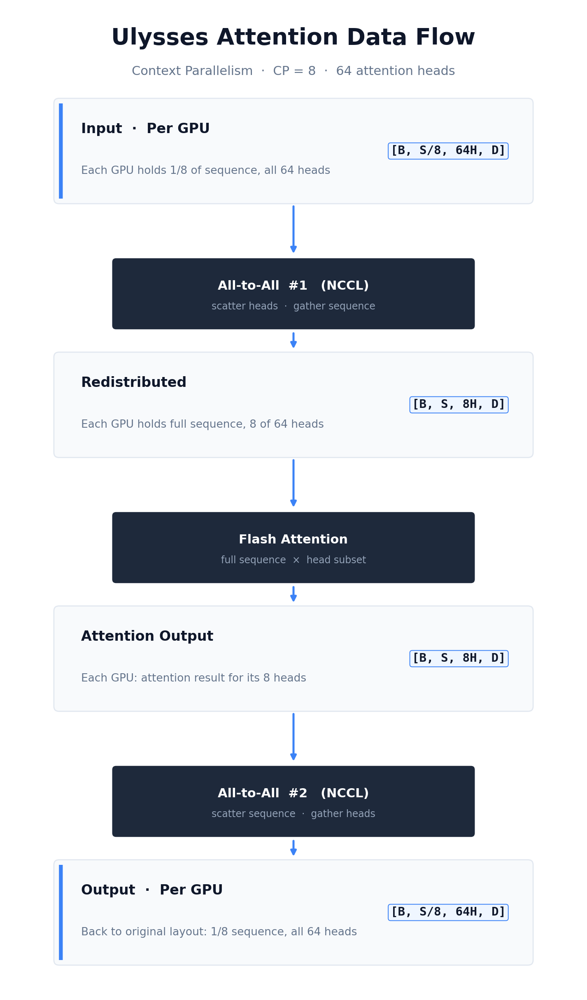
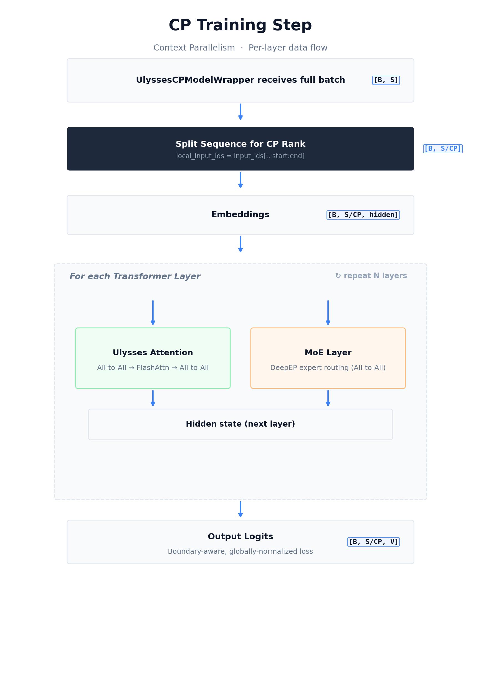

# Context Parallelism (CP)

CP splits long sequences across GPUs using Ulysses sequence parallelism with all-to-all
communication in attention layers. Use it when a sequence is too long to fit in single-GPU
activation memory. CP runs standalone or combined with EP (MoE models). Why sequence length, not
parameter count, drives that memory:
[GPU Training Theory §8](../reference/gpu-training-theory.md#activations-the-memory-sharding-doesnt-touch).

`data_parallel_size = world_size / cp_size`; gradient sync always spans all `world_size` ranks.
CP is **not compatible with TP** — both partition the same contiguous rank blocks, and TP has
already cut this rank's head count that Ulysses redistributes over.

## How Ulysses works

Naive sequence chunking breaks cross-chunk attention. Ulysses instead redistributes tensors around
the attention kernel: each GPU holds `S/cp_size` tokens but all heads, an all-to-all swaps that to
the full `S` tokens but `H/cp_size` heads for the attention compute, and a second all-to-all swaps
back. Multi-head attention is independent across heads, which is what makes this exact.

<div class="diagram-row" markdown>



</div>

## Implementation

`UlyssesCPModelWrapper` (`src/distributed/context_parallel/wrapper.py`) is the entry point. The
all-to-all (`UlyssesAllToAll`) is a custom autograd function: forward scatters heads and gathers
sequence, backward swaps the dims. Per-family attention wrappers in `layers/` subclass
`UlyssesAttentionBase` and pick one of two forward paths:

- **Optimized** (`_optimize_attention = True`, the default): RoPE on the local chunk before the
  all-to-all (no position gather), then Flash Attention with native GQA and zero transposes.
  Requires equal head_dim across Q/K/V.
- **Legacy** (MLA families GLM4 MoE Lite / Mistral4): all-to-all, gather full-sequence position
  embeddings, RoPE, then the MLA base's `_flash_attention` right-pads V to `qk_head_dim`, runs flash, and crops
  back to `v_head_dim`. MLA's `v_head_dim` differs from `qk_head_dim`, so the optimized GQA path
  cannot apply.

### Loss computation

CP computes loss per chunk with two corrections:

1. **Boundary tokens** — the causal label shift (`logits[:-1]` predicts `labels[1:]`) loses one
   prediction per chunk. Non-final ranks use their last logit to predict the first token of the next
   chunk.
2. **Globally-normalized sum loss** — completion-only training distributes tokens unevenly across
   chunks, so per-rank `reduction='mean'` biases gradients. Each rank computes
   `loss_i = cp_size * local_sum / global_tokens` with `global_tokens` the all-reduced non-masked
   token count. After FSDP2's `1/cp_size` gradient averaging every token contributes equally.

That form is rank-varying and exists for the gradient path only. Under `torch.no_grad()` (the eval
loop) the wrapper returns the rank-uniform group value instead — the CE sum and the aux term are
all-reduced over the CP group — because HF's DP-scoped metric gather keeps a single CP sibling's
copy as `eval_loss`, and a chunk-partial copy would bias it by that chunk's share of loss tokens.

The MoE router aux loss takes **no** `cp_size` factor. HF's `load_balancing_loss_func` returns a
per-chunk *mean*, so the FSDP average over CP ranks already reconstructs the global mean; a
`cp_size` factor would over-weight router balancing `cp_size`× for aux-loss families under EP+CP.

A model that returns an `aux_loss` while its config declares no `router_aux_loss_coef` **raises** — a
stand-in weight would train a different objective than the same config without CP. Set the field
through `model_init_kwargs`, or turn the aux loss off for that family with `moe_balancing`.

## Requirements

**NVLink-local topology** — `cp_size` must divide the NVLink domain (`gpus_per_node` on a standard
node, the rack on NVL72) and cannot exceed it; Ulysses' two all-to-alls per attention layer must stay
on NVLink. `cp_size=3` on an 8-GPU domain is rejected at config time, before the model loads
(`_validate_cp_locality`).

**Attention impl** — a real Flash Attention is required. `validate_model_for_ulysses` raises
`UlyssesConfigError` for any `_attn_implementation` outside `SUPPORTED_ATTN_IMPLEMENTATIONS` (FA2,
FA3, FA4, community kernel paths): `eager` and `sdpa` are rejected, and `flex_attention` is
auto-switched to FA4/FA2 by `load_distributed_model` when CP is active. A wrapper declaring
`REQUIRES_FLASH_ATTN_LABEL = False` waives the check for modeling code that cannot carry a flash
label at all (Bailing; see [bailing.md](../models/bailing.md#cp-wrapper)).

That check reads the *declared* implementation. The kernel CP calls is resolved separately by
`get_flash_attn_func` — FA3 on Hopper, FA4 (`flash_attn.cute`) on Blackwell, falling back to FA2 or
the community kernel when the arch-matched import fails. On Blackwell the wrapper vetoes FA4 for the
families whose FA4 backward emits NaN — head_dim-256 attention with partial rotary (Qwen3.5/3.6,
GLM-4 MoE Lite) — and calls FA2 instead (`model_fa4_backward_nan_prone`).

Leave `attn_implementation` at its auto-detected default: CP calls the non-varlen forward, which FA2
serves poorly on both architectures, and the arch-matched kernel is worth 1.2–3× at ≥32k tokens on
B300. Bailing is the exception — it needs an explicit `sdpa`, since transformers refuses the
auto-detected FA4 at model build and the CP loader has no SDPA retry.

**Head divisibility** — `cp_size` must divide both the Q and the KV head count. GPT-OSS (64 Q, 8 KV):
CP=8 → 8 Q / 1 KV; CP=4 → 16 Q / 2 KV; CP=3 rejected.

**Sequence length** must be a multiple of `cp_size`. `scripts/training/sft.py` sets `pad_to_multiple_of=cp_size`
and the collator factory routes to a padding collator that rounds each batch up — no manual collator
construction. A ragged batch that reaches SFT's `compute_loss` anyway is right-padded there, which needs
the tokenizer's `pad_token_id`: a `processing_class` without one raises rather than padding with
vocabulary token 0.

**Right padding only.** The Ulysses path ignores `attention_mask` — it calls dense flash attention
with `causal=` and has no varlen path — so it tolerates only padding a causal mask already ignores.
A left-padded batch is rejected on every forward: every real token would attend the leading pads
and the loss would silently differ from the same batch without CP. SMPO's collator left-pads
prompts, so under CP run SMPO with `per_device_train_batch_size=1`, where no padding is emitted.

### Supported model architectures

Source of truth: `WRAPPER_CLASS_MAP` in `src/distributed/context_parallel/layers/registry.py`, built
by walking the `UlyssesAttentionBase` subclass tree and reading each wrapper's `HF_MODULE_NAMES` (a
duplicate HF name raises). `CP_SUPPORTED_ATTENTION_CLASSES` is `tuple(WRAPPER_CLASS_MAP)` — there is
no separate accept list to keep in sync.

| Attention class | Wrapper | Path | Page |
|---|---|---|---|
| `GptOssAttention` | `GptOssUlyssesAttention` | optimized | [gpt-oss.md](../models/gpt-oss.md) |
| `Qwen3MoeAttention` (Qwen3 MoE) | `Qwen3MoeUlyssesAttention` | optimized | [qwen3.md](../models/qwen3.md#qwen3-moe) |
| `Qwen3Attention` (Qwen3 dense) | `Qwen3MoeUlyssesAttention` (reused) | optimized | [qwen3.md](../models/qwen3.md#qwen3-dense) |
| `Qwen3VLTextAttention` (Qwen3-VL text branch) | `Qwen3MoeUlyssesAttention` (reused) | optimized | [qwen3.md](../models/qwen3.md#qwen3-vl) |
| `Glm4MoeLiteAttention` | `Glm4MoeLiteUlyssesAttention` | legacy (DeepSeek-V3 MLA: separate qk/v head dims) | [glm4.md](../models/glm4.md) |
| `Mistral4Attention` | `Mistral4UlyssesAttention` | legacy (MLA: separate qk/v head dims, llama-4 scaling) | [mistral4.md](../models/mistral4.md) |
| `Qwen3_5MoeAttention` / `Qwen3_5Attention` | `Qwen3_5MoeUlyssesAttention` | optimized (post-attention sigmoid gate + partial RoPE) | [qwen3_5.md](../models/qwen3_5.md#cp-wrapper) |
| `BailingMoeV2Attention` / `…FlashAttention2` / `…SdpaAttention` (Ling 2.0) | `BailingMoeV2UlyssesAttention` | optimized (fused `query_key_value`, `dense` output projection, Q/K norm before partial RoPE) | [bailing.md](../models/bailing.md#cp-wrapper) |
| `Cohere2MoeAttention` | `Cohere2MoeUlyssesAttention` | optimized (interleaved fp32 rotary on sliding layers only; full-attention layers are NoPE) | [cohere2-moe.md](../models/cohere2-moe.md) |

**Not supported on production checkpoints:**

- **Qwen3.5 / Qwen3.6** — the full-attention wrapper exists, but every released checkpoint also ships `Qwen3_5MoeGatedDeltaNet` linear-attention layers (sequence-axis Conv1d + recurrent scan) that can't be sharded. Validation rejects any config whose `layer_types` contains `"linear_attention"`. See [qwen3_5.md — Why CP is blocked on real checkpoints](../models/qwen3_5.md#why-cp-is-blocked-on-real-checkpoints).
- **Ring-mini-linear-2.0** (`bailing_moe_linear`) — Lightning Attention-2 in most layers; validation rejects `BailingMoeV2LinearAttention` by name. Ling 2.0 itself is supported (table above).
- **Ling 3.0** (`bailing_hybrid`) — 3 of every 4 layers are `BailingMoeV3KimiDeltaAttention`, a KDA linear recurrence, and the MLA layers carry no wrapper; validation rejects the model as having no supported attention module.
- **LFM-2** — hybrid short-convolution layers mix tokens along the sequence axis, so a Ulysses split severs the conv receptive field.
- **Gemma 4** — KV-shared layers + `attention_k_eq_v`.
- **Laguna** — `LagunaAttention` has no Ulysses wrapper registered.
- **Inkling** — `InklingShortConvolution` runs a depthwise causal `Conv1d` over the sequence axis, and position enters as an additive relative-logits bias `flash_attn_func` cannot take (the family declares `_supports_flash_attn = False`). Validation rejects the conv class. Use EP (optionally + ETP) instead — see [Inkling](../models/inkling.md).
- **Zaya** — the CCA front-end runs depthwise + grouped `Conv1d` (kernel size 2) along the sequence axis and concatenates a delayed `v_proj_delayed(h_{t-1})` into V; both cross Ulysses chunk boundaries and would need a per-layer halo exchange the path does not provide.
- **DeepSeek-V4** — the CSA/HCA compressors (and the Lightning Indexer scoring against them) pool non-overlapping token windows along the sequence axis, so a CP shard would compress incomplete windows at every chunk boundary. Validation rejects the classes. Use EP instead — see [DeepSeek-V4](../models/deepseek-v4.md).
- **GLM-5 Next** (`glm5_next`) — 34 of 45 layers are `Glm5NextTextLinearAttention`, a KDA linear recurrence (sequence-axis conv1d k=4 + delta-rule scan); validation rejects the `"linear_attention"` entries in `layer_types`. Use EP instead — see [GLM-5 Next](../models/glm5-next.md).
- **Step-3.7 Flash** — `Step3p7Attention` has no Ulysses wrapper registered, so validation rejects the model as having no supported attention module. Nothing architectural blocks a wrapper (plain full/sliding GQA; 64/96 heads and 8 KV heads divide cp 2/4/8). Use EP instead — see [Step-3.7 Flash](../models/step3p7.md).

## CP with EP

EP is orthogonal to DP; CP reduces it. So `data_parallel_size = world_size / cp_size` whether EP is
on or off. CP does its all-to-all in attention and EP its DeepEP dispatch/combine in the MoE
block — different points in the forward pass, no conflict.

**Orthogonal mode** (`cp_size == world_size`): one CP group over all ranks, DP=1. **Partial mode**:
`world_size / cp_size` CP groups, each on a different batch.

CP always requires gradient sync when `world_size > 1`, even at DP=1 — each rank holds partial
gradients from its chunk. `DistributedTrainerMixin` applies FSDP2 across all ranks; for EP+CP the
same wrapper runs with EP params in `ignored_params`.

EP+CP requires node-local EP with `ep_group_size == nvlink_domain_size`
(`ParallelismConfig._validate_ep_cp` rejects cross-domain EP under CP). Supported 8-GPU shapes:
ep8/cp2 → DP4, ep8/cp4 → DP2, ep8/cp8 → DP1.

**Pure CP on a MoE still gets expert wrappers.** `_load_cp_model` hands `load_model_for_cp` an
`ep_size == 1` EP config whenever `needs_ep_wrappers` holds and the model declares experts, so the
MoE blocks run the [grouped-GEMM](../optimization/grouped-gemm.md) expert path rather than the stock
per-expert loop — `needs_ep_wrappers` forces Liger's swiglu/geglu off either way, so without it the
model would pay that cost for no speedup. Dense models under CP get no EP config.

## Usage

```bash
# CP-only (any supported model, long sequences)
torchrun --nproc_per_node=4 scripts/training/sft.py \
    examples/sft/qwen3/qwen3-4b-ultrachat.yaml --context_parallel_size=4

# EP+CP (MoE, ep_group_size must equal the NVLink domain)
torchrun --nproc_per_node=8 scripts/training/sft.py \
    examples/sft/gptoss/gptoss-20b-multinode-ep.yaml \
    --expert_parallel_size=8 --context_parallel_size=2
```

Programmatic: `parallelism_config=ParallelismConfig(ep_size=8, cp_size=8)`.

### Checkpoint saving

`save_cp_checkpoint` serves **dense** CP runs only. An MoE carries EP wrappers (grouped GEMM is
on by default), and the saver ladder checks for EP layers first, so EP+CP and even `ep_size=1`
MoE take the EP save — which strips the `.original_attention.` prefix itself.

The CP save runs on the FS-aware main process via `trainer.save_model(output_dir)`, using
`_find_cp_wrapper()` rather than `extract_model_from_parallel` (FSDP wraps the inner model *inside*
the CP wrapper, whose `__getattr__` proxy would make the standard unwrap go past it). The wrapper's
`state_dict()` remaps `.original_attention.` keys to standard paths and drops the duplicate dense
`.mlp.{gate,up,down}_proj` keys only on layers carrying routed experts — genuinely dense layers keep
their dense MLP weights.

On resume CP is a **Path B** mode: the trainer skips the checkpoint weight-reload (the CP wrapper
changes the module tree). The training scripts repoint `model_name_or_path` at the checkpoint so
`load_distributed_model` loads the trained weights at construction; a model not constructed from
the checkpoint raises rather than silently continuing on its current weights. Trainer state is
restored, and so are LoRA adapters — the saved CP-normalized keys are remapped back onto the live
wrapped names, and a wholesale key miss raises. `load_best_model_at_end` is refused at construction
for CP full fine-tunes (base weights only load at construction, so the best checkpoint cannot be
reloaded in place). See
[Checkpoints & Resume](../reference/checkpoints.md).

## Optimizations

The optimized path's native GQA (no `repeat_kv`) saves on the order of 6 GB per forward on a
20B-class GQA model, and the `[B, S, H, D]` layout drops the transposes. Both paths use native
BFloat16 all-to-all and fuse K/V into one all-to-all; the legacy path fuses cos/sin into one
`all_gather_into_tensor`. `torch.compile` gives no benefit — the all-to-all breaks the graph at
every attention layer (±0.0% on Qwen3-8B, CP=2, seq 16384, 2 GPUs (Blackwell)). Use Liger (default on).

## Limitations

**Trainers.** CP is declare-to-enable (`_supports_cp`, default `False`): only
`DistributedSFTTrainer` and `SmoothMarginPOTrainer` declare it. Every other trainer raises at
construction, and its entry script rejects `--context_parallel_size > 1` earlier through
`parallelism_config_from_args(..., supports_cp=False)`. Full matrix:
[Trainer Compatibility](../reference/trainer-architecture.md#trainer-compatibility). Nothing
inspects a trainer's loss for CP-safety, so a new trainer must verify its own objective before
declaring the flag.

**Models.** Only the wrappers in the [table above](#supported-model-architectures); anything else
raises `UlyssesConfigError`. Linear-attention and window-pooling blocks are rejected by class name
even when the surrounding attention is wrapped.

**Generation.** `UlyssesCPModelWrapper.generate()` raises: each rank holds one sequence chunk and the
Ulysses attention has no KV-cache path. Generate from a saved checkpoint without CP.

**Axis combinations.** CP composes with EP only; TP+CP, ETP+CP and PP+CP are refused by the
[allowlist](README.md#supported-combinations). EP alone OOMs at long sequences (it shards experts,
not activations) — that is the case CP exists for.

**Knobs.** Everything below raises unless the verdict says otherwise.

| Knob | Under CP | Gate |
|---|---|---|
| `packing`, `padding_free` | rejected — the Ulysses path runs a dense causal kernel with no per-document boundaries | `src/data/collators/factory.py`; `_reject_cp_incompatible_collator` re-checks a hand-built collator |
| left-padded batches | rejected on **every** forward (not cached — SMPO left-pads only some batches) | `context_parallel/wrapper.py` |
| `attn_implementation` | must resolve to FA2/FA3/FA4 or a community flash kernel; `flex_attention` is auto-switched with a warning, `eager`/`sdpa` rejected — except for a wrapper declaring `REQUIRES_FLASH_ATTN_LABEL = False` (Bailing), which runs on the `sdpa` label its model build forces | `SUPPORTED_ATTN_IMPLEMENTATIONS`, `validate_model_for_ulysses` |
| `reset_sinks: false` on GPT-OSS | rejected at model load — the CP attention kernels drop the sink column, so live sinks would misnormalize the softmax in every layer | `model_loading.py`, re-checked in `GptOssUlyssesAttention` |
| `label_smoothing_factor > 0`, `loss_type: dft` | rejected — the Trainer pops `labels` and pairs full labels with this rank's chunk logits | `validate_trainer_args_for_cp` |
| `compute_metrics`, `preprocess_logits_for_metrics` | rejected whatever `eval_strategy` is — eval under CP is loss-only, and `evaluate()`/`predict()` reach the metric path on demand | same |
| CP's own metrics (`mean_token_accuracy`, `entropy`, `aux_loss`, `num_attended_tokens_seen`) | accumulated locally per micro-batch and reduced once per log, so the metric path adds one collective per log instead of five to six per micro-batch | `sft/trainer.py` (`_drain_cp_metrics`) |
| multimodal inputs (`pixel_values`) | rejected — text-only | `context_parallel/wrapper.py` |
| `fsdp_shard_ep1_experts: false` | rejected — the CP path shards `ep1` experts unconditionally, so the flag would be a silent no-op | `_validate_fsdp_settings` |
| `accelerate launch` | rejected — CP requires `torchrun` | `model_loading.py` and `ParallelismValidationMixin` |
| `gradient_checkpointing` | supported; `use_reentrant` is forced to `True` (warned when the config sets `false`) | `mixins/base.py` |
| `use_liger_kernel` | supported; `cross_entropy` and `fused_linear_cross_entropy` are forced off (warned when explicitly enabled) | `kernels/liger/orchestrator.py` |
| `use_peft` / LoRA | supported — CP leaves attention unsharded, so adapters stay replicated | — |
| QLoRA (`load_in_4bit`) | supported on a **dense** model — CP keeps the standard loader and preserves `Params4bit`. On an MoE the grouped-GEMM loader takes over and rejects a quantized base (`use_grouped_gemm` is on by default) | `model_loading.py` |
| `use_hsdp`, `fsdp_reshard_after_forward` | supported — CP is one of HSDP's two accepted paths (pure DP, CP) and one of ZeRO-3's EP-free shapes | `_validate_hsdp`, `_validate_fsdp_settings` |
| `torch_compile` | not gated, and no measured benefit — the all-to-all breaks the graph at every attention layer | — |
| `save_sharded_ep` | rejected on a CP run — per-rank shards carry `.original_attention.` keys the merge script cannot remap | `validate_ep_sharded_save` |

## Adding a new model

1. Subclass `UlyssesAttentionBase` under `layers/`. Implement `_project_qkv` (returns `[B, S, H, D]`
   Q/K/V); the rotary defaults to rotate-half (`_apply_partial_rotary`), so override
   `_apply_rotary_core` only for a different one (GptOss split-concat, Cohere2 interleaved). For an
   MLA family subclass `MLAUlyssesAttentionBase` instead: it owns the geometry, the legacy path flag
   and `_apply_rotary_pos_emb`.
2. Declare the HF attention class name in the wrapper's `HF_MODULE_NAMES`. `layers/registry.py`
   imports every module in the package, so the file's existence is the whole registration; both the
   map and the accept tuple are derived from the subclass tree.
3. Test:

```bash
torchrun --nproc_per_node=2 \
    tests/gpu/parallelism/cp/test_cp_correctness.py
# EP+CP, if MoE (2-GPU minimal repro: EP=CP=world=2):
torchrun --nproc_per_node=2 \
    tests/gpu/parallelism/combined/test_ep_cp_correctness.py
```

Further CP tests live in `tests/gpu/parallelism/cp/`.

Background: [DeepSpeed-Ulysses](https://arxiv.org/abs/2309.14509).
