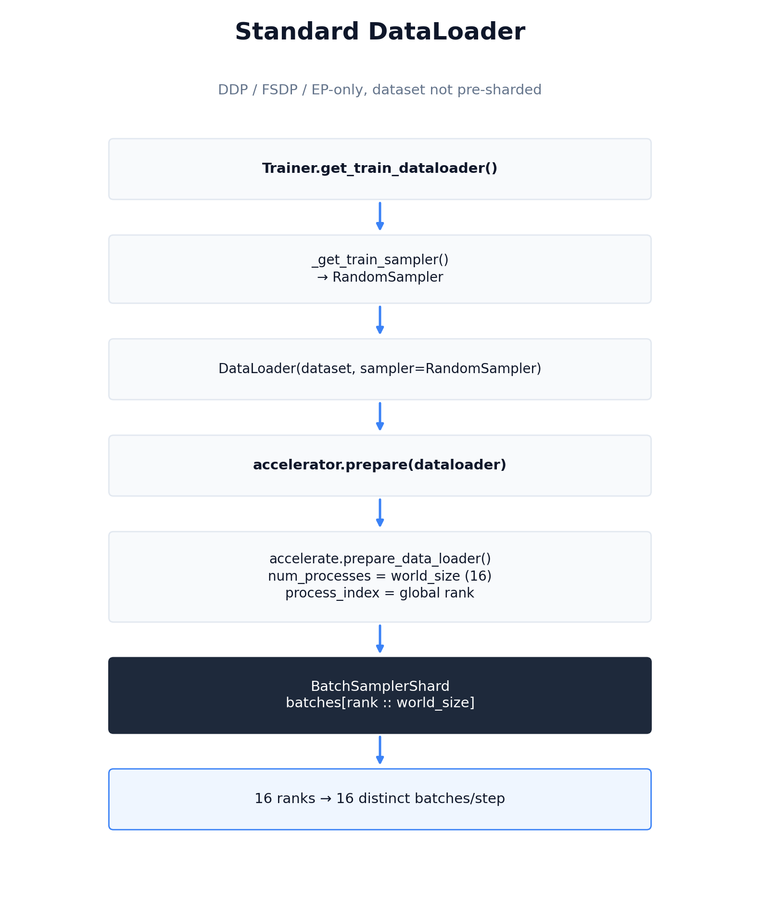
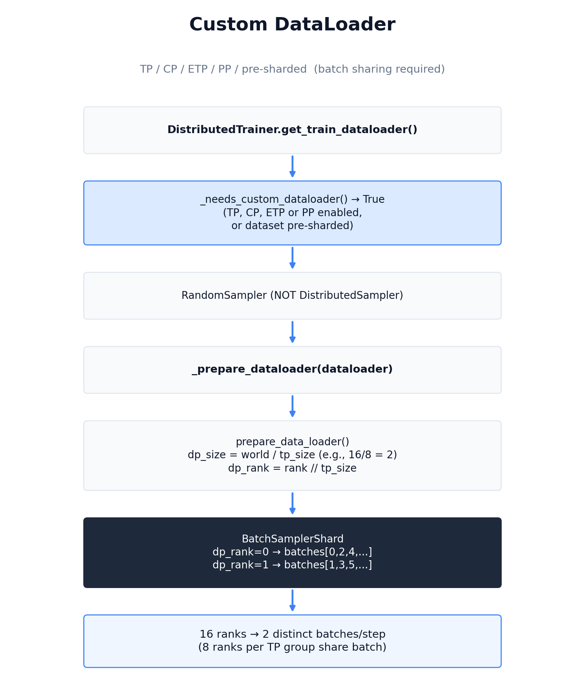

# Distributed Data Loading

Each parallelism mode shards data differently. The rule that drives every decision: which ranks need
the *same* batch.

| Mode | Data requirement | Reason |
|------|------------------|--------|
| DDP | Each rank gets different data | Standard data parallelism |
| EP | Each rank gets different data | EP is orthogonal to DP — it routes tokens to experts and returns them to the origin rank |
| TP | Ranks in a TP group get the **same** data | Weights are sharded; all shards need the same activations, combined by AllReduce |
| CP | Ranks in a CP group get the **same** sequence | The sequence is split across ranks (Ulysses) |
| Expert TP | Ranks in an expert-TP group get the **same** data | Expert FFN is sharded across the group |
| PP | Ranks of one pipeline chain get the **same** batch | Stage 0 reads `input_ids`, the last stage reads `labels`. PP itself is [not yet available](pipeline-parallelism.md); its stage-scoped sharding ships as a seam |

## Data parallel size

`data_parallel_size` is the number of distinct batches (= unique shards needed):

```text
dp_size = (world_size / pp_size) / max(tp_size, cp_size, expert_tp_size)
```

- DDP, EP-only: `dp_size = world_size` (EP is orthogonal)
- TP-only: `world_size / tp_size`
- CP-only: `world_size / cp_size`
- EP+TP: `world_size / tp_size` (only TP reduces DP)
- EP+CP: `world_size / cp_size` (only CP reduces DP)
- pure ETP (`ep_size=1`): `world_size / expert_tp_size`
- EP+ETP (`ep_size>1` AND `expert_tp_size>1`): `world_size / expert_tp_size` (experimental; the expert-TP group is node-local, EP itself may be node-local or cross-node)
- PP: `stage_world_size / max(...)`, where `stage_world_size = world_size / pp_size`

Computed once in `ParallelismConfig.__post_init__` (`src/distributed/parallelism_config.py`), applied
to one pipeline stage's rank block. `get_data_parallel_rank()` derives the shard index per mode from
stage-local coordinates, so every rank of a pipeline chain returns the same value — TP/CP take
`stage_local_rank // group_size`, expert-TP reads its sub-group membership (strided under node-local
EP, contiguous under cross-node EP), so partners sharing a dispatch rank process the same batch.

## How the DataLoader is built

`DataParallelDataLoaderMixin` (`src/trainers/mixins/dataloader.py`, composed into
`DistributedTrainerMixin`) takes the custom path when `_needs_custom_dataloader()` sees `is_tp_mode`,
`is_cp_mode`, `is_expert_tp_mode`, `is_pp_mode`, or `_dataset_presharded`; otherwise (DDP / EP-only,
not presharded) it uses the base Trainer flow. PP must take the custom path: accelerate's default
shards by **global** rank, which would hand every rank of a pipeline chain a different batch — stage
0 forwarding one row set while the last stage scores another's labels, with nothing raised.

On the custom path `_prepare_dataloader()` wraps the loader through Accelerate's
`prepare_data_loader` passing `num_processes=data_parallel_size` and
`process_index=data_parallel_rank` — **DP size/rank, not global world_size/rank**. For pre-sharded
datasets it passes `num_processes=1` (device placement only) so Accelerate does not re-shard the
already-disjoint slice. Prepared loaders are marked `_is_accelerate_prepared` to avoid double
preparation.

The samplers are not `DistributedSampler` — distribution happens in `prepare_data_loader` via
Accelerate's `BatchSamplerShard`, which yields batch `idx` to a process when
`idx % num_processes == process_index`. `data_seed` is passed through, so it owns the shuffle order
exactly as on the standard path; unset, the seedable sampler falls back to the ambient torch seed.
Dataloader workers are seeded by **DP rank**, not global rank, so TP/CP/ETP/PP siblings draw
identical worker randomness.

Under PP the train loader is forced to `drop_last=True`: a pipeline would freeze its P2P shapes on
the first step, so a short final batch would raise mid-epoch.

**Third-party sweeps over the dataset** — TRL's `precompute_ref_log_probs` builds its own loader and
prepares it with the world-keyed accelerator, so it would shard by global rank and let TP/CP/expert-TP
siblings forward *different* rows through a collective attention/expert path. `data_parallel_sweep()`
pins both ends of such a sweep to the DP axis for its duration: `prepare_data_loader` routes to
`_prepare_dataloader`, and the gather is deduplicated to one chunk per DP rank in DP order. It is an
identity when `dp_size == world_size`. Pre-sharded datasets are rejected under
`precompute_ref_log_probs`: TRL caches one rank-0-authoritative file that each rank would concatenate
onto its own different shard.

The two paths shard by different indices — the standard path by global rank (one distinct batch per
rank), the custom path by DP rank (ranks in a TP/CP group share a batch):

<div class="diagram-row" markdown>



</div>

## Per-trainer sampling

| Trainer | Sampler | Handles DP itself | `_prepare_dataloader` |
|---------|---------|-------------------|----------------------|
| SFT / SMPO | `RandomSampler` | No | for TP / CP / ETP / PP |
| Classification | `RandomSampler` | No | for TP / ETP / PP (no CP) |
| Online GRPO | `RepeatSampler` (TRL) | No (same seed all ranks) | for TP / ETP (no CP) |
| Offline GRPO | `MultiGroupSampler` | Yes (DP rank/size) | uses `prepare_data_loader(num_processes=1)` |

**Online GRPO** uses TRL's `RepeatSampler`: same prompts to all GPUs (for reward normalization across
generations) and prompt reuse across updates, with `mini_repeat_count = num_generations` and
`repeat_count = num_iterations * steps_per_generation`. Same seed on all ranks gives identical prompt
ordering; each GPU generates different completions, so an advantage centers each completion's reward
on its prompt-group statistics (`advantage[i] = (reward[i] - mean(group)) / (std(group) + eps)` under
TRL's default `scale_rewards="group"`). When TP or ETP reduces DP, `_prepare_dataloader` shards
prompts across DP groups while all ranks within a TP group share the same prompts.

On that custom-dataloader path the trainers override `_get_train_sampler`
(`GRPOTrainDataLoaderMixin` in `src/trainers/grpo/mixins/dataloader.py`) to size the sampler at the
loader's real DP consumption rate — TRL's world-rate geometry would re-roll part of every prompt
block and silently skip the rest. Two raises guard the shape: the DP-rate generation batch must be
divisible by `num_generations` (every round covers whole prompt groups), and under TP/ETP the
*per-rank* rows must be divisible by it too, because TP siblings inject duplicate blocks into TRL's
world-order reward gather and only whole per-rank groups regroup correctly. Pre-sharded datasets
consume per DP rank, so the rate is one rank's.

**Offline GRPO** uses `MultiGroupSampler` (`src/trainers/grpo/mixins/dataloader.py`). Advantages are
pre-computed per example at tokenization time (`compute_group_advantages` normalizes a group's
rewards via `advantage_method`, default `quantile_norm`), so the sampler does not pack a group into
one batch — it emits each group's indices in group-appearance order, shards the sequence across DP
ranks itself, then seed-shuffles each rank's slice (re-shuffled per epoch). The dataloader passes
`num_processes=1` to skip Accelerate's sharding. Per-rank index counts differ (the remainder goes to
the first ranks), so the loader all-reduce-MINs the per-rank batch count and truncates to the global
minimum, keeping every rank's optimizer-step count equal; a global minimum of 0 raises.

## Pre-processed (sharded) datasets

SFT can load pre-processed datasets at the **shard level** before the DataLoader is built. SFT
scripts pass DP rank/size (not global rank/world_size) into `load_datasets_auto()` so CP/TP group
members load the same shards. Each DP rank takes a **contiguous** range of shards, remainder to the
first ranks — 10 shards over 3 ranks gives `[4, 3, 3]` (`ShardedDatasetLoader`,
`src/data/sources/sharded_dataset.py`).

**Hard requirement:** `num_shards >= data_parallel_size`. A train split with fewer shards **raises**
at load time, since ranks with index `>= num_shards` would get zero examples; any other split warns.
A missing or globally empty `train`/`test` split is rejected at load
(`load_preprocessed_dataset`) — the sharded loader skips absent splits in silence, so the check is
what turns that into a failure.

The length-equalizer (`_equalize_presharded_length`, collective — every rank must reach it) runs for
**both train and eval**: unequal per-rank lengths make ranks run different step counts and hang at
the gradient sync or metrics gather, so each split is all-reduce-MIN truncated to the global minimum
(with a data-loss warning when uneven). A minimum of 0 raises instead of truncating every rank to
empty — for eval this means a small test split (sharding skips empty shards) must still yield at
least `data_parallel_size` non-empty shards, or evaluation must be disabled.

Downstream map/filter caches key on a forced deterministic fingerprint (`load_datasets` in
`src/data/sources/loading.py`) that folds in a content signature of the freshly loaded data, so
an in-place re-push cannot serve stale mapped rows. For pre-sharded loads the key also carries the DP
rank/size: each rank holds a disjoint slice, and without the DP identity equal-length shards would
stamp identical keys and non-writer ranks would load rank 0's mapped shard. Replicated (non-sharded)
loads keep a shared key so single-writer caching works.

The map/filter itself runs under `coordinated_dataset_operation`
(`src/data/pipeline/processing.py`): one writer rank per filesystem scope, the rest reading its
cache. That call **is** the rank ordering — never nest it in a main-first block
(`fs_aware_main_first`, `local_main_process_first()`). The phases join on the c10d store
(`store_reject_across_ranks`, bounded by `DIST_STORE_TIMEOUT_HOURS`), so an hours-long fresh-cache
map neither trips the NCCL watchdog on the waiting ranks nor hides a per-rank failure — the real
cause is re-raised on every rank. Shared vs
per-node scope: [Filesystem Handling](../data/filesystem-handling.md).

## Common pitfalls

- **Double-sharding:** a sampler that already shards DP (e.g. `MultiGroupSampler`) must pass
  `num_processes=1, process_index=0` to `_prepare_dataloader`, not let it resolve DP itself.
- **Global rank instead of DP rank:** use `get_data_parallel_rank()` / `get_data_parallel_size()` for
  samplers in TP/CP mode, not `accelerator.process_index` / world_size.
- **Treating EP like TP:** EP does not reduce DP. `dp_size = world_size` for EP-only.
- **Expecting a dataset list to shard:** `load_datasets` deliberately does not pass DP rank/size for
  a list path, so every entry loads whole — a sharded entry would otherwise get `1/dp` of its own
  `1/dp` slice, silent data loss. Combine sharded corpora offline with
  `scripts/before_training/prepare_dataset.py` instead.
