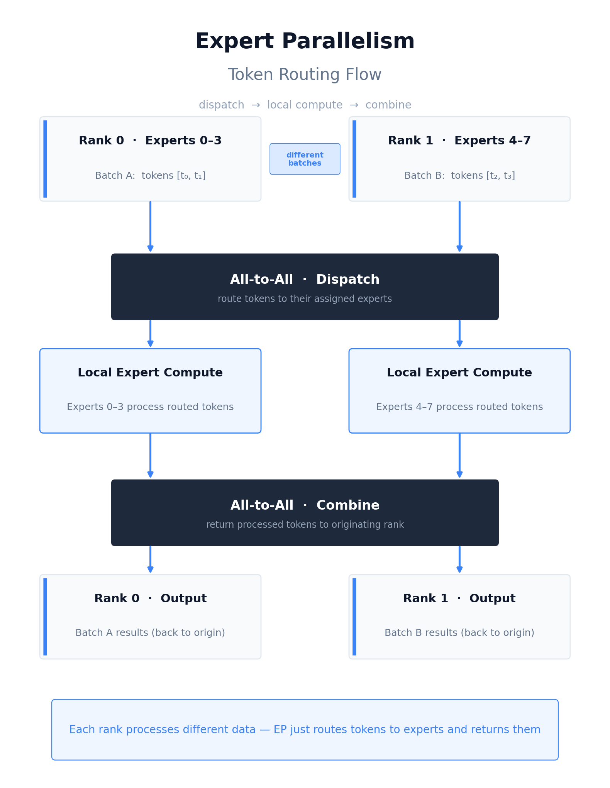
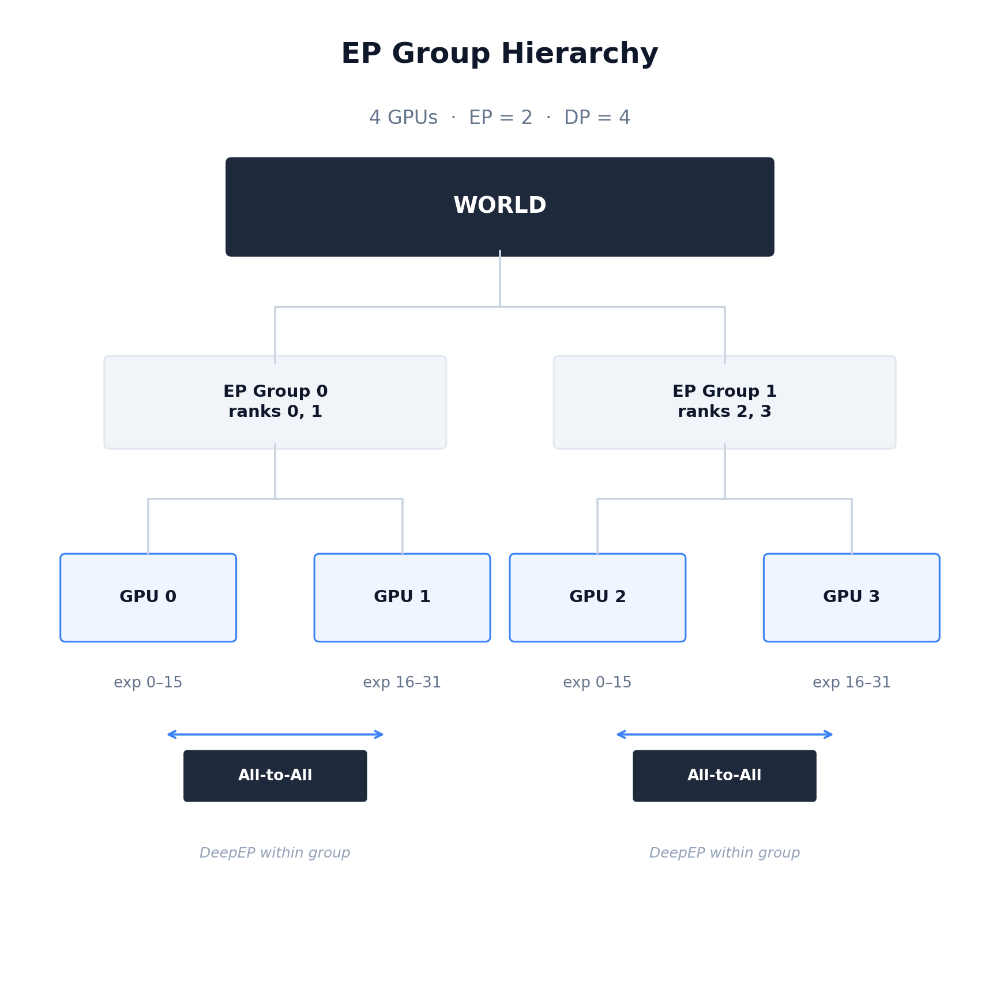

# Expert Parallelism (EP)

EP distributes MoE experts across GPUs to cut per-GPU expert memory while keeping full data
parallelism. EP is orthogonal to DP: unlike CP, TP and ETP it never reduces `data_parallel_size`.
Every GPU loads different data and holds a different expert slice; tokens reach the right experts via
DeepEP all-to-all. Use it when expert layers exceed single-GPU memory. Why the tokens-per-expert
count sets the speed of every expert GEMM:
[GPU Training Theory §2](../reference/gpu-training-theory.md#worked-example-why-small-per-expert-m-is-slow).

EP **requires** [DeepEP](https://github.com/deepseek-ai/DeepEP) — there is no NCCL fallback.
Non-EP gradients sync via FSDP2 (`fully_shard`, EP modules in `ignored_params`); router and expert
gradients sync via the EP layer's own backward hooks. [Expert Tensor
Parallelism](expert-tensor-parallelism.md) further shards each expert's FFN inside the EP group.

{ .diagram-narrow }

## Supported models

| Model | HF Class | EP Wrapper | Per-family page |
|---|---|---|---|
| GPT-OSS | `GptOssMLP` | `EPGptOssMoELayer` | [gpt-oss.md](../models/gpt-oss.md) |
| Qwen3 MoE | `Qwen3MoeSparseMoeBlock` | `EPQwen3MoELayer` | [qwen3.md](../models/qwen3.md#qwen3-moe) |
| Qwen3.5 / Qwen3.6 MoE | `Qwen3_5MoeSparseMoeBlock` | `EPQwen3_5MoELayer` | [qwen3_5.md](../models/qwen3_5.md) |
| GLM-4 MoE Lite | `Glm4MoeLiteMoE` | `EPGlm4MoELayer` | [glm4.md](../models/glm4.md) |
| Laguna | `LagunaSparseMoeBlock` | `EPLagunaMoELayer` (subclasses `EPGlm4MoELayer`) | [laguna.md](../models/laguna.md) |
| Inkling | `InklingMoE` | `EPInklingMoELayer` | [inkling.md](../models/inkling.md) |
| Bailing MoE / Ling | `BailingMoeV2SparseMoeBlock`, `BailingMoeV3SparseMoeBlock` (Ling 3.0) | `EPBailingMoELayer` | [bailing.md](../models/bailing.md) |
| LFM-2 MoE | `Lfm2MoeSparseMoeBlock` | `EPLfm2MoELayer` | [lfm2.md](../models/lfm2.md) |
| Gemma 4 MoE | `Gemma4TextExperts` | `EPGemma4MoELayer` | [gemma4.md](../models/gemma4.md) |
| Mistral4 | `Mistral4MoE` | `EPMistral4MoELayer` | [mistral4.md](../models/mistral4.md) |
| DeepSeek-V4 | `DeepseekV4SparseMoeBlock` | `EPDeepseekV4MoELayer` | [deepseek-v4.md](../models/deepseek-v4.md) |
| Zaya | `ZayaSparseMoeBlock` | `EPZayaMoELayer` | [zaya.md](../models/zaya.md) |
| Cohere2 MoE | `Cohere2MoeSparseMoeBlock` | `EPCohere2MoELayer` | [cohere2-moe.md](../models/cohere2-moe.md) |
| GLM-5 Next | `Glm5NextTextMoE` | `EPGlm5NextMoELayer` | [glm5-next.md](../models/glm5-next.md) |
| Step-3.7 Flash | `Step3p7SparseMoeBlock` | `EPStep3p7MoELayer` | [step3p7.md](../models/step3p7.md) |

Source of truth: `MOE_LAYER_MAP` in `src/distributed/expert_parallel/patching.py`, derived from the
`EPMoELayerBase` subclass tree.

- **Bailing / Ling** need `trust_remote_code=True` and have no aux router loss; freeze the router
  with `freeze_layers_patterns: ["*.mlp.gate.weight"]` during SFT.
- **LoRA** targets attention (PEFT) and the experts (native grouped adapters — list expert names in
  `lora_target_modules`). Attention adapters are replicated across EP ranks; expert adapters are
  rank-local and gathered on save. Expert LoRA is rejected with `expert_tp_size > 1`. The grouped
  adapters honor `r` / `alpha` / `dropout` / `use_rslora`; knobs with no grouped implementation
  (`use_dora`, `lora_target_parameters`) are rejected rather than applied to the attention half alone.
  See [PEFT](../optimization/peft.md#moe-models-expert-targets-and-full-trained-modules).

### Per-family EP restrictions

`EPMoELayerBase` declares six capability flags, all defaulting to `True`; a family turning one off
is the whole restriction. Every family absent from the table inherits the defaults and runs the full
EP surface. The table is pinned against the classes by
`tests/cpu/parallelism/test_docs_limitation_tables.py`.

| Family | Restricted capability | Class attribute |
|---|---|---|
| Bailing MoE / Ling | transient balancing bias — routing runs entirely inside the hub gate, so bias-update balancing requires the native `expert_bias` slot and raises rather than falling back to a trainer-only side-buffer ([MoE balancing modes](../training-methods/callbacks.md#moe-balancing-modes)) | `_supports_transient_balancing_bias` |
| Gemma 4 MoE | routing replay | `_supports_routing_replay` |
| Gemma 4 MoE | `fp32_non_ep_params` — refused at load ([Precision control](#precision-control)) | `_supports_fp32_non_ep_params` |
| DeepSeek-V4 | vLLM weight sync — online and environmental GRPO are rejected at construction | `_supports_weight_sync` |
| Inkling | vLLM weight sync — the hub namespace is WeightConverters-only, so a server loading hub names would silently skip every synced tensor | `_supports_weight_sync` |
| Mistral4 | vLLM weight sync — vLLM 0.26.0 registers no `mistral4` class at all, so the composite loader has no text tower to build for an export ([mistral4.md](../models/mistral4.md#serving)) | `_supports_weight_sync` |
| Zaya | gradient checkpointing | `_supports_gradient_checkpointing` |
| Zaya | routing replay | `_supports_routing_replay` |
| Zaya | vLLM weight sync — vLLM 0.26.0 ships no Zaya implementation | `_supports_weight_sync` |
| Cohere2 MoE | vLLM weight sync — no end-to-end sync validated against the pinned vLLM 0.26.0 server | `_supports_weight_sync` |
| Cohere2 MoE | lazy loading — the Command A+ index spells the vision tower `model.vision_tower.vision_model.*`, a from_pretrained-only conversion the lazy loader does not apply | `_supports_lazy_loading` |
| GLM-5 Next | vLLM weight sync — the live tree spells the KDA/hyper-connection tensors differently from the hub namespace a server reads, and no pinned rollout engine loads `glm5_next` | `_supports_weight_sync` |

One restriction sits outside that table because it is keyed on a model type, not a flag: **Bailing**
declares `_WEIGHT_SYNC_UNSUPPORTED_MODEL_TYPES = ("bailing_hybrid", "bailing_moe_linear")`, so online
and environmental GRPO are refused for Ling 3.0 and Ring-mini-linear-2.0 — no pinned rollout engine
registers a model class for those spellings. Ling 2.0 syncs normally.

Attention-side support is a separate question owned by each axis: which families TP can shard is
`TP_SHARDABLE_ATTENTION_CLASSES` ([TP](tensor-parallelism.md#supported-models)), and which CP can
split is the Ulysses wrapper registry
([CP](context-parallelism.md#supported-model-architectures)). Router balancing per family:
[Callbacks](../training-methods/callbacks.md#routerbiasbalancingcallback).

## EP grouping

`ep_size` must divide `num_experts` exactly — DeepEP dispatch assumes a uniform expert→rank
division. `ParallelismConfig.validate_against_model_config` raises off `config.json` at the top of
`load_distributed_model`, before the process groups and the meta shell;
`EPConfig.finalize_expert_assignment` re-checks it once the EP groups exist. `ep_group_size` must
divide the NVLink domain (node-local); under `ep_scope="global"` the bound is the **stage** world
(`world_size / pp_size`), and divisibility alone is not enough — the group must also tile that world
as equal contiguous per-domain blocks ([Multi-Node](multi-node.md#node-local-vs-cross-node-ep)). On a
single 8-GPU node every pure-EP job is DP=8; what changes is how many DeepEP dispatch groups form.

{ .diagram-narrow }

Example: 32 experts, world=4, `ep_size=2` → 2 EP groups of 2 GPUs, 16 experts each, DP=4.
Node-local EP assigns consecutive ranks within a domain; cross-node EP (`ep_scope="global"`) uses
the **column-block** layout — see [Multi-Node](multi-node.md#node-local-vs-cross-node-ep).

`ep_scope="auto"` (the CLI default) picks node-local when `ep_group_size <= nvlink_domain_size`,
else cross-node. `"node"` forces NVLink-only groups; `"global"` spans domains over RDMA.

### Single-domain multi-group EP races and hangs

Inside **one NVLink domain** (not one OS node — on NVL72 the domain is the rack), `ep_size=4` on
8 GPUs (two 4-rank groups) makes the groups' DeepEP combine barriers
**race FSDP2's DP-wide NCCL collectives**. Both backends fail, with different symptoms: the `legacy`
buffer (DeepEP V1) deadlocks deterministically on ~step 2 (`DeepEP timeout check failed` →
`cudaErrorLaunchFailure`), and the `elastic` default (V2) faults with `CUDA error: Invalid access of
peer GPU memory over nvlink`. Both measured on 8×B300 against an `ep8` control that trains clean on
the same harness, with gradient checkpointing on or off; `CUDA_DEVICE_MAX_CONNECTIONS=1` (baked into
the images) does not cover it. `ParallelismConfig._validate_single_domain_multigroup_ep` **rejects the
shape at config construction**, before the model loads;
`EpIntrospectionMixin._setup_ep_gradient_checkpointing` is a second gate after load. A single node
has no cross-node reduce to defer, so this stays blocked.

Safe single-node pure-EP shapes — one group, or 2-rank groups:

- **`ep_size == GPUs in the job`** → single group. `ep4` on 4 GPUs runs clean (the online-GRPO shape
  where training GPUs join EP and a separate vLLM server holds the rest); `ep4` on 8 races.
- **`ep_size == gpus_per_node`** → one group across the node (`ep8` on 8).
- **`ep_size == 2`** → many 2-rank groups, clean.

The only 4-way expert split left on 8 GPUs is EP+**ETP** (`ep4 + etp2`), which the gate accepts
because `ep_group_size` then fills the domain, and which is GPU-validated
([ETP validation rules](expert-tensor-parallelism.md#validation-rules)). Attention **TP does not
help** at all: it leaves `ep_group_size` untouched, so `ep4 + tp2` is rejected exactly like bare
`ep4`.

### Multi-node multi-group EP is supported

**Across nodes**, multiple EP groups (`num_ep_groups > 1`) are data-parallel replicas — node-local
EP across domains, or a cross-node EP group replicated within a larger cluster. Here the toolkit
avoids the race instead of blocking: every backward-time collective stays inside the EP group and
the cross-replica DP average is deferred to one post-backward sweep. Node-local `ep8×2` and
cross-node `ep8` (two replicas) both converge and match single-group `ep16` on 2× `p6-b300.48xlarge`.

That sweep covers every shape holding more than one EP group, the single-node ones (`ep2`,
`ep2+tp2`) included. Mechanism:
[Multi-Node → deferred cross-replica sync](multi-node.md#deferred-cross-replica-sync).

`CUDA_DEVICE_MAX_CONNECTIONS=1` is a free global default (baked into the images): neutral on dense
and `ep_size=2`, **+9.7%** on `ep_size=8`.

## Quick start

```bash
torchrun --nproc_per_node=8 scripts/training/sft.py \
    examples/sft/gptoss/gptoss-20b-multinode-ep.yaml \
    --expert_parallel_size=8
```

EP patching and gradient sync are automatic. Programmatically, pass
`parallelism_config=ParallelismConfig(ep_size=8)`; `trainer.save_model()` gathers expert slices, and
`trainer.cleanup_ep()` destroys DeepEP buffers before exit.

## Configuration

EP flags live on `DistributedArguments` (`src/args/distributed_args.py`):

```python
expert_parallel_size: int = 1     # >1 enables EP
ep_scope: str = "auto"            # "auto" | "node" | "global"
nvlink_domain_size: int = 0       # NVLink locality unit (0 = auto)
use_grouped_gemm: bool = True     # grouped-GEMM expert compute (SM90+)
ep_buffer_backend: str = "auto"   # "auto"/"elastic" | "legacy"
save_sharded_ep: bool = False     # per-rank save (needs merge script)
fp32_router: bool = False
fp32_experts: bool = False
fp32_non_ep_params: bool = False
fp32_grad_reduce: bool = False    # fp32 cross-rank grad reduction, bf16 storage
```

Training args: `bf16=True`, `gradient_checkpointing=True` (recommended).
`ddp_find_unused_parameters=True` is required for EP and set automatically by the entry scripts —
do not rely on setting it yourself. With GC the trainer calls
`enable_ep_gradient_checkpointing()` and sets `args.gradient_checkpointing=False` so HF Trainer does
not re-enable it.

**`fp32_grad_reduce`** upcasts the router grad (always reduced) and the expert cross-replica grad
(only when `num_ep_groups > 1`) to fp32 for the collective and writes back bf16. bf16 reduction is
lossy and the error grows with rank count — worth enabling for many-rank / multi-node EP.

### Precision control

| Flag | Scope | Effect |
|---|---|---|
| `fp32_router` | Router/gate weights | FP32 master weights, BF16 compute via autocast |
| `fp32_experts` | Expert weights | FP32 master, BF16 compute. No effect when FSDP2 manages replicated experts (`fsdp_shard_ep1_experts` at `ep_group_size == 1`) — use `fp32_non_ep_params` there |
| `fp32_non_ep_params` | Attention, embed, norm | FP32 master, BF16 compute |

`fp32_non_ep_params: true` unconditionally implies `fp32_router: true` — every family except Gemma 4
keeps its router inside the EP wrapper, where leaving it BF16 next to FP32 dense params would trip
FSDP2's uniform-dtype check.

**Gemma 4: `fp32_non_ep_params` under EP is refused at load**, off the family's
`_supports_fp32_non_ep_params = False` and before the model is built. Its router (`Gemma4TextRouter`)
lives in the parent decoder layer and its norms re-emit activations at weight dtype, so the upcast
would feed fp32 tokens into DeepEP's 2-byte transport. `fp32_router` is a warned no-op there for the
same reason — the router is outside the wrapper and stays BF16; only `fp32_experts` applies.

**AdamWBF16** is auto-enabled with `bf16=True` (6 vs 12 bytes/param, stochastic rounding on the
weight write) and takes precedence over the dtype-grouped optimizer, so it — not
`fp32_non_ep_params` — decides the optimizer. It handles the mix internally: bf16 params take the
fused SR kernel, fp32 params standard in-place AdamW. See
[BF16 Optimizer](../optimization/bf16-optimizer.md).

## DeepEP backend

[DeepEP](../infrastructure/deepep.md) owns installation, buffer sizing, transport and fabric tuning.
What an EP run has to plan around:

- **Two dispatch ceilings**, both raised at buffer sizing rather than left to fault mid-kernel. The
  32-bit wire index caps every topology at `2³¹ / (num_topk × padded_hidden)` ≈ **175k tokens per
  forward** for GPT-OSS. Cross-node (Gin) dispatch caps at `HALO_DEEPEP_GIN_MAX_TOKENS_PER_RANK`
  (default **8192**, `0` disables), above which an EFA proxy-GIN dispatch **wedges instead of
  erroring**. The second is the binding limit on `per_device_train_batch_size × max_length` for any
  `ep_scope=global` run spanning more than one NVLink domain
  ([AWS EFA](../infrastructure/deepep.md#expert-parallelism-over-aws-efa)); intra-node NVLink
  dispatch is validated to 65536 tokens per rank. Both are applied before the load as well, against
  the declared budget — `rows-per-forward × per_device_train_batch_size × max_length`, with
  `max_length: null` resolved to the model's own context window (the largest budget that spelling
  can mean).
- **The dispatched count is `per_device_train_batch_size × tokens-per-sequence`.** It does not scale
  with `num_generations` or `gradient_accumulation_steps`, and the buffer is per-rank, so raising
  `ep_size` does not lower it. Bound the *single-sequence* length: `per_device_train_batch_size = 1`
  for long sequences, and cap SFT `max_length` or the RL rollout budget.
- **`PYTORCH_CUDA_ALLOC_CONF=expandable_segments:True` composes with the `ElasticBuffer`** on
  single-node runs — set it when variable-shape packing at `per_device_train_batch_size > 1`
  fragments the allocator.
- **Dtype contract** (`src/distributed/expert_parallel/autograd.py`): `topk_weights` must be FP32
  contiguous; token tensors keep their dtype across dispatch/combine. The wire zero-pads the feature
  dim to a multiple of 256 and slices it back symmetrically (GPT-OSS hidden 2880 → 3072), so
  gradients are exact.
- **`ep_buffer_backend: legacy`** selects the V1 CUDA-IPC `deep_ep.Buffer` — numerically identical,
  intranode only, and rejected at config time for a cross-node group, a dispatch width above 8
  NVLink peers or above `gpus_per_node`, or a rank count DeepEP ships no tuned `Config` for. Destroy
  buffers before process exit (`trainer.cleanup_ep()`).

## Gradient synchronization

Hybrid sync (`src/distributed/expert_parallel/grad_sync.py`):

- **Non-EP params** — FSDP2 `fully_shard` reduce-scatter over the DP world; EP modules sit in
  `ignored_params`.
- **Router params** (`register_post_accumulate_grad_hook`): computed on the local batch before
  all-to-all, then `all_reduce(SUM) / world_size`.
- **Expert params**: the DeepEP backward already aggregates within the EP group, so the hook carries
  no collective — it divides by `world_size / expert_tp_size` and nothing else.

Hooks integrate with accelerate's `GradientState`: they skip sync while `sync_gradients` is False
(accumulation steps). A post-accumulate hook fires only for params in that backward's graph, so a
bank (or a single expert in the eager loop) that idles in the **sync** microbatch after accumulating
earlier would miss the divide — the layer adds a zero-valued graph edge onto every
already-accumulated expert param (`_expert_hook_grad_edge`) so the hook always reaches it; a bank
with no accumulated grad keeps `grad=None` and the optimizer skips it.

**More than one EP group registers no hooks at all.** The cross-replica `all_reduce(SUM)` those
topologies need cannot ride a post-accumulate hook — it fires only where a grad accumulated, so a
rank whose dispatch delivered no tokens for a layer would leave its replicas hanging in a collective
it never enters. `EPConfig.defer_grad_sync` routes every such shape, single-node included, to the
[post-backward sweep](multi-node.md#deferred-cross-replica-sync); `ep_group_size == 1` under
`fsdp_shard_ep1_experts` is the exception, since FSDP2 already owns those experts.

**Gradient clipping** is custom because experts are distributed
(`_compute_global_grad_norm`, `src/trainers/mixins/grad_sync.py`): local expert grad-norm² per rank → TP shard
norms batch-`all_reduce(SUM)`ed via `._local_tensor` → expert norms `all_reduce(SUM)`ed over the
expert-TP group, then the **dispatch** group, then across replica groups divided by `num_ep_groups`
→ `sqrt(expert² + non_expert² + tp_shard²)`.

## Gradient-checkpoint dispatch replay

A checkpointed layer runs its body twice, and the second run must NOT touch DeepEP: a fresh dispatch
reuses the same `ElasticBuffer` and invalidates the handle the original forward's backward node
still holds, which corrupts every gradient in the model and raises nothing. So the first pass caches
detached dispatch/combine results and the recompute replays them through `ReplayDispatchFunction` /
`ReplayCombineFunction`; only the expert compute is recomputed, and backward still calls
`buffer.combine()` / `buffer.dispatch()` for the gradient comm.

That cache lives on an `EPCheckpointScope` (`src/distributed/expert_parallel/gc_scope.py`) created
per checkpoint invocation and entered by both passes, not on the layer: concurrent frames stay
separate (a pipeline stage would keep several microbatches in flight), and a `no_grad` reference or teacher pass
cannot reach a scope it did not create. The recompute signal is the scope's pass counter, not grad
mode, so replay works in both checkpoint modes — but the two modes are still **not**
interchangeable.

`use_reentrant=True` is **required** — the trainer forces it. Non-reentrant triggers its recompute
lazily, when backward first needs a discarded tensor; nothing imposes a common order across ranks,
they desynchronize, and DeepEP's barrier times out — `cudaErrorLaunchFailure`, an unrecoverable
abort, not a raised error. Measured on 2×B300: reentrant is grad-exact (worst relative gradient
error 4.3e-05 vs no checkpointing, across all 155 parameters), non-reentrant aborts. (Pipeline
parallelism — [not yet available](pipeline-parallelism.md) — would invert the rule: its schedule
serializes each microbatch's backward, and the shipped config-time gates already encode that.)

Under [routing replay](../training-methods/grpo/environmental-grpo.md#off-policy-mismatch-and-stability-knobs)
the recompute reads the frame's saved expert selection. Expert-load counters record only a scope's
grad-driven **original** pass, gated on the outer grad mode captured at invocation: the recompute
never double-counts `moe/*` metrics or bias-update balancing, and a `no_grad` forward through a
train-mode checkpointed model (offline GRPO's KL reference pass) records nothing either.

Scopes are installed automatically when `gradient_checkpointing=True` and EP is active, and they
follow every later re-enable: `enable_ep_gradient_checkpointing` wraps the model's own
`gradient_checkpointing_enable`. Online GRPO depends on this — TRL wraps generation in
`disable_gradient_checkpointing`, whose exit restores a bare checkpoint from the args once per step,
and a layer that entered backward without a scope raises rather than silently corrupt the gradients.

## Kernels

Expert compute uses [Grouped GEMM](../optimization/grouped-gemm.md)
(`torch.nn.functional.grouped_mm`) on SM90+ by default; otherwise a per-expert loop accumulates with
`index_add_`. The win scales with local experts per rank (`num_experts / ep_size`): large with many
(Qwen3-30B EP=2, 64 experts/rank: +243% at batch 1), while gpt-oss-20b EP=8 (4 experts/rank) is
faster on the loop from batch 2. Keep the default unless profiling says otherwise; full grid on the
[Grouped GEMM guide](../optimization/grouped-gemm.md).

GptOss's clamped-SwiGLU runs as a single fused Triton kernel on the grouped path
(`src/kernels/fused_glu.py`). Liger is the default and `torch.compile` reaches about the same gain
on EP MoE — the DeepEP all-to-all breaks the graph at every MoE boundary either way
([torch.compile](../optimization/torch-compile.md)).

Whichever kernel a family resolves, a layer with a real dispatch group (`ep_size > 1`) traces it on
its **first forward, before that forward's dispatch** (`_warm_activation_graphs`): one grad-enabled
pass with a backward and one under `no_grad`, at two token counts — these kernels take the element
count as a runtime argument and Triton compiles a separate binary per divisibility-by-16 class of it.
The inputs are zeros rather than a draw, and the backward runs under identity saved-tensor hooks:
the warm-up sits inside the gradient-checkpointed block, whose recompute restores the RNG to region
entry and whose non-reentrant form would otherwise recompute the whole block mid-forward. A cold
activation compiles between `dispatch` and `combine`
instead, where every peer of the group is already inside DeepEP's barrier — and that barrier's budget
bounds rank *skew*, not idle time. At `ep_size == 1` the dispatcher is a no-op, so there is no barrier
to stall and no warmup.

## Model loading

`ep_lazy_loading` (default `true`) builds the model shell with **parameters on the meta device and
buffers computed for real** (`accelerate.init_empty_weights(include_buffers=False)`), then streams
each rank's expert slice straight from safetensors
(`src/distributed/expert_parallel/lazy_loader.py`). Buffers must be real: a config-less rotary derives
`inv_freq` from ctor args it never stores, which a meta build loses irrecoverably. The
`from_pretrained(device_map="meta")` route strands the non-persistent ones on meta, so it builds a
config-only twin and grafts them back. The shell carries the **run's** dtype, not the checkpoint
config's. An architecture that route cannot place is built from the config alone; a failure there
raises rather than falling back, since `from_pretrained` inside a meta context still streams the whole
checkpoint into host RAM.

State the checkpoint does not carry (`score` for reward / classification on top of a base LM
checkpoint) is random-initialized through the family's own `_init_weights`, exactly as
`from_pretrained` does; the run's identical seeding makes every rank draw the same values. A module
only *partially* absent raises rather than overwrite the tensors that did load, and a tied shadow
(`lm_head.weight`) is left to the post-load `tie_weights()`. A parameter **or buffer** that reaches
device placement still on meta raises — filling either would train or score uninitialized memory that
differs on every rank.

The disk side is guarded symmetrically, because a ranged read is silently satisfiable by a checkpoint
whose shapes disagree with the config: every materialized tensor's shape is checked against the live
target, a fused expert axis longer than the config's expert count raises before the read, a
per-expert fusion must cover the rank's full contiguous expert range with both GLU halves, keys
matching no model tensor are warned once, and two disk keys claiming one tensor is refused (an
error). The per-rank reads are fenced through the same
rank-consensus seam the save side uses, so a torn shard on one rank fails the whole world with the
real disk error instead of stranding peers at the next collective.

## Checkpointing

| Mode | Writers | Output | Loading |
|---|---|---|---|
| **Gathered** (default) | one rank, streaming | HF-standard, auto-sharded | `from_pretrained()` |
| **Sharded** (`save_sharded_ep`) | every rank, in parallel | Per-rank files | `merge_ep_shards.py` first |

**Gathered:** experts are `all_gather`ed (every rank must enter) but only the **save rank** keeps
the tensors — global rank 0 on a shared FS, each node's local rank 0 otherwise. `retain` reaches
inside the family gather, so a non-writing rank joins every collective and returns `{}` without
running the layout assembly (per-expert split, re-interleave, transpose + `contiguous`, host copy)
that follows it; the expert-axis gather itself receives into one preallocated buffer rather than a
shard list plus a `cat`. Both bound the *transient* on every rank that keeps nothing. It streams one EP
layer at a time into a `StageShardWriter` and finalizes with `close_as_hf_checkpoint()`, so its host
RAM peaks at the replicated non-expert params plus one gathered layer and one pending shard
(`save_max_shard_size`, default `5GB`) — not the whole checkpoint. At gpt-oss-120b (ep8) that peak
is ~11 GB on the writer; at Qwen3.5-397B-A17B (ep64) ~26 GB. The plain FSDP2, CP and TP gathered
saves stream the same way, one decoder layer at a time
(`stream_gathered_checkpoint`) — ~22 GB on the writer at 397B instead of the whole 794 GB state
dict.

**Sharded exists for write bandwidth, not for memory.** N ranks write their own slice in parallel,
so the pause at each save is bounded by one rank's shard instead of by the whole artifact funnelled
through a single writer. Host memory is not a reason to choose it — a sharded save holds *more* per
node (every local rank buffers its own slice). The cost is that nothing loads the result:
`merge_ep_shards.py` must run before resume or serving, and the merge carries no optimizer state, so
a resume from the merged directory warm-restarts. Pair it with `save_only_model: true`, as every
shipped sharded config does. `save_max_shard_size` does not apply to these files — a per-rank shard
is one file by design; the cap bounds the gathered save and the merged artifact.

**Sharded** writes `model-{rank:05d}-of-{world_size:05d}.safetensors` plus an index carrying
`ep_size`. `validate_ep_sharded_save()` rejects it **at trainer construction** whenever
`ep_group_size != world_size`, `expert_tp_size > 1`, CP, native expert LoRA,
`merge_expert_lora_on_save`, a `model_type` no EP layer class claims or whose EP layer exports the
hub namespace through transformers' save-side revert (Step-3.7 Flash — the merge streams key by key
and cannot apply it), or a non-shared multi-node filesystem. A run with **no EP layers at
all** (dense, or an MoE without EP wrappers) is rejected too: every save would be an ordinary
gathered checkpoint while a planned merge waits for shards that never appear. The merge raises on an
incomplete shard set.

```bash
python scripts/after_training/merge_ep_shards.py --input_dir checkpoint --output_dir merged
```

On resume, EP is a **Path B** mode: the gathered HF checkpoint cannot load into the EP-fused
tree, so the trained weights load at model construction — the training scripts repoint the model
source at the checkpoint, and the checkpoint loader raises when the live model was constructed from
anything else, rather than silently continuing on stale weights. The loader then restores adapters
and extra trained params; optimizer, scheduler and balancing biases resume from trainer state. An
unmerged sharded save is refused at resume resolution, and `load_best_model_at_end` is refused
under EP full fine-tune (export the best checkpoint instead). See
[Checkpoints & Resume](../reference/checkpoints.md).

**Non-EP params in EP+TP saves** take three routes: DTensor attention params through
`full_tensor()`, hand-sliced non-DTensor params (GptOss `sinks`) all-gathered over the TP group, and
replicas from rank 0. All ranks must enter the collectives even though only one writes.

## Limitations

**Trainers.** Every trainer supports EP (`_supports_ep`, default `True`, never overridden), and the
same flag gates the `ep_size == 1` grouped-GEMM wrappers. The families whose EP layer declares
`_supports_weight_sync = False` narrow this — online and environmental GRPO raise at construction for
each of them ([Per-family EP restrictions](#per-family-ep-restrictions)). Matrix:
[Trainer Compatibility](../reference/trainer-architecture.md#trainer-compatibility).

**Models.** The wrapped families in the [table above](#supported-models), plus the per-family
restrictions. A `ep_group_size > 1` run that patches **zero** MoE layers raises — that is how a
dense model under EP or pure ETP is rejected.

**Axis combinations.** EP composes with TP, CP and ETP; EP+TP+ETP and EP+TP+CP are refused by the
[allowlist](index.md#supported-combinations), and PP shapes are
[not yet available in this release](pipeline-parallelism.md). Two EP-specific
topology rejections sit on top: single-domain multi-group EP with `ep_size > 2`
([above](#single-domain-multi-group-ep-races-and-hangs)) and multi-domain multi-group EP+TP / EP+ETP.

**Knobs.** Everything below raises unless the verdict says otherwise.

| Knob | Under EP | Gate |
|---|---|---|
| QLoRA / `load_in_4bit` | rejected — the EP loaders materialize plain de-quantized weights, losing `Params4bit` | `model_loading.py` |
| `use_peft` / LoRA | attention adapters are fine; a PEFT `LoraLayer` **inside** an EP layer is rejected — expert LoRA must go through the native grouped adapters | `_validate_lora_ep_compatibility` |
| expert LoRA | rejected with `expert_tp_size > 1` at config time, before the checkpoint downloads (`EPConfig` re-checks hand-built configs at group construction); rejected under [TP](tensor-parallelism.md#limitations) and PP, and alongside `save_sharded_ep`; a `merge_lora` gather under ETP raises | `_validate_expert_tp`, `_validate_lora_tp_compatibility`, `_validate_pipeline_parallel`, `saving.py` |
| `use_grouped_gemm: false` | drops the wrappers at `ep_size == 1`; peeled expert-LoRA targets then raise rather than silently vanish | `_validate_expert_lora_realized` |
| `fsdp_reshard_after_forward` | rejected — the backward all-gather can race the DeepEP combine | `_validate_fsdp_settings` |
| `use_hsdp` | rejected — EP already shards over the EP group | `_validate_hsdp` |
| `bf16_optimizer: false` | rejected on any MoE — fused AdamW cannot mix plain expert tensors with FSDP2 DTensors | `mixins/base.py` |
| `ref_model` (explicit) | rejected — the reference is never parallelized, so its log-probs would not match the policy | `_validate_reference_model` |
| `init_from_scratch` | rejected — no sharded random init | `model_loading.py` |
| `accelerate launch` | rejected — EP requires `torchrun`; the same rejection covers a grouped-GEMM MoE at `ep_size == 1` | `model_loading.py`, `ParallelismValidationMixin` |
| `save_sharded_ep` | needs a single EP group spanning the world; every rejection is listed under [Checkpointing](#checkpointing) | `validate_ep_sharded_save` |
| `gradient_checkpointing` | supported; `use_reentrant` is forced to `True`. `gradient_checkpointing_kwargs.every_n_layers` selects the checkpointed decoder layers exactly as on the plain path (lifted out of the kwargs at the EP enable seam and at every re-enable). Rejected for a family declaring `_supports_gradient_checkpointing = False` | `_setup_ep_gradient_checkpointing` |
| `ep_lazy_loading` | honored on every EP path (EP, EP+CP, EP+TP, pure ETP). Falls back to `from_pretrained` + patch when the checkpoint layout is unreadable; that fallback is the only EP path `max_concurrent_loading` throttles | `model_loading.py`, `expert_parallel/loading.py` |
| `use_liger_kernel` | supported. `swiglu`/`geglu` default off only for an **upstream** applier, whose expert-FFN swap the EP layers replace (an explicit `liger_kernel_config` request is honored but inert there). A toolkit spec patches the dense and shared-expert MLPs, which the wrappers adopt unchanged, so its fused GLU stays on. RMSNorm, RoPE and CE/FLCE are unaffected by EP | `kernels/liger/orchestrator.py` |
| `moe_balancing` | `aux_loss` is inert on families whose EP wrapper severs the aux path (warned); `bias_update` raises where nothing carries the bias, and also where the family has no checkpoint slot to export it (Qwen3, Qwen3.5/3.6, Mistral4, Cohere2 MoE — `bias_update_transient` is the trainer-only opt-in there, and its bias reaches no export); both bias modes are downgraded to `none` under on-policy weight-sync RL | `expert_parallel/balancing_strategy.py` |
| `ddp_find_unused_parameters` | must be `True`; the entry scripts set it — do not rely on setting it yourself | — |
| `packing`, `padding_free`, `torch_compile`, `lowp_precision`, `dataset_num_proc` | not gated under EP | — |

## Troubleshooting

| Symptom | Fix |
|---|---|
| `No module named 'deep_ep'` | Install DeepEP ([deepep.md](../infrastructure/deepep.md)) |
| `EP group size (N) must divide world size (M)` | Use a size dividing `world_size` (cross-node) or `nvlink_domain_size` (node-local) |
| `Parameter indices which did not receive grad` | `ddp_find_unused_parameters=True` did not reach the trainer — launch through the entry scripts, which set it for every EP run |
| `DeepEP NVLink barrier timeout` then `cudaErrorLaunchFailure` abort, under GC | `use_reentrant=False` reached the EP path. The trainer forces `True` — this only appears if `enable_ep_gradient_checkpointing` was called directly. Do not pin `false` |
| OOM | Enable GC; raise EP size (each doubling roughly halves per-GPU expert memory) |

gpt-oss-20b peak per GPU on 8×B300 (grows with sequence length): `ep8` ~48 GB, `ep2` >139 GB —
roughly halving per doubling of `ep_size`. `ep4` is not a legal shape on 8 GPUs
([above](#single-domain-multi-group-ep-races-and-hangs)).

## Adding a new model

1. **Declare** the HF MoE class name in the wrapper's `HF_MODULE_NAMES`. `MOE_LAYER_MAP` is derived
   from the `EPMoELayerBase` subclass tree by `build_moe_layer_map()` (duplicate names raise), and
   `layers/roster.py` imports every module in the package, so dropping the file into `layers/` is the
   whole registration.
   `patch_moe_model_for_ep()` instantiates it and auto-detects `num_experts`.
2. **Choose a wrapper** by expert layout:
    - Pre-fused contiguous halves (`gate_up_proj` `[gate | up]`): reuse `EPGlm4MoELayer` or call
      `_init_fused_glu_params`.
    - Separate `gate_proj`/`up_proj` fused at init: reuse `EPQwen3MoELayer` / `EPBailingMoELayer`.
    - Interleaved fused weights (`[g0, u0, g1, u1, …]`): reuse `EPGptOssMoELayer`.
    - Custom routing: subclass `EPMoELayerBase`. The base owns `__init__` and expert-compute
      dispatch; a contiguous-halves family only needs `forward`. Construction is a template with
      one hook per step (`_detect_hidden_dim` / `_init_routing` / `_init_shared_experts` /
      `_init_expert_compute` / `_init_expert_params`), so a family declares what differs and
      inherits the rest — `self.top_k` included, which routing replay sizes its mask from.
    - Per-expert hub layout (GLM4, LFM2): declare `_PER_EXPERT_UNFUSED_KEYS` and the base
      `gather_expert_state_dict` splits the fused gather automatically.
3. **Expert detection:** declare `_NUM_EXPERTS_ATTR_PATHS` with the family's dotted attribute path —
   `detect_num_experts` is one base implementation for every family, probing those paths first and
   the generic container attributes second.
4. **(Optional) bias-update balancing** — only for families doing routing *selection* in-layer
   (every wrapper except Gemma 4, whose router sits outside it, and Zaya, whose own gate owns the
   buffer). Set
   `_supports_bias_balancing = True` (+ `_ep_severs_aux_loss = True` when the family's aux-loss path
   dies under EP); add the per-expert bias to selection scores before top-k and gather gate weights
   from the **unbiased** scores; call `self._record_expert_load(...)`.
   `_deepseek_biased_route(logits)` does both in one call. Also declare
   `_NATIVE_BALANCING_BIAS_ATTR` when the family ships a checkpoint slot for the bias — without one
   the family reaches only `bias_update_transient`, whose bias no export carries. See
   [RouterBiasBalancingCallback](../training-methods/callbacks.md#routerbiasbalancingcallback).

Routing weights must produce FP32 `topk_weights`. Test:

```bash
torchrun --nproc_per_node=2 \
    tests/gpu/parallelism/ep/test_ep_correctness.py
```
