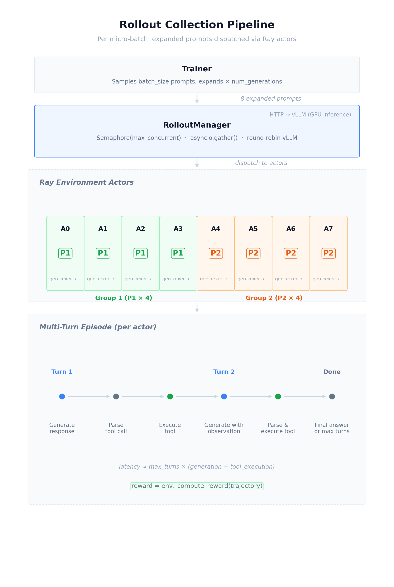
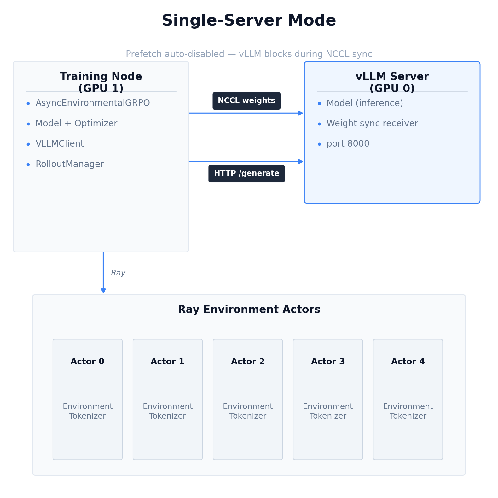
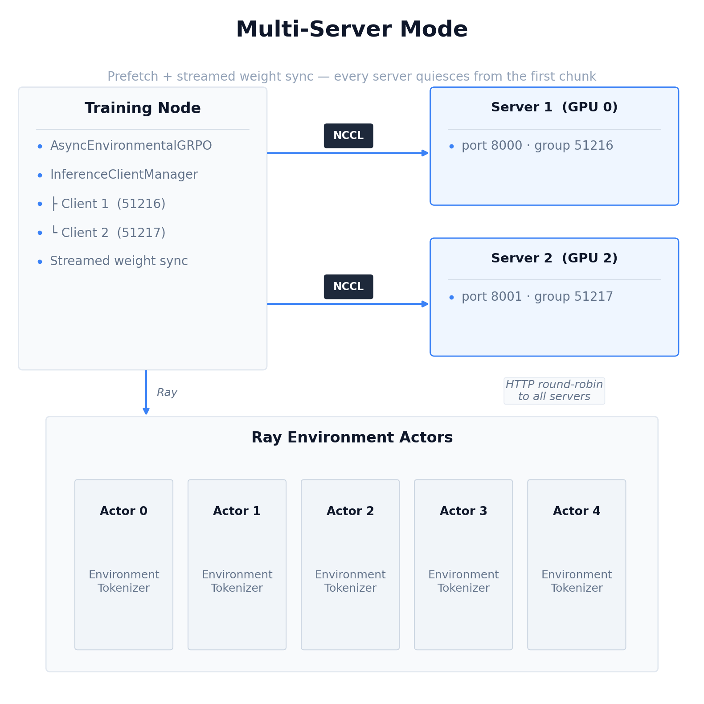
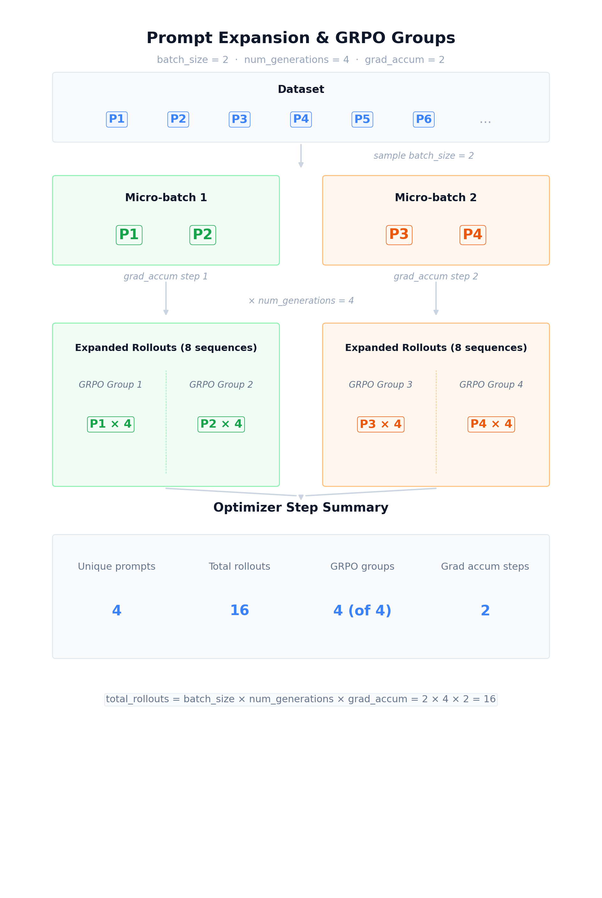
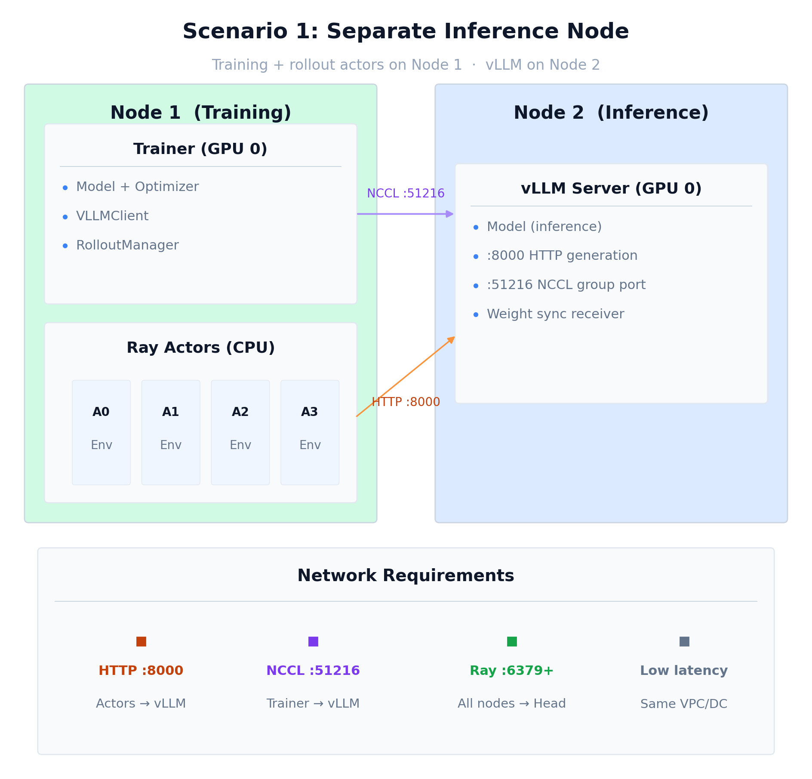
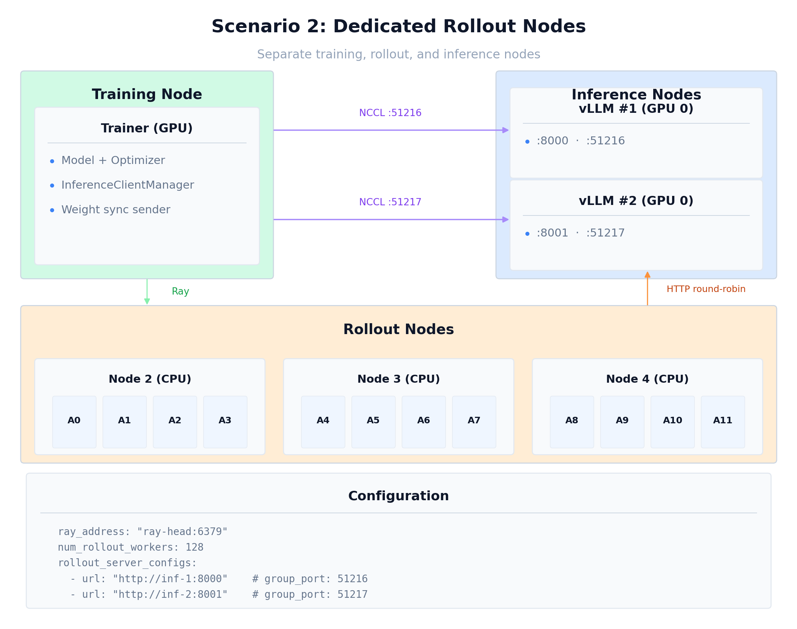

# Environmental GRPO Trainer

Multi-turn environment RL: the model converses with an environment (tools, code, repositories, search) before a final reward, then trains with GRPO. Use it for tool use, multi-step reasoning with environment feedback, and agentic training. For pre-collected rewards use [Offline GRPO](offline-grpo.md); single-turn, [Online GRPO](online-grpo.md); pairwise preferences, [SMPO](../preference/smpo.md) / [DPO](../preference/dpo.md).

The trainer is **environment-agnostic** — it dispatches episodes, takes whatever reward the env returns, and trains. Pick the env with `environment_type`: one of the eleven registered names (`code_contests`/`codeforces`, `swe`, `react_math`/`react_search`, `native_math`/`native_coding`/`native_combined`, `qa_search`, `exam_qa`, `mcp`) or your own ([Environments](environments/README.md) · [Custom Environments](environments/custom-environments.md)).

The moving parts: async Ray-actor rollouts, HTTP generation from a vLLM or SGLang server ([Rollout backend](#rollout-backend)), NCCL weight sync. Trainer `DistributedAsyncEnvironmentalGRPOTrainer` (`src/trainers/grpo/environmental.py`), script `scripts/training/environmental_grpo.py`, data format `{"prompt": "task", "answer": "expected"}`. You need a running [rollout server](../../infrastructure/rollout-servers.md) before launching; [Ray](../../infrastructure/ray.md) configures itself on one node.

The environment is handed the task as **text**, and it builds the conversation itself. A `prompt` given as a message list is therefore reduced to its **last `user` turn** — the system message and every earlier turn are the dataset's framing, not the task. A conversation with no `user` turn has no task to send: the trainer records a batch error and raises it on every rank (a per-rank raise would strand DP peers in the next collective).

## How it works

1. `RolloutManager` (`src/environments/ray_actors.py`) dispatches one trajectory per batch row to Ray actors, round-robin across actors and server URLs. Each actor instantiates its own environment on whatever node it runs, so sandbox interpreters, binaries and any file paths in `environment_kwargs` must exist on every Ray worker node ([Multi-node deployment](#multi-node-deployment)).
2. Actors POST `/v1/chat/completions` (the engine applies the chat template server-side), parse response text + `tool_calls`, and execute environment steps until done or `max_turns`.
3. The trainer grades each trajectory, re-tokenizes it, computes the GRPO loss ([Batch construction](#batch-construction)), then syncs weights to the engine over NCCL.



Configuration is split across `EnvironmentConfig` (env type and rewards), `AsyncTrainingConfig` (Ray, rollout servers, prefetch) and `EnvironmentalGRPOScriptArguments` (dataset fields) — full field tables in the [configuration reference](../../reference/configuration-reference.md#asynctrainingconfig). The script parses those three plus TRL's `GRPOConfig`, `ModelConfig` and `DistributedArguments`.

Two field rules are load-bearing. The environment owns the system turn and the tool schema: there is no `system_prompt` field on this surface (set `environment_kwargs: {system_prompt: ...}`), and a `tools_field` is **rejected**. And `prompt_field`, `answer_field` and every `context_fields` entry must name a real dataset column — an unknown one raises at startup rather than yielding answer-less rows and all-zero rewards.

From Python, pass an environment by class (`environment_cls=SweEnvironment`), by registry config (`environment_config=EnvironmentConfig(environment_type="react_math")`), or add `peft_config=LoraConfig(...)` for LoRA.

## Setup

Trainer GPU(s) MUST differ from rollout-server GPU(s) — one process cannot send weights to itself over NCCL, and a shared GPU also holds two copies of the model. Nothing checks it; `CUDA_VISIBLE_DEVICES` is the enforcement, and a shared GPU surfaces as `init_communicator()`'s 120 s group-formation timeout, not as a named error. The same NCCL isolation is why generation always runs in a separate server, never colocated in-process ([Server mode only](online-grpo.md#server-mode-only)).

```bash
make build-vllm
VLLM_MODEL=Qwen/Qwen3-8B VLLM_CUDA_DEVICES=0 docker compose -f docker-compose.vllm.yml up vllm-server
```

Server variables, load-bearing flags, and troubleshooting: [Rollout Servers](../../infrastructure/rollout-servers.md#vllm).

Ray initializes automatically for single-node runs; a multi-node cluster is started manually and passed via `ray_address` — setup, sizing, and monitoring on [Ray Cluster](../../infrastructure/ray.md).

### Launching

Launch with `torchrun`, adding `DistributedArguments` (`--expert_parallel_size` / `--tensor_parallel_size` / `--expert_tensor_parallel_size`) for Expert / Tensor / Expert-Tensor Parallelism; `accelerate launch` also works for plain data-parallel. Context Parallelism and Pipeline Parallelism are rejected at config time. The environment is resolved by `environment_type`; for a hand-written `BaseEnvironment` subclass, register it with `register_environment("my_env", factory)` and set `environment_type: my_env` ([Custom Environments](environments/custom-environments.md)).

```bash
# Plain data-parallel (dense or MoE without expert distribution): vLLM on GPU 0, FSDP2 DP on the rest
CUDA_VISIBLE_DEVICES=1,2,3,4,5,6,7 torchrun --nproc_per_node=7 \
    scripts/training/environmental_grpo.py \
    examples/grpo/environmental/environmental-grpo-template.yaml

# MoE with Expert Parallelism: add the EP flag (one DeepEP group across the trainer GPUs)
CUDA_VISIBLE_DEVICES=1,2,3,4,5,6,7 torchrun --nproc_per_node=7 \
    scripts/training/environmental_grpo.py <config> --expert_parallel_size=7
```

### EP group size on one node

Skip this section for dense models and `ep1` configs. Terms: [glossary](../../reference/glossary.md#parallelism); legal combinations: [parallelism matrix](../../parallelism/README.md).

The trainer ranks must form **one** DeepEP group: set `ep_size` to the training-GPU count.

- `ep_group_size` (`ep_size × expert_tp_size`) must divide `nvlink_domain_size` when the group fits inside one domain (`ep_scope: node`, the auto default), or the training world size when it spans domains (`ep_scope: global`). Within a single domain the EP group must span the **whole** domain unless `ep_size <= 2`: a narrower multi-group split races FSDP2's DP-wide NCCL collectives. So `ep4` on 4 training GPUs is fine, `ep4` on 8 is not ([DeepEP](../../infrastructure/deepep.md)).
- **EP=8 needs ≥9 GPUs / multi-node**, since vLLM holds a separate GPU.
- EP forces ZeRO-2 — `fsdp_reshard_after_forward: true` (ZeRO-3) is rejected under EP: its backward all-gather and the DeepEP combine would run concurrently and deadlock ([ZeRO-2 vs ZeRO-3](../../parallelism/data-parallelism.md#zero-2-vs-zero-3-reshard_after_forward)).
- `beta > 0` without PEFT makes TRL build an implicit fp32 dense reference per rank — **rejected in every parallelism mode** when the policy carries live attention sinks, and additionally costly under EP ([Online GRPO](online-grpo.md#grpo-objective-for-verifiable-rewards)). Set `beta: 0`, or `use_peft: true` with at least one attention target — an expert-only LoRA run is never PEFT-wrapped, so TRL still builds the reference.

Reference configs live under `examples/grpo/environmental/<family>/<backend>/`, one file per backend (`vllm/`, plus `sglang/` where the family supports it) × adapter (`-lora-` / `-full-`) × expert distribution (`-ep1` = experts undistributed, `-ep4` = a 4-rank DeepEP group). Start from `examples/grpo/environmental/gptoss/vllm/gptoss-20b-code-contests-lora-ep1.yaml` for a tool-heavy graded env (LoRA r=64 on all linears, pure DP ZeRO-2, KL-free objective with the [IS-band trust region](#off-policy-mismatch-and-stability-knobs) and R3 routing replay), or `examples/grpo/environmental/qwen3_5/vllm/qwen3.6-35b-a3b-react-math-full-ep4.yaml` for a light single-tool env.

The `-full-` siblings turn PEFT off (full-FT LR, ZeRO-3 at ep1 for activation headroom); the `-ep4` siblings run one 4-rank DeepEP group with ZeRO-2 for the dense params — use them when expert weights or optimizer state are the memory pressure. The code-contests configs use [chunked log-probs](#chunked-log-probs) and the [tuned verifiable-reward objective](online-grpo.md#grpo-objective-for-verifiable-rewards); every per-family recipe runs `beta: 0` (only `environmental-grpo-template.yaml` carries `beta: 0.01`), which also sidesteps the implicit-reference rejection a full-finetune-under-EP shape would hit. The code-contests configs set `episode_timeout: 2700`, which needs `DIST_NCCL_TIMEOUT_MINUTES=60` on the trainer — an episode timeout above the NCCL watchdog is rejected before the first rollout ([Troubleshooting](#troubleshooting)).

SGLang variants exist only for gpt-oss at ep1: the backend is rejected under any expert distribution, and gpt-oss is the only MoE family whose EP layer implements the fused expert gather SGLang's loaders consume — every other family, Qwen3 MoE included, is refused at construction ([Rollout Servers](../../infrastructure/rollout-servers.md#the-fused-expert-layout-is-declared-per-family)).

## NCCL weight synchronization

A force-sync runs once at **train-begin**, after `resume_from_checkpoint` is restored and before the first rollout or `eval_on_start`. It covers step 0 and, on resume, replaces the server's launch weights with the resumed checkpoint; the prefetch thread starts at the same point, so no rollout is ever drawn from pre-restore weights (a resumed LoRA run would otherwise serve the zero-init adapter merged into the base until the next scheduled sync).

Afterwards the sync runs at the **start** of a training step, before that round's generation, so the rollout inside the step samples from the just-updated policy — a tail-of-step sync would leave every rollout one optimizer step stale. `sync_weights_every_n_steps` trades freshness for overhead; for slow envs (`code_contests`, SWE) sync every 2–4 steps, since rollout collection already dominates. A step the cadence declines pushes nothing and is not recorded as synced.

Multi-rank runs (EP/TP/ETP or any FSDP2-DP world) gather shards through the shared `gather_and_send_weights` (`src/trainers/grpo/rollout/weight_sync.py`) — the same EP-then-dense/TP path online GRPO uses, with the same LoRA merge and the same construction gate: QLoRA, the [`_supports_weight_sync = False` families](../../parallelism/expert-parallelism.md#per-family-ep-restrictions), and GptOss whose sinks the `reset_sinks` reset removed are all refused ([Online GRPO — LoRA](online-grpo.md#lora)).

Both the client init and each sync are fail-fast on every rank: an error on the main process (duplicate group port, dead server, wedged scheduler) is broadcast so all ranks raise together instead of stranding peers until the NCCL watchdog.
Sync mechanics — the pause/broadcast/resume protocol per engine, the pinned-host snapshot and packed broadcast, the layerwise-reload patch that keeps vLLM expert syncs honest, and the checkpoint-layout/no-quantization serving constraints — live on [Rollout Servers](../../infrastructure/rollout-servers.md#weight-sync).

One bound is trainer-side and worth sizing for here: each EP layer's expert gather materializes the **full expert set** transiently on every rank — it scales with total expert count, not `ep_size`, so a fine-grained 256-expert layer costs tens of GB for the duration of that layer's gather no matter how wide the EP group is. The trainer-side symptom of a broken expert sync is `sampling/logratio_mean` drifting monotonically negative — check the server log for `RoutedExperts: Failed to load weights` first.

### Group port

`vllm_group_port` (default `51216`, a TRL `GRPOConfig` field) is the TCP store for NCCL group coordination. The trainer (rank 0) binds `0.0.0.0:<group_port>` and the vLLM workers dial back to `<trainer_host>:<group_port>`. The port is bound on the **trainer host**, one listener per server, so each server in multi-server mode needs a **unique** `group_port` even on distinct vLLM hosts (`51216`, `51217`, …) — sharing one conflicts in `init_communicator()`. In multi-server mode `vllm_group_port` is the **base**: an entry of `rollout_server_configs` that declares no `group_port` of its own binds `vllm_group_port + index`.

The vLLM server host comes from the HTTP URL (`socket.gethostbyname`), and the client tests only whether that host is **this machine**, to pick the group address; it never checks which GPU either side holds. The NCCL group address the workers dial resolves as `group_host` arg → the client's own `GROUP_HOST_ENV` (`VLLM_GROUP_HOST` for vLLM, `SGLANG_GROUP_HOST` for SGLang) → loopback when the server address is local → default-route NIC. A loopback group address against a remote server is rejected ([Multi-homed nodes](online-grpo.md#multi-homed-nodes-vllm_group_host)).

## Single-server vs multi-server

With a **single** server — including a one-entry `rollout_server_configs` — prefetch is auto-disabled and the sync blocks: the one server is paused for the broadcast. With **≥2** servers prefetch is enabled and the sync is either rolling (keeps N−1 servers live) or streamed-concurrent (all servers pause together).

Rolling sync needs all of: one training process, no PEFT, a model with no EP wrappers, and a `rollout_server_configs` list. Every other shape gathers collectively (EP/TP/ETP, or more than one training process) and streams **all** servers concurrently — one thread per client, each with its own NCCL connection. Every shipped config lands there, each being a multi-rank torchrun run.

On the streamed path the pause covers the whole push, not just the final broadcast: the update opens with the first full 1 GB chunk and closes when the last one lands, so every server is quiesced for most of the gather (minutes at 397B). Size `sync_weights_every_n_steps` against that window. vLLM queues requests behind the pause, so a prefetched rollout resumes after it; SGLang aborts them, and they return as prefetch misses ([Weight sync](../../infrastructure/rollout-servers.md#weight-sync)).





Multi-server prefetch pipelines rollout collection **one round deep**: each round pops the previously submitted rollouts, then hands its own prompts to the prefetch thread. Results queue in `prefetch_queue`, sized `num_prefetch_batches` — rejected below `1`, since `queue.Queue` reads `0` as *unbounded* and "no prefetch" would then buffer until the host OOMs; turn it off with `enable_prefetch: false`. `num_rollout_workers` is likewise rejected below `1`, as is an explicitly set `max_concurrent_rollouts`.

Dispatch is server-state-blind — `RolloutManager._next_url` is plain round-robin, so a server mid-sync still takes its turn. Watch `async/prefetch_hit_rate` (target > 0.8); `< 0.5` means raise `num_prefetch_batches` or add workers. Prefetch makes each batch one sync stale (more if `sync_weights_every_n_steps > 1`), but that off-policy lag is corrected by the truncated vLLM importance-sampling ratio ([Training on sampled tokens](#training-on-sampled-tokens-train_on_sampled_tokens-default-on)).

```yaml
rollout_server_configs:
  - {url: "http://localhost:8000", group_port: 51216}
  - {url: "http://localhost:8001", group_port: 51217}
enable_prefetch: true   # auto-disabled for single server
```

## Rollout backend

`rollout_backend` selects the engine: `vllm` (default) or `sglang`. Both serve rollouts over `/v1/chat/completions`, receive weights over an NCCL group the trainer joins as rank 0, and support `train_on_sampled_tokens` through shared gather/merge/gate code — but the expert layout that code emits belongs to the receiving engine: the family's own gather for vLLM, the fused `experts.{gate_up,down}_proj` pair for SGLang. Engine capabilities, required serving flags, the SGLang-only constraints (expert distribution and non-fused families refused at construction; `rollout_max_thinking_tokens` rejected; the five socket NCCL vars; `fsdp_reshard_after_backward: false` on the trainer), and the ~1.4× measured step-cost ratio are on [Rollout Servers](../../infrastructure/rollout-servers.md).

TRL's own sampling knobs are inert here. `top_p`, `top_k`, `min_p`, `repetition_penalty` and `generation_kwargs` set on `GRPOConfig` reach no sampler — rollouts sample from the `rollout_*` fields — and the trainer warns for each one set. `temperature` is reconciled the other way: it is force-set to `rollout_temperature`, so the trainer scores log-probs at the sampling temperature.

At startup the script reads each server's context window (`/v1/models`) and calls `verify_context_window_synced` (`src/trainers/grpo/rollout/weight_sync_clients.py`); rank 0 probes and broadcasts the verdict, so all ranks raise together if one rollout turn exceeds the context. The single-turn budget is `max_prompt_length + environment prompt overhead + rollout_max_tokens`, where the overhead is the env system prompt + tool schemas (measured at startup, 2048-token fallback) — easy to forget when sizing `max_prompt_length`. The worst case, `+ max_turns × rollout_max_tokens`, is checked too but only **warns**, since a trajectory that grows past the context OOMs the training forward before the fail-on-overflow check fires.

The same startup path calls the environment's `verify_backend()` (rank 0, verdict broadcast), so an environment scoring through an external service fails the launch on a bad endpoint instead of invalidating every episode. The base hook is a no-op.

### Trajectory length

`rollout_max_tokens` (default `32768`) is the only generation knob: it caps each turn (vLLM `max_tokens`). The multi-turn trajectory accumulates across turns and is bounded only by the model context window.

Trajectories are **never truncated** — one that exceeds the context **fails**. Both tokenize paths (per-turn `_tokenize_trajectory_turns` and single-sequence `_tokenize_trajectory`) record the overflow per row, and `_raise_batch_error_uniformly` raises on every rank together rather than stranding peers at the next NCCL call. Silently dropping the tail would lose the rewarded final action — `submit_solution` in `code_contests`, the last patch write in `swe`, the final answer in `qa_search` — and decouple it from the reward.

`max_prompt_length` is an optional dataset filter (rows above it are discarded, not truncated; `null` keeps all). `max_completion_length` is **not** a knob here: the script assigns `rollout_max_tokens` over it, so a YAML value is discarded — it survives only as TRL's `loss_type: dr_grpo` normalization constant (the default `dapo` ignores it). Set the budget through `rollout_max_tokens`.

### Tool parser is per model family

Native-tool environments send `tools` (vLLM defaults `tool_choice=auto`), so a matching `--tool-call-parser` is required. The failure is silent for a mismatched parser (the model's XML form comes back as plain text with **no** `tool_calls` and no error — every turn scores as a no-tool give-up) and a 400 for a missing one. Per-family parser values and plugins: [Rollout Servers](../../infrastructure/rollout-servers.md#vllm); gpt-oss specifics: [GPT-OSS](../../models/gpt-oss.md#serving-for-grpo-vllm). Non-tool RLVR needs no parser, and neither do the [ReAct](environments/react.md) envs — they send no `tools` block and read the action out of the assistant text, so a parser there strips the call into a burnt turn.

### Stopping a turn at the tool call (`rollout_stop_tokens`)

A turn ends when the model emits its turn terminator, and most models list it in their `eos_token_id`. **GPT-OSS with harmony disabled does not:** its tool-call terminator `<|call|>` is not an eos (the model's eos is `<|return|>`/`<|endoftext|>`, and harmony would add `<|call|>` dynamically, but the harmony pipeline is patched off). The model therefore keeps generating after a tool call, hallucinating the tool result and playing out the whole episode in one turn. The environment runs only the first call, but with `train_on_sampled_tokens` the policy trains on the entire stream, reinforcing the hallucinated tool outputs.

`rollout_stop_tokens` fixes this: special-token strings the trainer resolves to ids via the tokenizer and sends as `stop_token_ids`, so a turn stops the instant the model emits its call. The gpt-oss configs set `["<|call|>"]`, dropping a turn from ~2000 tokens to ~125. Leave it empty (default) for models that stop via their eos. A server-side `--override-generation-config` eos does **not** work — vLLM's chat endpoint only honors the tokenizer's real eos.

Resolution is checked at startup on every rank: a name the tokenizer does not know is warned and skipped, but a list where **none** resolves **raises**. Degrading to "no stop tokens" is indistinguishable from leaving the knob unset, and on gpt-oss that silently restores the one-turn runaway above.

### Reasoning budget

`rollout_max_thinking_tokens` caps a reasoning model's chain-of-thought per turn (vLLM's `thinking_token_budget`): at that many reasoning tokens vLLM forces the reasoning-end marker, so the model still answers within the rest of `rollout_max_tokens`. It only bites when it is **below** `rollout_max_tokens` — set the per-turn budget higher (e.g. 48k for a 40k thinking cap) or the turn stops on `max_tokens` first.

It is a ceiling, not a target: the model usually stops earlier, steered by the env's `reasoning_effort` (`low`/`medium`/`high`/`random`, or `None` for no steer — `BaseEnvironment` defaults to `None`, the `code_contests`/`codeforces` envs to `medium`). `reasoning_effort` applies to every env, but the per-level budgets are coding-env-specific: `code_contests`/`codeforces` bind each level to a profile (`reasoning_effort_profiles` — thinking tokens 4k/8k/16k applied per episode as `min(level budget, rollout_max_thinking_tokens)`, plus optional per-episode submission/scratchpad caps — [Code Contests](environments/code-contests.md#reasoning-effort)).

**`random`** samples a level so one run spans budgets. The draw is made **once per generation group** — the trainer stamps the level into every member's rollout context and the actor prefers a context-supplied level over its own draw — because GRPO's group baseline compares the `num_generations` completions of one prompt against each other, which is only fair under identical conditioning.

A budget needs a reasoning parser on the server (Qwen3.x `qwen3`; Gemma 4 `gemma4`; gpt-oss the bundled plugin) and `VLLM_USE_V2_MODEL_RUNNER=0` on the vLLM container — [Rollout Servers](../../infrastructure/rollout-servers.md#vllm); sending one without a parser is rejected (400). Leaving `rollout_max_thinking_tokens` unset means unbounded reasoning.

A turn the engine cuts off at its token cap before it produces anything is nudged and retried within `max_turns` and counted in `episode/length_cutoff_turns`, but carries **no reward penalty of its own** — bound its frequency through the per-effort caps and the answer headroom instead ([Native tool-use](environments/native-tool-use.md#reward-knobs)).

`reasoning_compliance_weight` (default `0` = off) adds an **asymmetric** reward term matching reasoning length to the requested effort. The trainer counts each assistant turn's CoT tokens against the episode's applied budget `B` and scores them with `reasoning_calibration_penalty` (`src/environments/episode.py`): **0** in the `[0.3·B, 0.9·B]` band, a **mild** penalty below, a **strong** penalty above that saturates at `-weight` once `r ≥ B`. The term is added to the task reward before advantage computation, so keep the weight small (~`0.15`) to shape rather than dominate. Logged as `reward/calibration`; pairs naturally with `reasoning_effort: random`.

### Chat template must match training

The trainer sends **messages** to `/v1/chat/completions`, so vLLM renders the prompt server-side. With `train_on_sampled_tokens` (the default) the per-turn training rows are built from the **engine's own tokens**, so a template mismatch cannot bias the loss on those rows. The rule governs the **fallback** paths — a turn whose ids were not captured, or `train_on_sampled_tokens: false` — where the trainer re-tokenizes with its own tokenizer: differing templates there mean the policy generated against a different prompt than the loss is computed on, so log-probs are wrong and the gradient is biased.

Two safe setups. **Built-in** (default): no `chat_template:` on the trainer and no `--chat-template` on vLLM, so both load the checkpoint template. **Custom**: `chat_template: <file>.jinja` + `force_chat_template: true` on the trainer and `--chat-template <same file>` on vLLM (`VLLM_CHAT_TEMPLATE`), with the file visible inside the vLLM container. Failure is **silent** — setting `chat_template:` on the trainer alone leaves the server on the checkpoint template. Online GRPO (RLVR) has no such risk, since it sends text ([Chat template handling](online-grpo.md#chat-template-handling)).

The same rule extends to `reasoning_effort`: the rollout records the episode's resolved level on the trajectory and the fallback re-render applies it, so the trained `Reasoning: <level>` preamble matches what the model generated under. The request sends the level as the **top-level `reasoning_effort` field only** (`generation_control_fields` in `src/environments/engine_wire.py`, shared by the trainer and the eval driver). That spelling is the one both engines read into the template render *and* derive their thinking toggles from — vLLM sets `enable_thinking`, SGLang `thinking` + `enable_thinking`; the nested `chat_template_kwargs={"reasoning_effort": …}` form reaches the template but sets neither, and sending both is ambiguous (vLLM resolves a disagreement to the top-level value, SGLang to the nested one).

## Training on sampled tokens (`train_on_sampled_tokens`, default on)

env-GRPO trains on the **actual token ids the model sampled**, captured from the engine's per-token logprobs, rather than re-tokenizing a chat-template re-render of the parsed trajectory. A re-render can differ from what the model emitted — for gpt-oss (harmony) the history template renders an assistant tool call as `assistant to=functions.NAME<|channel|>commentary json` where the model sampled `assistant<|channel|>commentary to=functions.NAME <|constrain|>json` — so re-tokenizing would apply the RL advantage to tokens the model never emitted, eroding its native tool-call format. Training on sampled ids sidesteps that and every other re-tokenization mismatch (argument-JSON whitespace, reasoning re-render), for **any** model family.

Each assistant turn becomes its own training row: `prompt` = the history vLLM built for that turn (server-rendered, with a generation prompt and **no** prior-turn reasoning), `completion` = that turn's sampled ids verbatim, and rows share the trajectory's advantage. Per-turn rather than one concatenated sequence is required because a template may drop prior-turn CoT from context, so a later turn was sampled without the earlier turns' reasoning.

The **prompt side uses the engine's tokens too**: the rollout sets vLLM's `return_token_ids` flag and `_tokenize_trajectory_turns` uses the returned `prompt_token_ids` verbatim, so each row is conditioned on byte-identical context to what its completion was sampled under. This needs a vLLM server run with `--return-tokens-as-token-ids`; SGLang needs no flag, since the ids are requested per call.

Turns the rollout marked unusable — engine-cut (`truncated`) or every tool call naming a nonexistent tool (`calls_rejected`) — are **excluded** from the training rows. They stay in the next turn's prompt, since the model must condition on what it actually emitted, but training on them would reinforce the runaway or the invented call whenever the episode later recovers and earns a positive advantage. An episode whose assistant turns were **all** excluded yields one fully masked row (`completion_mask` all zero), keeping the row count rank-uniform.

Two fallbacks fire when capture is incomplete, and only one is loud. A trajectory where **any** assistant turn lost its completion ids drops whole to the single-row re-tokenize path with a one-time warning naming the engine's remedy — all-or-nothing, so a partial capture never silently drops turns. A turn that kept its completion ids but lost its `prompt_token_ids` re-renders **only its prompt** through the serving template, silently.

`train_on_sampled_tokens: false` forces the re-tokenization path for every trajectory. It also disables the vLLM importance-sampling correction, which needs the captured sampling log-probs: the trainer warns, and every batch then trains uncorrected on rollouts at least one weight-sync stale.

The same per-token logprobs are the **behavior-policy reference** for a vLLM importance-sampling correction. env-GRPO always applies **token-level** truncation and ignores TRL's `vllm_importance_sampling_mode` and `vllm_importance_sampling_clip_min` (each warns when set). Each step the trainer recomputes the current-policy logps and forms a per-token ratio `clamp(exp(logπ_recompute − logπ_sampling), max=vllm_importance_sampling_clip_max)` (TRL's default `3.0`), which multiplies the per-token loss — correcting the vLLM↔trainer numerical gap and, with prefetch, the one-step off-policy staleness.

This stays **separate** from the PPO ε-clip: at `num_iterations: 1` with aligned gradient accumulation, `old_per_token_logps` stays `None` so the ε ratio is exactly 1. Correction is per row — a row whose trajectory lost its vLLM logprobs runs at ratio `≡ 1` on its own, leaving the rest of the batch corrected.

Watch `sampling/logratio_mean` first: the **unclamped** mean `logπ_recompute − logπ_sampling` in nats, which should sit near 0. A large negative value means the recompute conditions on a different prompt than vLLM sampled under; a *monotonically growing* negative drift is the broken-weight-sync fingerprint ([layerwise-reload patch](../../infrastructure/rollout-servers.md#weight-sync)).

For that recompute to be faithful the trainer renders each turn's prompt through the **same** serving chat template **and the same `tools=` schema** the rollout sent (`_render_messages_to_ids` passes the env's `get_tools_schema()`). Dropping the tool block — two-thirds of a harmony prompt for a tool-use env — would mis-condition every completion token and drive `logratio_mean` sharply negative.

Two per-model conditions keep the ratio honest. GPT-OSS stays on-policy through its attention sinks: vLLM serves them **on** (sinks-off it emits degenerate repetition and zero tool calls) and the trainer freezes the **same** pretrained sinks (`reset_sinks: false`, read via FA4), so recompute matches vLLM to ~0 nats and the IS correction handles only prefetch staleness ([GPT-OSS → Attention sinks](../../models/gpt-oss.md#attention-sinks)). A MoE run on this path carries no router balancing at all ([Online GRPO](online-grpo.md#configuration)), so nothing trainer-only can desync routing; if it did, the symptom would be `is_ratio_mean` drifting steadily below 1 — a slow monotonic decline, unlike the sink gap's constant offset.

### The re-tokenization fallback (`_tokenize_trajectory`)

The fallback builds **one** row whose `prompt + completion` is exactly ONE render of the whole trajectory, then locates each assistant turn's span inside it (`src/trainers/grpo/rollout/trajectory_spans.py`). Accumulating independently rendered per-turn prefixes is not valid, because chat templates are not prefix-monotone: Qwen3 injects an empty `<think>` block into whichever assistant turn is currently last, harmony rewrites earlier turns' terminator (`<|return|>` → `<|end|>`) and strips their reasoning once a final message exists, GLM-4 turns its generation-time `<think>` into `</think>`. Diffing prefixes would train a sequence no serving render produces.

Spans are pinned by *anchors* — a prefix render verified to be an exact prefix of the authoritative render — and, for the one boundary no prefix render can pin (the end of a non-final assistant turn), by re-rendering with that message duplicated and taking the length delta against the nearest anchor above it. Within a turn, the trained span starts where the engine's generation prompt stops agreeing with the authoritative render.

No boundary is ever inferred from another turn, since a role header's token length is not turn-invariant (BPE merges its last token with the turn's first content token differently per turn). So a turn whose own context does not anchor — consecutive assistant messages, which `_add_action_message` cannot produce — and a template that rejects its own trajectory are both **recorded and raised on every rank** (`_raise_batch_error_uniformly`) naming the model, never trained on a guessed span.

Because the row is the serving render, a turn's reasoning survives only where the template keeps it (harmony keeps the final turn's, drops earlier ones), and a token spanning the template/policy boundary falls whole on one side (Qwen3 trains the header newline merged into content opening with `\n`; Gemma's header absorbs it instead). Use the sampled-token path to train every turn's CoT verbatim.

Cost: the anchor and duplication probes are O(turns²) in rendered tokens, single-threaded inside `_build_training_tensors` — on Qwen3, order ~1 s per host core per trajectory for a 21-turn / 15k-token episode, paid per step by a long-horizon config with many rollouts per rank. The sampled-token path avoids it entirely.

## Off-policy mismatch and stability knobs

Three optional knob groups on `AsyncTrainingConfig` (all default off) target the vLLM↔trainer mismatch and failure-dominated batches. Each is validated at construction; the IS mask stages raise unless the IS correction is active, since without it they would silently do nothing.

**IS mask/veto stages** (`src/trainers/grpo/objective/logratio.py`) layer *masking* on the truncated ratio: a truncated reweight only caps a divergent token's weight, a mask removes its policy-gradient term entirely. A masked token keeps the β·k3 KL anchor (the KL term is added after the ratio multiply), so it stops learning from the corrupted ratio but stays anchored. Trajectory-level stages pool all of an episode's turn rows — the drift compounds over the episode, so a per-turn reset would hide it. Stages compose; a paired band activates only with both bounds set.

| Knobs | Stage | Metric |
|---|---|---|
| `isr_band_min` / `isr_band_max` | token band — mask a corrected token whose raw ratio leaves the band (start `[0.5, 2]`) | `sampling/is_token_band_masked_frac` |
| `isr_geo_band_min` / `isr_geo_band_max` | trajectory geometric-mean band — mask a whole trajectory when `exp(mean log-ratio over its corrected tokens)` leaves the band (start `[0.99, 1.01]`) | `sampling/is_geo_band_masked_frac` |
| `isr_veto_min` | catastrophic-token veto — mask a whole trajectory when **any** corrected token's raw ratio falls below it (~`1e-4`) | `sampling/is_veto_masked_frac` |
| `isr_opsm_delta` | off-policy sequence masking — mask **negative-advantage** trajectories whose \|mean log-ratio\| exceeds this many nats; positives are never masked (a stale-but-successful episode still teaches) | `sampling/is_opsm_masked_frac` |

`skip_update_masked_frac` is the circuit breaker over these stages: when more than that fraction of IS-corrected trajectories are fully masked, the step's policy gradient is zeroed outright instead of training on the unmasked remainder. At high masked fractions the survivors are a selection-biased sample of wherever the drifted policy still agrees with the rollouts, so continuing amplifies the drift. Any configured KL term still applies; at `beta: 0` the step is a no-op and the next weight sync re-anchors the rollouts.

Watch `sampling/is_masked_traj_frac` and `sampling/update_skipped`. A sustained `1` means rollouts and trainer disagree structurally (weight sync, template, kernels) — fix that, do not widen the bands.

**Advantage surgery** (`advantage_mode`, `src/trainers/grpo/objective/advantages.py`) targets entropy explosion in failure-dominated batches: with a group-mean baseline and success rate → 0, every failure carries a negative advantage, and negative gradients on confident tokens *raise* entropy.

- `mean` (default) — plain group-mean baseline, bit-identical to no shaping.
- `qae` — the baseline becomes the per-group `advantage_quantile` (default `0.4`), so failures get ~0 advantage and only the rare successes train.
- `asymmetric` — mean baseline, then positive/negative advantages scale by `advantage_pos_scale` / `advantage_neg_scale`.
- `neg_mask_hard` — zero negative advantages only in groups where no member's **objective** reward component reached `advantage_hard_group_threshold`. The gate reads `reward/objective` where the env decomposes (total reward otherwise), so shaping rungs cannot make a failed group look solved.

**MoE routing replay** (`routing_replay`, `src/trainers/grpo/rollout/routing_replay.py`) targets a different mismatch: tiny numeric differences between the trainer's own passes flip top-k expert selection near decision boundaries, so the update pass trains through a *different* token distribution than the one the IS ratios were computed on.

`recompute` (R2) captures each EP MoE layer's top-k selection in the no-grad logprob-recompute pass and replays it in the update and GC-recompute forwards; gate weights are always re-derived from the update pass's live router scores, since replaying weights would kill the router gradient. Enforced at startup: EP-wrapped MoE layers only (Gemma4 and Zaya are rejected — they cannot re-derive gate weights at a forced selection) and a config that actually runs the recompute pass (IS correction, or `beta > 0`, or `num_iterations > 1`). Under TP/ETP the mask rides the TP-leader batch broadcast, int16 crossing NCCL as a lossless uint8 bit view.

`rollout` (R3) replays the rollout **engine's** selection. It requires `train_on_sampled_tokens` and a capture-capable server: vLLM ≥ 0.22 with `--enable-return-routed-experts` and a non-FlashInfer MoE backend (`--moe-backend triton` — FlashInfer's monolithic MoE kernels bypass the capture hook), or SGLang with `--enable-return-routed-experts --moe-runner-backend triton`. The wire form differs per engine — vLLM returns `routed_experts` per completion choice, SGLang one response-level `sglext.routed_experts` blob — and the trainer decodes either by the model's own layer/top-k counts. Mask alignment rides the engine-token rows, so `routing/rollout_prompt_len_mismatch_frac` should sit at 0.

A training batch in which no rollout carried a mask is fatal on every rank — replaying nothing would train through a different token distribution than the ratios were computed on, silently. The one exception is a batch that trains nothing: every assistant turn the engine cut off at its token cap is excluded from the rows, so a step whose completions all ran away is a batch of masked rows with no selection to replay, logged as such and trained as the zero-gradient step it already is under every other mode.

The mask costs ~2 bytes × tokens × MoE layers × top_k per generation batch; `routing/replay_flip_rate` is the fraction of (token, layer) selections the live top-k would have flipped.

### KL tail

TRL's k3 KL estimator, `exp(ref − logp) − (ref − logp) − 1`, is unbounded on the side where the policy suppresses a token the reference likes: one token at 12 nats contributes `~1e5`, and its gradient scales the same way. At `per_device_train_batch_size: 1` a micro-batch is a single row, so that token is never averaged down — it becomes the step's gradient and `max_grad_norm` clips the whole update to a direction chosen by one token. `top_entropy_quantile` compounds it: TRL masks only the *policy* term, so the KL penalty still spans every completion token.

`clamp_ref_logps` (`src/trainers/grpo/objective/logratio.py`) is unconditional, not a knob: whenever reference log-probs exist (`beta > 0`) it caps the log-ratio at `KL_LOGRATIO_CLAMP` (5 nats), bounding the per-token KL at `exp(5) ≈ 148` while leaving typical tokens (≈0.4 nats) untouched. Watch `kl_clamp_frac`: a persistently non-zero value means the policy is being held far from the reference on real tokens, not just outliers.

### Protecting the chat template

Structural tokens — chat-template role/channel markers, tool-call delimiters, BOS/EOS — are the **lowest-entropy** tokens in a completion, because the template makes them near-deterministic. `top_entropy_quantile < 1.0` restricts the policy loss to the *highest*-entropy tokens, so on its own it denies those tokens any policy gradient, leaving only the KL term to hold them. If `beta` is small or 0, nothing holds them: the template erodes, the model starts emitting the *text* form of its special tokens, tool calls stop parsing, and a verifiable reward collapses to zero even while the model keeps calling tools.

`ProtectedTokenEntropyMixin` (`src/trainers/grpo/mixins/entropy_mask.py`) unions the special-token positions (tokenizer `all_special_ids` plus every added token, so it is model-agnostic) back into the entropy mask, keeping structural tokens trained. Keep `beta > 0` as the second line of defense, treat a rising rate of malformed tool calls as the leading indicator, and back it with the reward side: a nonzero `tool_error_penalty` (every tool-use env) makes a failed tool call *cost* something, and where the env pays a rung for the final action, it should pay only when that action landed — `code_contests` pays `submission_reward` only for a submission that actually **graded**.

### Degenerate groups and reward scaling

A GRPO group whose completions all scored the same reward has advantage ≡ 0 for every member: it contributes no policy gradient, yet its tokens still inflate the DAPO loss normalizer and dilute the groups that do carry signal. On a sparse verifiable reward these dead groups dominate the batch. `drop_degenerate_groups` (default **on** here, off for online GRPO) masks them out of the loss and the token count — the cheap half of DAPO's dynamic sampling (drop, without resampling replacements). Watch `sampling/degenerate_group_frac`. `scale_rewards` interacts directly:

| value | behavior | when |
|---|---|---|
| `batch` | divide by the **global** batch std | Recommended here (TRL's own default is `group`). Never divides by a per-group std, so degenerate groups stay near zero advantage and the gradient scale stays steady across steps. |
| `none` | Dr.GRPO: `r − group_mean`, unscaled | Unbiased, but the gradient magnitude tracks each batch's raw reward spread, so the effective LR swings with how hard the sampled prompts were. |
| `group` | divide by the **per-group** std | Hazardous on a sparse verifiable reward: a near-degenerate group (every completion fails, the only spread being the shaping rungs) has std → 0, so the division amplifies shaping noise into a full-scale advantage. |

`scale_rewards_std_floor` bounds the amplification for either divisor: the division uses `max(std, floor)`, so a behaviorally-degenerate batch cannot inflate its own noise into full-scale advantages. Set it in reward units, below the healthy batch std; it is inert while the batch has real spread.

`mask_truncated_completions` is enforced by this trainer itself (TRL applies it only inside the `_generate_and_score_completions` this trainer replaces): a trajectory cut off at the token/turn budget never reached a terminal state, so its final action is missing and the reward measures the truncation, not the policy. Watch `sampling/truncated_masked_frac`.

## Batch construction

TRL's `RepeatSampler` delivers each unique prompt `num_generations` consecutive times, kept rank-local, and the trainer rolls out exactly **one** trajectory per batch row. `RolloutManager.collect_rollouts()` dispatches them to the actors, the env grades each trajectory into a reward, `_compute_advantages` normalizes rewards **within each rank-local group**, and `_build_training_tensors` **pads** the batch into `[completions, prompt+completion]` before the policy trains on it micro-batched.

A rollout carrying no learning signal — a raised episode, an `episode_timeout` cancellation, or one the environment flagged `episode_invalid` such as a grading-infrastructure outage — enters as a zero-masked row excluded from its group's baseline, so it neither trains nor poisons the advantages.

A step in which **no** episode anywhere in the world survived warns once, then **halts the run** on the second consecutive such step, carrying the rollout layer's own error. It would otherwise train on all-masked batches, logging a plausible `loss=0` indefinitely.



The training trajectory keeps the **final turn's** reasoning. The rollout actor reads the response's reasoning channel through `get_reasoning_text` (`src/inference/response.py`) — vLLM answers `reasoning` and SGLang `reasoning_content`, and a reader of one spelling sees the other engine's CoT as empty rather than as missing — the episode driver carries it on the step context, and `_add_action_message` (`src/environments/base.py`) lands it on `Message.thinking`; `to_dict(include_thinking=True)` emits it under **every** key spelling the roster reads (`REASONING_KEYS` — harmony/GPT-OSS reads `thinking`, every other reasoning family reads `reasoning_content`, the OpenAI/vLLM spelling). Each template ignores the spelling it does not know, so the chain-of-thought renders exactly once with no per-family branch; emitting only one spelling makes the others render an **empty** reasoning block, training the policy to skip reasoning altogether.

Whether an earlier turn's reasoning then renders is the template's decision — harmony keeps the final turn's and strips the rest, matching the reasoning-stripped context the model saw at generation. The plain `to_dict` the rollout sends to the engine emits no reasoning key at all, since an unknown field can 400 a request.

**Collator.** Like online GRPO, the dataloader uses TRL's dataset-**row** collator, not the SFT [collators](../../data/collators.md); no completions-only masking, no padding-free packing. Token batching is rollout-driven and follows TRL's two-mask convention — **`completion_mask`** is attention-valid (every real completion token, including tool results and generation-prompt headers, which conditioned the sampling and must stay visible to attention) and **`tool_mask`** is the loss mask (`1` only on assistant spans); the loss and the DAPO normalizer use their intersection. Never packed; CP cannot shard it.

**Counting.** `per_device_train_batch_size` counts batch **rows = completions** (TRL's convention — the sampler already repeated each prompt, so one row is one rollout). Rollouts per optimizer step follow the [online-GRPO count](online-grpo.md#data-flow-and-batch-construction); unique prompts per step = that total ÷ `num_generations`.

**Per-forward cost.** `compute_loss` processes `per_device_train_batch_size` rows at once, so a single MoE forward's DeepEP-dispatch size and activation/logits memory scale with **`per_device_train_batch_size × trajectory length`** — neither `num_generations` nor `gradient_accumulation_steps` is in it. TRL's `old_per_token_logps` / reference log-prob precompute is skipped at `num_iterations=1` / `beta=0` and otherwise chunked to `per_device_train_batch_size` in train, `per_device_eval_batch_size` in eval. To fit longer trajectories, lower `per_device_train_batch_size` and grow `gradient_accumulation_steps` for saturation.

The three sizing knobs sit at different layers:

- **`num_generations`** (algorithm) — the GRPO group size. It does **not** change the rollout count: it trades unique prompts for samples-per-prompt within the fixed total above. Bigger groups give a less noisy baseline (standard GRPO uses 8–16). A group is normalized **rank-locally** here, so a whole group must fit one rank: `per_device_train_batch_size × steps_per_generation` must be divisible by `num_generations`, raised at trainer construction. It is stricter than the generation-round rule the shared loader checks ([Online GRPO](online-grpo.md#data-flow-and-batch-construction)).
- **`max_concurrent_rollouts`** (throughput throttle) — an `asyncio.Semaphore` **per training rank**. This, not the actor count, is the real cap on simultaneous in-flight rollouts; cluster-wide load on the server pool is `max_concurrent_rollouts × data_parallel_size ÷ num_servers`. Size it to one generation cycle's per-rank demand (`per_device_train_batch_size × steps_per_generation`) with ~2× headroom for prefetch. Larger is harmless but never binds.
- **`num_rollout_workers`** (parallelism substrate) — the Ray actor pool. Actors are async, so one already handles many concurrent episodes; the worker count is *not* the HTTP-concurrency limit. Size it to the env's **blocking** per-episode cost: sandboxed execution and grading (`code_contests`, `swe`) is bursty and CPU-bound and shares the sandbox gate; `qa_search`/`react_search`/`mcp` are latency-bound, where more actors help only until the endpoint rate-limits ([Ray Cluster](../../infrastructure/ray.md#pool-sizing)).

### Learning rate

Environmental GRPO refines a tuned policy, so the rate sits near the SFT floor. Task configs span `2e-7` (the full-finetune code-contests configs, at `grad_accum 24`, so 12 unique prompts per step at DP 4) to `5e-6` (`environmental-grpo-template.yaml`), with `1e-6` for the Qwen3.6-35B-A3B AIME, react-math and exam-QA configs and `3e-6` for the LoRA code-contests siblings. Too high a rate collapses the policy faster than the sparse multi-turn reward can correct, so a small-batch run wants the low end. See [SFT — Learning rate and global batch size](../sft.md#learning-rate-and-global-batch-size).

## Memory and the context budget

The whole multi-turn trajectory trains as **one padded sequence**, so the training forward for a long episode is dominated by the full-vocab logits plus the per-sequence DeepEP dispatch buffer. **The logits wall:** TRL's GRPO computes per-token log-probs from a full `[B, T, vocab]` logits tensor; at gpt-oss's ~201k vocab a 24k-token trajectory is ~9 GiB of bf16 logits, and the log-softmax on top of them — saved for the backward — roughly doubles that.

**Neither EP nor TP attacks it:** EP wraps only the MoE experts (logits come from the dense `lm_head`), and TP leaves the full plane on every rank either way — the MoE path shards attention alone and keeps `lm_head` replicated (`src/distributed/tensor_parallel/parallelize_attention.py`), while a dense model's HF plan shards the head but gathers its output. The three levers that do shrink it are [chunked log-probs](#chunked-log-probs), `per_device_train_batch_size: 1` (peak is set by the single longest trajectory's forward), and `fp32_output_conversion` (default off — keeps logits in bf16). Two further consequences:

- **Keep the trained trajectory under the served context.** The trajectory keeps reasoning only on the last turn, so it is `prompt + last-turn(reasoning + answer) + Σ_other-turns(answer + tool output)` — the per-turn CoT budget is counted **once**, not `max_turns`×. `prompt + max_turns × rollout_max_tokens` is therefore only a **loose upper bound**; staying under it guarantees a fit but usually over-restricts `max_turns`. If even the trained trajectory can exceed the context, a long episode OOMs the training forward (or trips the DeepEP 32-bit dispatch guard) *before* the fail-on-overflow check fires.
- **Bound large tool/observation outputs.** Every tool-use env truncates an observation at `max_observation_chars` (base default 16384, settable in `environment_kwargs`) — lower it when tool output, not reasoning, drives trajectory length. The coding grader is the exception: its `max_output_size` (a `CodeContestsEnvironment` kwarg reaching `GradingSpec`) defaults to `1_000_000` chars so a large-array test result stays gradeable, which balloons a multi-turn trajectory and intermittently OOMs the forward — cap it (`environment_kwargs: {max_output_size: 16384}`) for training.

Otherwise the usual memory levers apply: `gradient_checkpointing: true` with `use_reentrant: false` (EP forces reentrant GC automatically), `optim: adamw_bnb_8bit`.

### Chunked log-probs

`use_chunked_grpo_logprobs: true` (default off) removes the logits wall. Instead of TRL's full `[B, T, vocab]` logits → `selective_log_softmax`, the completion log-probs come from the backbone's `last_hidden_state` and a vocab-chunked matmul + online softmax (`src/trainers/grpo/mixins/chunked_logprobs.py`), so peak memory is bounded by the chunk size. The objective is **identical** — the resulting `(B, T)` log-probs feed TRL's unchanged `_compute_loss` and match the full path to bf16 tolerance. The cost is a recompute backward; entropy is fused into the same vocab sweep, so logging it adds no second pass.

Turn it on for large-vocab models on long trajectories. The gpt-oss code-contests configs require it: at `rollout_max_tokens: 22000` per turn over `max_turns: 12`, one trajectory's full-vocab logits run to tens of GiB (OOM) even at `per_device_train_batch_size: 1`.

It works under FSDP2 (the `lm_head` weight is gathered with `full_tensor()`, differentiable, so the sharded parameter still gets its gradient), ep1/EP and TP. Text-only — multimodal inputs fall back to the full path, and that choice is all-reduced across ranks so a mixed batch keeps every rank on one collective path. The same flag exists on the online trainer ([RLVR Online GRPO](online-grpo.md#chunked-log-probs)); it does not apply to offline GRPO.

## Throughput tuning

Async environmental GRPO is **rollout-bound**: each step is generate → train → NCCL sync. In single-server mode these phases are serial, so the trainer GPUs sit at idle wattage during generation and sync — expected, not a slow step. To push them toward full power, in priority order:

1. **Multiple vLLM servers + prefetch** — the only way to hide the generate+sync gap (above). On one 8-GPU node, e.g. 2 GPUs for vLLM + 6 for the trainer. **Prefetch warms up**: step 1 is always cold, and only from step 2 does generation overlap the prior step's training. Step time drops roughly an order of magnitude once `prefetch_hit_rate` reaches ~0.8 — step 1 is a full cold rollout, so judge throughput on warm steps.
2. **Saturate the servers** — the number of rollouts in flight is rollouts-per-optimizer-step, *not* `max_concurrent_rollouts`: the semaphore can only throttle work that exists. Grow the **generation batch** with `gradient_accumulation_steps` (more micro-batches at **no** extra per-forward memory), then raise `max_concurrent_rollouts` to match. Watch `Running:` and `GPU KV cache usage` climb; `Waiting: > 0` or request timeouts means you overshot. A bigger generation batch also amortizes the fixed weight-sync cost; or sync less often with `sync_weights_every_n_steps > 1`.
3. **Speed generation** — the server-side levers (memory fraction, CUDA graphs, server TP, server count) are on [Rollout Servers](../../infrastructure/rollout-servers.md#throughput); trainer-side, keep `rollout_max_tokens` / `max_turns` / `rollout_max_thinking_tokens` only as large as the task needs.
4. **Cut the rest** — raising `max_concurrent_loading` above the node-derived default trims startup idle; the usual SFT trainer-side levers (padding-free collation, GC only when memory-bound, Liger, grouped GEMM, BF16 optimizer) are all on by default.

Profile one step with `nvidia-smi dmon` or `EfficiencyCallback`: trainer GPUs idle most of the step → rollout-bound (levers 1–2); busy but low throughput → the training step is the target. `max_turns` dominates per-rollout latency — each turn is sequential (generate → tool → generate), so halving turns roughly halves rollout time; tool-heavy envs (`code_contests`, `swe`) run an order of magnitude slower per rollout than a closed-book `exam_qa` pass. Each env ships a default sized to its loop (`code_contests` 15, `swe` 20, `exam_qa` 8, else 10) — on a new task start well under the class default and raise only if reward improves. Watch `episode/turns` — always hitting max means raise the limit, well below means lower it.

## Multi-node deployment

Training, vLLM and rollout workers can run on separate nodes: episode results return through Ray (set `ray_address` — [Ray Cluster](../../infrastructure/ray.md)), generation goes to vLLM over HTTP (one `rollout_server_configs` entry per inference node, each with its own `group_port`), NCCL weight sync over TCP/RDMA to the `group_port`. Rolling sync and prefetch work cross-node.





**Actor placement:** `num_rollout_workers` actors are created **per training rank**, each rank's pool soft-pinned to its own node; on a shared cluster (`ray_address` set) the count divides by the world size so the cluster-wide total stays near `num_rollout_workers`. Pool math, CPU budgeting (an actor holds no CPU for its lifetime — the sandbox gate is the real bound), and `PENDING` diagnosis: [Ray Cluster](../../infrastructure/ray.md#pool-sizing).

Ports: vLLM HTTP `8000`, NCCL `group_port` `51216+` (TCP); Ray's own ports are upstream defaults ([Ray Cluster](../../infrastructure/ray.md#multi-node)). vLLM URLs must resolve from **all** Ray actor nodes, not just the trainer; conversely the trainer's NCCL address must be routable from the rollout nodes — set `VLLM_GROUP_HOST` (or `SGLANG_GROUP_HOST`) if the default-route NIC is wrong ([Multi-homed nodes](online-grpo.md#multi-homed-nodes-vllm_group_host)). Use `--gpus all` (not `--gpus '"device=N"'`) on vLLM containers so NCCL can negotiate P2P. Start vLLM and verify `/health` before launching the trainer, or `init_communicator()` hangs up to `rollout_connection_timeout`.

**Single-node co-located (trainer + vLLM on one host).** Run the vLLM containers with `--network=host` and launch the **trainer container with `--network=host` too** — otherwise `localhost:8000` inside the trainer's bridge namespace points at itself and the Ray actors cannot reach the servers. On a host without InfiniBand, both containers also need the no-IB NCCL overrides — the full two-container recipe and its EP/multi-node caveats are on [Rollout Servers](../../infrastructure/rollout-servers.md#vllm).

## Saving trajectories (`save_completions`, default on)

Each log step the trainer writes the step's rollouts to `<output_dir>/completions/completions_<step:05d>.parquet` — columns `step`, `prompt`, `completion`, the reward columns (`environment_reward` here), any env extras, and `advantage` — plus a `completions` wandb table when wandb is among `report_to`. Eval logs land at an unchanged step number, so their files carry an `_eval` suffix.

The record is **decoupled from console logging**: `save_completions` (`CommonScriptArguments`) controls the parquet + backend table, while TRL's `log_completions` controls only the rich per-sample console table (capped by `num_completions_to_print`). Leave `log_completions` false to keep the console clean while still keeping trajectories. The `completion` column is a readable multi-turn render built from **detokenized message text**, so it is unaffected by `train_on_sampled_tokens` (raw ids feed the loss only). The online GRPO trainer honors the same flag.

The writer rank comes from `fs_aware_save_rank`, so a non-shared output filesystem gets one writer per node rather than losing every node but the first. On a shared output filesystem the four per-round gathers target global rank 0 alone — the full multi-turn render is the heaviest object the trainer moves, and an all-gather would stage every rank's copy through every rank's CUDA device. With a per-node output filesystem the all-gather stays, because each node's writer holds the whole world's record. Every rank enters the same gathers either way.

## Logged metrics

Metrics are namespaced by the question they answer, so a moving number is unambiguous:

| Namespace | Answers | Keys |
|-----------|---------|------|
| `async/*` | infra throughput | `mean_rollout_latency` (per-episode wall-clock, this batch); cumulative **job** counters `total_rollouts`, `cumulative_mean_rollout_latency`, `total_generation_tokens`, taken from the same gathered-global episode population as the means (never one rank's shard); `prefetch_hit_rate` + `prefetch_hits` / `prefetch_misses` (multi-server); `prefetch_input_skips`, emitted only once non-zero — a wedged prefetch worker dropped those prompts and they never trained |
| `episode/*` | agent behavior | `turns`; `generation_tokens` / `generation_tokens_max` / `generation_tokens_p90` (generated tokens **per episode**, summed over turns); `natural_termination_rate`, `truncation_rate`, `error_rate`, `length_cutoff_turns`; plus env counters (`tool_calls`; `submission_rate` / `test_calls` / `tested_before_submission` / `grading_infra_outage` for coding) |
| `outcome/*` | task success | `solve_rate`, `test_pass_frac` (env-specific, from `env.rollout_metrics`) |
| `reward/*` | reward + decomposition | `reward` / `reward_std` (headline, gathered-global), `reward/within_group_std`, the env's own components (`objective` plus its shaping channels — `submission` / `tested_submission` / `execution` / `tool_shaping` / `turn_shaping` in code-contests), the trainer's `calibration` (only at `reasoning_compliance_weight > 0`), and `composition_residue` — mean \|headline − Σ components\| per episode; the env's components must sum exactly to its scalar reward, so nonzero flags a channel bypassing the logged decomposition |
| `logps/*` | policy confidence | `logps/sampling_mean` — token-weighted mean sampling log-prob (needs `train_on_sampled_tokens`); rising toward 0 signals the policy sharpening. The related keys are unnamespaced: TRL's `kl` (at `beta > 0`) and `entropy`, plus `kl_clamp_frac`, the fraction of tokens hitting `KL_LOGRATIO_CLAMP` ([KL tail](#kl-tail)) |
| `sampling/*` | vLLM↔trainer agreement | `is_correction_active`, `is_correction_coverage` (fraction of policy tokens with vLLM logprobs; `< 1` = some rollouts errored and run at ratio 1), `is_ratio_mean` / `is_ratio_max` over surviving tokens (`max → 3.0` = truncation biting), `logratio_mean`; the mask fractions plus the union `is_masked_frac`, and `is_masked_traj_frac` / `update_skipped` when `skip_update_masked_frac` is set; `degenerate_group_frac`, `truncated_masked_frac`, `invalid_episode_frac` |
| `routing/*` | MoE replay | `replay_flip_rate`; under R3 also `rollout_prompt_len_mismatch_frac` and the other `rollout_*_frac` coverage keys |

Three readings are easy to get wrong:

- **`reward_std` is not the learning signal.** It is the sample std over the whole gathered batch, dominated by between-problem difficulty spread (a single-row gathered batch reports `0.0` rather than the NaN an unguarded sample std would fold into the logging window). `reward/within_group_std` — the mean over prompts of each group's reward std — is what GRPO's advantage uses, so near zero means degenerate groups and no gradient.
- **`episode/natural_termination_rate` is not a solve rate** (that is `outcome/solve_rate`). It is the fraction of episodes that reached a terminal `done` state without hitting `max_turns`, and it says nothing about turns the engine cut off at their token cap — those are `episode/length_cutoff_turns` ([Native tool-use](environments/native-tool-use.md)).
- **The reward decomposition separates objective from shaping.** `reward/objective` is the env's own task metric (hidden-test pass fraction in `code_contests`, answer match in `exam_qa`/`qa_search`); the rest is tool-use/submission shaping. A rising `reward` is attributable to real task progress only when the objective component moves.

Task-specific `outcome/*` and `reward/*` components come from the environment's `rollout_metrics` hook, so a new env exposes its own without touching the trainer. Where the env steers reasoning effort, a per-level breakdown is emitted under `effort/<low|medium|high>/*` — `count`, `reward`, `generation_tokens`, `reasoning_tokens` (CoT tokens per episode), `turns`, `truncation_rate`, `solve_rate`, plus every env `episode/*` metric sliced per level (e.g. `effort/high/test_calls`) — and a profile-stamped per-effort compute price lands as `reward/token_cost`.

Step-time accounting lands under `profiling/Time taken: *` (TRL's instrumentation, main process only). The trainer adds `rollout_acquire` (the step's generation wait, near zero on a prefetch hit), `build_training_tensors`, `weight_sync`, and the chunked log-prob forward, alongside TRL's own `compute_loss` and `_prepare_inputs` timings.

Eval rolls out the eval set (metrics prefixed `eval_`). The eval group size is `num_generations_eval` (TRL's `GRPOConfig`; falls back to `num_generations`) — set it to `1` for a fast pass@1 monitoring eval, as the code-contests configs do.

## Troubleshooting

**NCCL connection timeout / hang in `init_communicator()`** — four causes in order of likelihood: vLLM not ready (wait for `Uvicorn running on http://...`, verify `curl http://<host>:8000/health`), a firewall blocking TCP 51216+, `rollout_connection_timeout` too short (default 120 s), or trainer and vLLM sharing a GPU (give them different `CUDA_VISIBLE_DEVICES`). Debug with `NCCL_DEBUG=INFO NCCL_DEBUG_SUBSYS=ALL`; `nc -zv localhost 51216` checks the group port.

**Group port conflict** (`Address already in use`): assign a unique `group_port` per server. On a relaunch after a crash this is usually a still-dying trainer container (or its Ray actors) holding the host port — `SO_REUSEADDR` is set, so a true `EADDRINUSE` means a live process, not `TIME_WAIT`. Fully remove the old container (`docker rm -f`) and confirm the port is free.

**`GENERATION is wedged (no response … to a 1-token probe)`** at startup — the weight-sync client's fail-fast probe (`probe_generation`): the server answers `/health` but its scheduler is stuck because a previous trainer died mid-run while attached to the weight-transfer engine. **Restart the vLLM container** — the probe trades an opaque ~30-min NCCL-watchdog timeout for an immediate failure. After any hard trainer crash, restart vLLM before relaunching.

**`Prefetch auto-disabled: single rollout server mode detected.`** — expected; use multiple servers for prefetch.

**vLLM request timeouts / `asyncio.TimeoutError`** — actors retry with backoff (`request_timeout` 120 s, `max_retries` 3, `retry_base_wait` 1 s; 4xx terminal except 408/429). Check vLLM health; multi-server keeps servers live during sync. `episode_timeout` (default `1200` s) bounds the whole episode and must stay under the NCCL collective watchdog (`DIST_NCCL_TIMEOUT_MINUTES × 60`, default `1800`): a larger value raises at training start and ≥80% of it warns. The default sits at two thirds of the watchdog, leaving ~10 min of margin — raise `DIST_NCCL_TIMEOUT_MINUTES` before raising it.

**`500 "Already borrowed"`** — a vLLM fast-tokenizer concurrency race. It scales with concurrency, so it shows up once `max_concurrent_rollouts` is large, but it is transient and the actor retry absorbs it. Harmless unless give-ups appear (`gave up after N tries`) — then raise `max_retries` / `retry_base_wait`.

**`ray.exceptions.RayActorError`** — the episode returns as a masked zero-reward row and the actor restarts (`max_restarts=-1`); check `ray logs` and per-node memory ([Ray Cluster](../../infrastructure/ray.md#monitoring)).

## Related pages

- [Environments](environments/README.md) — types, tools, rewards, dataset format
- [Offline GRPO](offline-grpo.md) · [Online GRPO](online-grpo.md) · [GRPO Comparison](grpo-comparison.md)
- [Trainer Architecture](../../reference/trainer-architecture.md) · [Scripts Reference](../../reference/scripts-reference.md)
- [AsyncTrainingConfig Reference](../../reference/configuration-reference.md#asynctrainingconfig)
