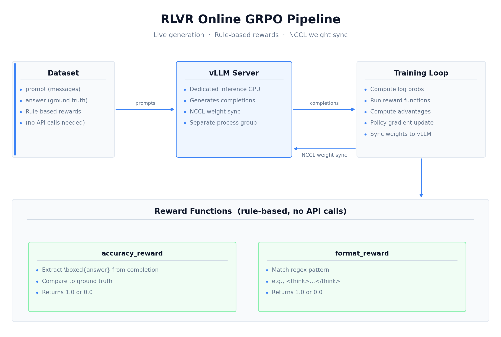

# RLVR Online GRPO

RLVR (Reinforcement Learning with Verifiable Rewards) runs online GRPO with deterministic, rule-based reward functions — `\boxed{}` matching and regex format checks — instead of an external reward model. Trainer `DistributedGRPOTrainer`, script `scripts/training/online_grpo/rlvr.py`, generation online via vLLM with NCCL weight sync. Parallelism: EP, TP, EP+TP, EP+ETP and pure ETP (`ep_size=1`); **CP and PP are not supported**.



The vLLM server generates completions on a dedicated GPU and receives weight updates via packed NCCL broadcast. It runs in its own container; the training env never imports vLLM and reaches it through the vendored `VLLMWeightSyncClient` (`src/distributed/nccl/`). Reward functions score locally, with no network calls.

## TP/ETP rollout consistency

Every rank in a TP group must forward identical inputs (column-/row-parallel collectives compute partial results for the same hidden states). Server-mode vLLM samples each rank's slice independently, so `_generate_single_turn` `broadcast_object_list`s the rollout tuple from the TP-group leader; a second tensor broadcast in `_generate_and_score_completions` covers anything that could diverge through reward functions or tool masks.

## Chat template handling

The script renders each prompt to text with the trainer's tokenizer (`render_generation_prompt`, `src/data/pipeline/rendered.py`) and sends **text** to vLLM, which applies no further template. A `tools_field` column is parsed via `maybe_parse_json` and passed as `tools=` to `apply_chat_template`; `system_prompt` is prepended when the row has no system turn.

The rendered leading BOS is stripped **only** when the tokenizer's post-processor prepends one of its own. Stripping unconditionally would delete BOS for families whose template emits it while the post-processor adds nothing (Gemma 4), with nothing downstream to put it back.

The tokenizer is the single source of truth here, so a `chat_template:` override is honored on both generation and loss without a server-side setting — unlike environmental GRPO, which sends messages and must match the server template ([Chat template must match training](environmental-grpo.md#chat-template-must-match-training)).

## Reward functions

Both live in the RLVR script; the final reward is the weighted sum via TRL's `GRPOConfig.reward_weights`.

- **Accuracy reward** (`use_accuracy_reward`, default on, weight `1.0`) — extracts the **last** `\boxed{...}` from the completion and exact-matches it against the ground-truth `answer`, `1.0` on match else `0.0`. Both sides are normalized first: the answer keeps only the text after a GSM8K `####` marker, surrounding whitespace is stripped, and `,`/`$` are removed. String and conversational completions both work. Extraction (`extract_last_boxed` in `src/environments/rewards.py`) matches braces by depth, so nested LaTeX survives (`\boxed{\frac{1}{2}}` yields `\frac{1}{2}`); an unterminated or empty `\boxed{}` is skipped in favor of the last one that closes.
- **Format reward** (`use_format_reward`, default off, weight `0.5`) — `1.0` if the completion matches `format_pattern`, default `<think>.*?</think>\s*<answer>.*?</answer>`.

This is a **strict boxed exact-match**, not the environments' **validated-answer chain** (`compute_answer_reward`, exact + numeric — [Shared reward validation](environments/benchmarks.md#shared-reward-validation)), which lowercases, re-extracts a box from the ground truth too, and accepts a numeric match within `rtol=0.01`. The two graders are deliberately distinct: switching a run from one to the other changes the RL signal.

## Configuration

Script arguments (`RLVROnlineGRPOScriptArguments`) are listed in the [configuration reference](../../reference/configuration-reference.md#rlvronlinegrposcriptarguments). Three optional objective changes ride on the same class:

- **`advantage_mode`** (`mean` default, plus `qae` / `asymmetric` / `neg_mask_hard`), **`drop_degenerate_groups`** (default `false` here, `true` in env-GRPO) and **`scale_rewards_std_floor`** (default `0.0`, off) use the same `AdvantageShaping` / `degenerate_group_mask` helpers as [environmental GRPO](environmental-grpo.md#off-policy-mismatch-and-stability-knobs). `mean` at a zero floor is bit-identical to unshaped GRPO; a non-zero floor moves the advantages off TRL's fixed `1e-4` divisor. `advantage_mode` and `scale_rewards_std_floor` are each mutually exclusive with `use_rlrr` (RLRR never divides by a reward std), and all four raise unless `multi_objective_aggregation` is `sum_then_normalize`, since they recompute the advantages under that aggregation.

    `neg_mask_hard`'s hard-group gate here is the **total weighted reward** — this trainer has no objective decomposition, unlike the env trainer's `reward/objective` — so with several reward functions a shaping term can lift an unsolved group past `advantage_hard_group_threshold`. Set the threshold for the total scale, or keep a single objective reward function (a warning fires).
- **`use_rlrr: true`** enables RLRR relative-reward shaping ([arXiv:2601.23058](https://arxiv.org/abs/2601.23058)): advantages are recomputed from intra-group rankings instead of group mean/std, keeping signal on all-correct/all-wrong groups and staying reward-scale-invariant. Tunables `rlrr_mode` (`hrr`/`prr`), `rlrr_tau`, `rlrr_lambda`, `rlrr_std_normalize`, `rlrr_length_rerank`, `rlrr_correctness_clip`, `rlrr_correctness_threshold`, and the Eq. 5 clip band `rlrr_xi_pos` / `rlrr_xi_neg` (`1e-3` / `-1e-3`; `xi_neg > xi_pos` is refused). `examples/grpo/online/qwen3/online-grpo-qwen3-8b-rlrr-math.yaml` is the worked recipe. Shaping lives in `src/trainers/grpo/objective/relative_rewards.py` (hyperparameters in `RLRRConfig`, `src/args/mixins.py`); the trainer recomputes on the gathered group set before the TP broadcast.
- **`use_sdpg: true`** enables [SDPG](../distillation/online-sdpg.md) self-distillation ([arXiv:2606.04036](https://arxiv.org/abs/2606.04036)): `DistributedSDPGTrainer` adds a privileged-teacher reverse-KL OPD term on positive-advantage rollouts (`L = L_GRPO + beta(k)·L_OPD`), reusing the same rollouts and verifier. Text-only.

**`reasoning_effort`** (`low`/`medium`/`high`/`random`, default unset) is passed straight to `apply_chat_template` at dataset-map time, so it needs a template that reads that keyword (gpt-oss harmony, mistral4). Single-turn here, so `random` draws per prompt. It changes the rendering, and the map cache is keyed on it.

**MoE balancing is off on this path.** `moe_balancing: aux_loss` is inert under any policy-gradient loss, and both bias-update modes are downgraded to `none` because the routing bias is not forwarded by the weight sync (parameters only — an adopted native slot is a buffer) — so an on-policy MoE run has no router balancing at all, on any family ([Callbacks](../callbacks.md#routerbiasbalancingcallback)).

**Key `GRPOConfig` fields.** `use_vllm: true` and `vllm_mode: server` are required (see below), with `vllm_server_host`/`vllm_server_port`. TRL's defaults: `num_generations` 8 (the group size), `max_completion_length` 256 (the generation budget — the shipped configs span 128 on the smoke runs to 4096 on the math recipes), `beta` 0.0 (the KL penalty), `num_iterations` 1 (GRPO iterations per batch), `epsilon` 0.2 (the PPO clip; the shipped configs run 0.15 or 0.2), `temperature` 1.0.

**vLLM importance-sampling correction.** With `vllm_importance_sampling_correction` (TRL default on), the trainer recomputes the sampled tokens' log-probs and multiplies the per-token loss by `exp(logπ_recompute − logπ_sampling)`, bounded by `vllm_importance_sampling_clip_max` (`3.0`) in the mode `vllm_importance_sampling_mode` selects (default `sequence_mask`: whole sequences above the cap are zeroed rather than clipped). This trainer runs TRL's stock path — unlike environmental GRPO, which forces token-level truncation ([details](environmental-grpo.md#training-on-sampled-tokens-train_on_sampled_tokens-default-on)). The correction is what makes the old-logprob forward unconditional (step 5 of [Data flow](#data-flow-and-batch-construction)), and it gates the k3 KL tail clamp: `beta > 0` with the correction off and aligned accumulation warns at init.

**Dropout is forced off.** `_disable_dropout_for_onpolicy` (`src/trainers/mixins/base.py`) sets `disable_dropout=True` after `_setup_distributed_modes` (so it also reaches EP grouped expert-LoRA dropout), overriding a user-set `GRPOConfig.disable_dropout=False`. Active dropout lowers every recomputed log-prob, drifting the importance ratio below 1 and corrupting the IS correction, the k3 KL estimator, and the `num_iterations > 1` PPO ratio. A non-zero config-level dropout float (`attention_dropout`, `resid_pdrop`, …) is invisible to the module sweep and only warns.

## GRPO objective for verifiable rewards

A graded-fraction reward in `[0, 1]` over a small group wants a different objective than the math defaults — this is about the reward's *shape*, not the task. The knobs are TRL `GRPOConfig` fields and apply equally to online and [environmental](environmental-grpo.md) GRPO; the code-contests env configs carry them (e.g. `examples/grpo/environmental/gptoss/vllm/gptoss-20b-code-contests-lora-ep1.yaml`):

- **`loss_type: dapo`** — token-level **global** normalization (sum over all completion tokens ÷ global active-token count). Length-unbiased: a long correct solution is not down-weighted the way `grpo`'s per-sequence mean would. TRL 1.6's default.
- **`epsilon: 0.2`, `epsilon_high: 0.28`** — DAPO clip-higher: the asymmetric clip loosens only the **upper** bound, so positive-advantage tokens can rise faster (exploration, resists entropy collapse) while the lower bound stays tight. A higher *symmetric* `epsilon` is not equivalent — it also loosens the lower bound and crushes negative-advantage tokens.
- **`scale_rewards: batch`** — group-mean baseline divided by the **global batch** std. The divisor follows the reward's shape.

    A **shaped or multi-component** reward — a per-tool-call rung (`tool_success_reward` 0.05, `tool_error_penalty` 0.1 in the ReAct/QA environments), a graded judge score, code-contests partial credit, or a second reward function at all — leaves a uniformly-failed group with a small non-zero spread, and `group` (TRL's own default) divides by exactly that, turning shaping noise into a full-scale advantage. Every environmental recipe is in that case and sets `batch`.

    A **single-component binary** reward is not: a uniformly-failed group's std is exactly 0 and the `1e-4` divisor floor holds its advantages at exactly 0, so the shipped RLVR configs (`use_accuracy_reward` alone, `use_format_reward: false`) keep the per-group divisor. Enabling a second reward function moves the run into the first case. Full trade-off in [Degenerate groups and reward scaling](environmental-grpo.md#degenerate-groups-and-reward-scaling).
- **`beta`** — the KL anchor to the base model. The PPO clip is inert at `num_iterations: 1`, so a non-zero β·k3 KL is the **only** live trust region; every shipped per-family env recipe instead runs `beta: 0` and takes the shaping bands and the IS clip as its trust region. Without PEFT, `beta != 0` makes TRL build its own reference — an fp32 dense per-rank replica from the hub's default revision. `_validate_implicit_reference_model` **rejects that outright when the policy carries live attention sinks** (`reset_sinks: false`), in every parallelism mode: the reference is not sink-restricted, so it computes different log-probs for identical tokens and the KL is biased on every token. Under EP the same replica is additionally warned about as wasteful. Use `beta: 0` (the shaping bands and the clip become the trust region), or `use_peft: true` with at least one attention target — expert-only LoRA is never PEFT-wrapped, so TRL still builds the reference.
- **`mask_truncated_completions: true`** — single-turn only: a completion cut at the token budget is dropped from the loss rather than scored as a failure. The multi-turn env trainer sets it `false` and applies its own rule ([Degenerate groups](environmental-grpo.md#degenerate-groups-and-reward-scaling)).
- **`num_iterations: 1`** — fully on-policy; old and new log-probs come from the same weights, so the PPO ratio is exactly 1 and `epsilon`/`epsilon_high` bind only when `num_iterations > 1`.

The math defaults (`loss_type: grpo`, symmetric `epsilon: 0.15`, `scale_rewards: true` — the per-group divisor) stay appropriate for `\boxed{}`-style single-token verifiable answers scored by one binary reward function, where neither length bias nor shaping spread is in play.

## Chunked log-probs

`use_chunked_grpo_logprobs: true` (default off) computes the completion log-probs from the backbone's `last_hidden_state` and a vocab-chunked softmax instead of a full `[B, T, vocab]` logits tensor, bounding the loss-forward peak by the chunk size rather than `B·T·vocab`, at the cost of a recompute backward. Turn it on for large-vocab models on long completions — the allocation is `B·T·vocab`, so it binds first on the widest vocabularies (gpt-oss ~201k, Qwen3 ~151k). Neither EP nor TP shrinks that peak, so chunking and a small `per_device_train_batch_size` are the levers. Text-only; [Offline GRPO](offline-grpo.md#memory-chunked-log-probs) shares the same switch. Mechanism, limits and the measured peak: [Environmental GRPO — Chunked log-probs](environmental-grpo.md#chunked-log-probs).

## Dataset format

Required columns: `prompt` (`str` or `List[Dict]` conversation) and `answer` (`str`, ground truth for verification).

```jsonl
{"prompt": "What is 2 + 3? Put your answer in \\boxed{}.", "answer": "5"}
{"prompt": [{"role": "user", "content": "What is 2 + 3? Put it in \\boxed{}."}], "answer": "5"}
```

`trl-lib/DeepMath-103K` (103K math problems with verified answers) is a known-good dataset; any prompt + verifiable-answer dataset works. Rows whose rendered prompt exceeds `max_prompt_length` are **dropped** during preprocessing, never truncated.

## Data flow and batch construction

One optimizer step:

1. The dataloader batches raw `{prompt, answer}` rows. Each prompt is rendered to **text** with the trainer's tokenizer and replicated `num_generations`× (one GRPO group per prompt).
2. `_generate_single_turn` sends the text to the vLLM server (under TP the group leader generates and broadcasts, so every rank forwards identical tokens).
3. Completions are tokenized; `_generate_and_score_completions` right-**pads** prompt+completion into `[B, prompt+completion]` with an `attention_mask` and a **`completion_mask`** that is `1` only on generated tokens — the loss trains the completion, never the prompt.
4. Reward functions score each completion against `answer`; `scale_rewards` normalizes within each `num_generations` group into advantages (`use_rlrr` swaps in ranking-based advantages).
5. The policy forward computes the GRPO loss. A ref forward runs only at `beta > 0`. The old-logprob forward runs whenever `vllm_importance_sampling_correction` is on or `gradient_accumulation_steps` is not a multiple of `steps_per_generation × num_iterations` — so at the defaults it runs every step, independent of `num_iterations`.
6. `_distributed_sync_weights` pushes weights to vLLM before the next generation (see [Weight sync](#weight-sync)).

**Collator.** GRPO uses TRL's dataset-**row** collator (it groups `{prompt, answer}` dicts for generation), **not** the SFT [collators](../../data/collators.md) — there is no `CompletionsOnly`/padding-free packing. Token-level batching is generation-driven (step 3): a right-padded prompt+completion tensor with a completion mask, never packed. This is also why [CP is unsupported](#parallelism-modes).

**Counting.** Rollouts per optimizer step = `per_device_train_batch_size × gradient_accumulation_steps × data_parallel_size` (`per_device_train_batch_size` counts completions — TRL's `RepeatSampler` already repeats each prompt `num_generations`×). `num_generations` trades unique prompts for samples-per-prompt within that fixed total. The training forward processes `per_device_train_batch_size` completions at once, so that × completion length sets the per-forward memory — lower it for long completions, and grow `gradient_accumulation_steps` for batch size at no per-forward cost.

**Batch geometry under TP/ETP or a pre-sharded dataset.** The custom DP-sharded dataloader rebuilds TRL's `RepeatSampler` at the DP consumption rate (`src/trainers/grpo/mixins/dataloader.py`), so `per_device_train_batch_size × steps_per_generation × data_parallel_size` must be divisible by `num_generations` (for a pre-sharded dataset the rate is one rank's, so the DP factor drops).

Under TP/ETP the per-rank product `per_device_train_batch_size × steps_per_generation` must **itself** be divisible by `num_generations`: TP siblings contribute duplicate copies of their DP slice to TRL's world-order reward gather, so a prompt group spanning DP ranks would be regrouped with duplicate rows and silently corrupt the advantages. Both constraints raise at dataloader construction.

## Server mode only

Generation runs in a **separate vLLM container** reached over HTTP, weights pushed in over NCCL. Two reasons force the separation:

- **Isolation.** Training and inference scale and schedule independently. vLLM pins its own torch/transformers stack, so the training image carries no vLLM at all.
- **Separate NCCL worlds.** A colocated, in-process `vllm.LLM()` builds **its own** NCCL / tensor-parallel communicators on the training GPUs, alongside the trainer's FSDP2 / EP / CP / TP groups. Two NCCL worlds sharing the same devices and CUDA streams (under `CUDA_DEVICE_MAX_CONNECTIONS=1`) deadlock or desync.

`DistributedGRPOTrainer` therefore rejects both in-process paths at init: `use_vllm=False` (TRL's in-process `model.generate`) and `vllm_mode='colocate'`. This holds for every on-policy method — online GRPO, [online SDPG](../distillation/online-sdpg.md), and [environmental GRPO](environmental-grpo.md).

vLLM runs in its own container — build, compose variables, and load-bearing flags: [Rollout Servers](../../infrastructure/rollout-servers.md#vllm).

**Context-window preflight.** Before the trainer is built, the script reads the served model's `max_model_len` from `/v1/models` and raises when `max_prompt_length + max_completion_length` exceeds it (`verify_context_window_synced`, `src/trainers/grpo/rollout/weight_sync_clients.py`; the URL follows TRL's precedence — `vllm_server_base_url` over `vllm_server_host:vllm_server_port`). Rank 0 probes and broadcasts the verdict so **every** rank raises together instead of hanging at the next collective; an unreadable `max_model_len` skips the check, and a `None` `max_prompt_length` counts as 0.

!!! warning "GPT-OSS: toolkit vLLM image, sinks on"
    Serve GPT-OSS from `vllm-server:0.26.0` (toolkit), **not** stock upstream vLLM — stock produces garbage GPT-OSS output on Blackwell. Serve attention sinks **on** (the default) and keep them on the trainer too: `reset_sinks: false` freezes the pretrained sinks and the trainer reads them via FA4, so recompute matches the sinks-on generator (`is_ratio ~1`). See [GPT-OSS → Serving for GRPO](../../models/gpt-oss.md#serving-for-grpo-vllm).

## Usage

vLLM must own GPU(s) **no trainer rank uses** — NCCL cannot share a GPU between a trainer rank and the server.

Set `ep_size` to the training-GPU count so the trainer ranks form **one** DeepEP group. `ep_group_size` (`ep_size × expert_tp_size`) must divide `nvlink_domain_size` (the EP locality unit — at least `gpus_per_node`, a whole NVL72 rack on GB300) while it fits in one domain, or the training world size once it spans domains; within a single domain the EP group must span the **whole** domain unless `ep_size <= 2`. **EP=8 therefore needs ≥9 GPUs / multi-node.** See [DeepEP](../../infrastructure/deepep.md).

```bash
# vLLM on GPU 0 (server flags and variables: Rollout Servers)
VLLM_MODEL=Qwen/Qwen3-30B-A3B VLLM_CUDA_DEVICES=0 \
    docker compose -f docker-compose.vllm.yml up vllm-server

# 4 training GPUs = one EP group
CUDA_VISIBLE_DEVICES=1,2,3,4 torchrun --nproc_per_node=4 \
    scripts/training/online_grpo/rlvr.py examples/grpo/online/rlvr-online-grpo-template.yaml \
    --model_name_or_path=Qwen/Qwen3-30B-A3B --expert_parallel_size=4
```

Drop the `--expert_parallel_size` flag for plain FSDP2 data-parallel, or pass `--tensor_parallel_size` for dense TP. `accelerate launch` also works for plain DP, but its shipped configs pin `num_processes: 8` (override on the CLI when vLLM takes a GPU) and `launcher-configs/accelerate/multigpu_dp_config.yaml` is `MULTI_GPU` — accelerate-managed **DDP**, not FSDP.

**EP+TP.** EP and TP partition GPUs along distinct axes (EP distributes experts, orthogonal to DP; TP shards attention, with embeddings/`lm_head` replicated). TP must stay NVLink-local — `tensor_parallel_size` must **divide** `nvlink_domain_size`, since TP groups are contiguous rank blocks — and `ep_size` must be a multiple of `tp_size` so each EP group spans whole TP groups; both divide the training world size. Example: 8 training GPUs with `--expert_parallel_size=8 --tensor_parallel_size=2` and vLLM on a separate host.

### LoRA

Add `use_peft: true` and the `lora_*` fields. LoRA runs under FSDP2 DP, EP and pure ETP (attention adapters), but any adapter on the TP-sharded backbone is **rejected under TP and EP+TP** (`_validate_lora_tp_compatibility`, `src/trainers/mixins/validation.py`): PEFT keeps `lora_A`/`lora_B` as plain tensors outside the TP graph, so the replicated matrix diverges per rank and the sharded one is corrupted by the TP grad sync. EP's **native grouped expert adapters** are refused there too, by the gate's `has_ep_lora` arm — every other TP gate skips them by param identity.

The vLLM weight sync merges the adapter into the base before broadcasting, so vLLM serves the plain base. Plain LoRA is the supported RL adapter path: QLoRA (`load_in_4bit`/`load_in_8bit`) is rejected at trainer construction (`validate_weight_sync_support`, `src/trainers/grpo/rollout/weight_sync.py`) — the sync forwards raw parameter storage under base-weight names, so a bnb-packed 4-bit base would corrupt the served policy, and a per-sync merge/unmerge round-trip through 4-bit weights is lossy.

The same gate refuses every EP family whose layer class sets `_supports_weight_sync = False` ([Per-family EP restrictions](../../parallelism/expert-parallelism.md#per-family-ep-restrictions)), so those models cannot run online or environmental GRPO at all, plus the model types no pinned engine can serve and any live `bias_update` balancing state (the sync ships parameters only). Two GptOss shapes are refused for the same reason from opposite ends: sinks the `flash_attention_2` `reset_sinks` reset removed are never pushed, and `train_sinks: true` moves them every step with no validated sync — on-policy GptOss RL keeps the pretrained sinks live and frozen (`reset_sinks: false`, sink-carrying attention; [Rollout Servers](../../infrastructure/rollout-servers.md#weight-sync)).

See [PEFT](../../optimization/peft.md#hyperparameters) and [Expert Parallelism](../../parallelism/expert-parallelism.md) for LoRA on MoE experts as native grouped adapters.

## Parallelism modes

Data-parallel size is `world_size` for standard and EP-only (EP ⊥ DP), and `world_size / max(tp_size, expert_tp_size)` otherwise — so pure ETP and EP+ETP shrink it the same way TP does.

**CP is not supported.** The GRPO loop needs each rank to see complete sequences for the importance-sampling ratio. The script builds its `ParallelismConfig` with `supports_cp=False`, so `--context_parallel_size > 1` is rejected at config time, before any model load.

**PP is not supported** — and [not yet available in this release](../../parallelism/pipeline-parallelism.md) on any trainer. This one will not take it even when the engine lands: the weight sync gathers the model's full `named_parameters()` from one rank-set in a fixed collective order, and under PP no rank holds every layer; the rollout phase also forwards the training model outside `compute_loss`. The script builds its `ParallelismConfig` with `supports_pp=False`, and the trainer's `_supports_pp = False` re-checks a hand-built config.

### Weight sync

Weights are pushed before the **next** generation, not at the optimizer step: TRL's `_generate_single_turn` syncs when `state.global_step` has moved since `_last_loaded_step`. A **resumed** run therefore pushes before its first rollout: `_last_loaded_step` is a per-process sentinel (`-1`) that `TrainerState` never carries, so the checkpoint's weights reach the engine before any completion is sampled. `_distributed_sync_weights` delegates to the shared `sync_trainer_weights` (`src/trainers/grpo/rollout/weight_sync.py`), which runs `gather_and_send_weights` on every rank and then barriers — the same routine environmental GRPO uses.

It reshards the FSDP2 modules first — a forward leaves its transient unsharded params registered while the optimizer steps the shards, so a push taken as-is would ship the previous step's weights and fold a LoRA adapter into a copy the next unshard discards. Then it gathers EP expert shards (local→global expert remap; ETP all-gathers TP shards within `expert_tp_group`, then across the dispatch EP group), then every dense param (one `full_tensor()` unfold over FSDP2-DP and TP DTensors; the hand-sliced GptOss `sinks` through `iter_tp_sharded_non_dtensor_full`). All ranks run the collective gathers; only the global-main (TP-rank 0 under TP) process forwards — and only it materializes the gathered experts (`retain=False` on every peer). Its sends and the final flush run under a `DeferredRankFailure`, so a send that fails on that rank alone does not drop it out of the next gather: it keeps participating and every rank raises together at the sync's closing `reject`, with the failing rank and the real cause in the message.

Forwarded params are buffered as pinned host snapshots and shipped in one packed broadcast by `reset_prefix_cache()` (`src/distributed/nccl/clients/base.py`) — the name is TRL API compat, it calls no *prefix-cache* endpoint, and the KV flush rides the `/pause` → `/update_weights` → `/resume` sequence.

The server is `/resume`'d in a `finally` and on `close_communicator`, with the pause recorded *before* the `/pause` request goes out so a lost reply still leads to a resume; a started-but-unfinished `/start_weight_update` is closed on the way out. `init_communicator` runs `probe_generation`, which reads `/is_paused` before its 1-token generation, so a paused server is reported as paused and a wedged one as wedged.

The gather asks each EP layer to fold native expert-LoRA in (`merge_lora=True`), so vLLM serves the *trained* experts. Under `expert_tp_size > 1` that fold has no seam in the sharded layout, so a run that actually carries expert adapters is rejected there — but `EPConfig` already refuses expert LoRA with `expert_tp_size > 1`, and a run without adapters folds nothing and syncs normally.

Gathered saves are the default (`save_sharded_ep: false`): HF-standard sharded safetensors plus an index, read back sharded-aware on resume. See [Checkpoints & Resume](../../reference/checkpoints.md).

### Multi-homed nodes (`VLLM_GROUP_HOST`)

The trainer (rank 0) binds the NCCL weight-sync TCPStore and advertises a trainer interface for the vLLM workers to dial back. Resolution order: explicit `group_host` arg → `VLLM_GROUP_HOST` env → **loopback when the server URL is itself loopback** (advertising an external NIC there lets a provider firewall silently drop the hairpin traffic and the first collective spins forever) → default-route NIC. On a multi-homed node — the default route is not the subnet a **remote** vLLM host can reach — set `VLLM_GROUP_HOST` to the trainer IP the server should dial.

`VLLM_GROUP_HOST` controls only the advertised control-plane address, distinct from `NCCL_SOCKET_IFNAME` (data-plane transport). The TCPStore listener binds `0.0.0.0`, so it accepts on any NIC. When the server is on a different host but the advertised address resolves to loopback, `init_communicator` fails fast (the workers would dial themselves) — this happens on an air-gapped cluster with no default route, and the fix is again `VLLM_GROUP_HOST`.

!!! note "Multi-server sync is an Environmental GRPO feature"
    The list-of-dicts `server_configs` API (per-server `url`/`group_port`/`group_host` via `InferenceClientManager`) belongs to **Environmental GRPO** (`AsyncTrainingConfig.rollout_server_configs`), not this single-server RLVR trainer.

## Tuning

**Learning rate.** GRPO perturbs an already-tuned policy, so the rate sits near the SFT floor — every shipped online config uses `1e-6` except `examples/grpo/online/rlvr-online-grpo-template.yaml` at `5e-6`. Too high a rate collapses the policy. LoRA raises this ~10× (`5e-5`, see [PEFT](../../optimization/peft.md#hyperparameters)).

**Batch and groups.** Rollout count and the per-forward product are derived in [Data flow and batch construction](#data-flow-and-batch-construction); larger `num_generations` tightens the advantage estimate but multiplies the per-forward. Conservative math defaults: `beta: 0.0`, `num_iterations: 1`, `epsilon: 0.15`, `num_generations: 8`, `temperature: 1.0`, `scale_rewards: true` (single binary reward — [objective](#grpo-objective-for-verifiable-rewards)), `learning_rate: 5.0e-6`, `gradient_accumulation_steps: 8`. See [SFT — Learning rate and global batch size](../sft.md#learning-rate-and-global-batch-size).

**GPU allocation.** Reserve GPUs for vLLM; the remaining training count must be a valid TP/EP size — TP needs `num_kv_heads % tp_size == 0`, EP needs `ep_size` = training-GPU count. On 8 GPUs that gives EP=4 or TP=4 with 4 for vLLM, or EP=6 / FSDP with 2 for vLLM (TP=6 is invalid on most `num_kv_heads`).

**Memory.** `gradient_checkpointing: true`; `optim: adamw_torch_fused`; raise EP size to spread MoE experts; LoRA for large models. Reduce `per_device_train_batch_size` / `max_completion_length` on OOM.

## vLLM on Blackwell (B200)

Server-side: `VLLM_ATTENTION_BACKEND=FLASH_ATTN` and CUDA graphs on — see
[Rollout Servers → Throughput](../../infrastructure/rollout-servers.md#throughput).

**Training side.** All three GRPO scripts request **SDPA** when the YAML pins no `attn_implementation` and `reset_sinks` is true (`padded_workload_attn_implementation`, `src/training/script_runner.py`) — the auto-detected FA4 runs these right-padded batches through its slow varlen path. At `reset_sinks: false` the request is dropped, since only a sink-carrying implementation is accepted there, and the model auto-selects via `_detect_attention_impl`: Blackwell uses FA4 when `flash_attn.cute` is importable else FA2; Hopper uses FA3 when `flash_attn_3` is importable else FA2. A pinned `attn_implementation` always wins.

## Troubleshooting

- **vLLM not responding / hang at sync or generation** — `curl http://localhost:8000/health`; ensure `gpu_memory_utilization` leaves room for the model; check for `vllm_server_port` conflicts; confirm vLLM's `CUDA_VISIBLE_DEVICES` does not overlap the training GPUs.
- **`vLLM server ... is PAUSED for a weight update`** — a prior trainer died between `/pause` and `/resume`. `/health` still returns 200 and new requests only queue. Lift it with `curl -X POST http://<server>/resume`; no container restart needed.
- **`vLLM server ... answers /health but GENERATION is wedged`** — a prior trainer died mid-sync (SIGKILL from `docker rm -f` skips the atexit `/resume`), leaving the scheduler stuck while `/health` still returns 200 and `/is_paused` reports false. **Restart the vLLM container.**
- **NCCL timeout / `Failed to broadcast barrier_id` / TCP store timeout** — a crashed vLLM server, a model/shape mismatch between trainer and server, blocked NCCL ports, or vLLM launched via `docker run` without host networking. Check server logs, match the model exactly, add `--network host` (compose handles this). On a host **without InfiniBand** the training image's baked OFI/Gin NCCL defaults wedge the weight-transfer group's first collective instead of falling back — both containers need the no-IB overrides ([Rollout Servers](../../infrastructure/rollout-servers.md#vllm)). For genuinely slow collectives raise `DIST_NCCL_TIMEOUT_MINUTES` (default `30`).
- **OOM** — raise EP size, enable gradient checkpointing, reduce `per_device_train_batch_size` or `max_completion_length`, or use LoRA.
- **All rewards zero (`rewards/accuracy_reward/mean: 0.0`)** — the model is not emitting `\boxed{}`. Add explicit `\boxed{}` instructions to the prompt, raise `max_completion_length`, lower `temperature`, and inspect completions with `log_completions: true`.
- **FlashInfer JIT failure on B200** (`class TllmGenFmhaKernelMetaInfo has no member mGroupsTokensHeadsQ`) — set `VLLM_ATTENTION_BACKEND=FLASH_ATTN` on the server.

## Related pages

- [Distributed Trainers Guide](../../reference/trainer-architecture.md) · [Scripts Reference](../../reference/scripts-reference.md)
- [Offline GRPO](offline-grpo.md) · [Environmental GRPO](environmental-grpo.md) · [GRPO Comparison](grpo-comparison.md)
- [Expert Parallelism](../../parallelism/expert-parallelism.md) · [Tensor Parallelism](../../parallelism/tensor-parallelism.md)
- [RLVROnlineGRPOScriptArguments Reference](../../reference/configuration-reference.md#rlvronlinegrposcriptarguments)
