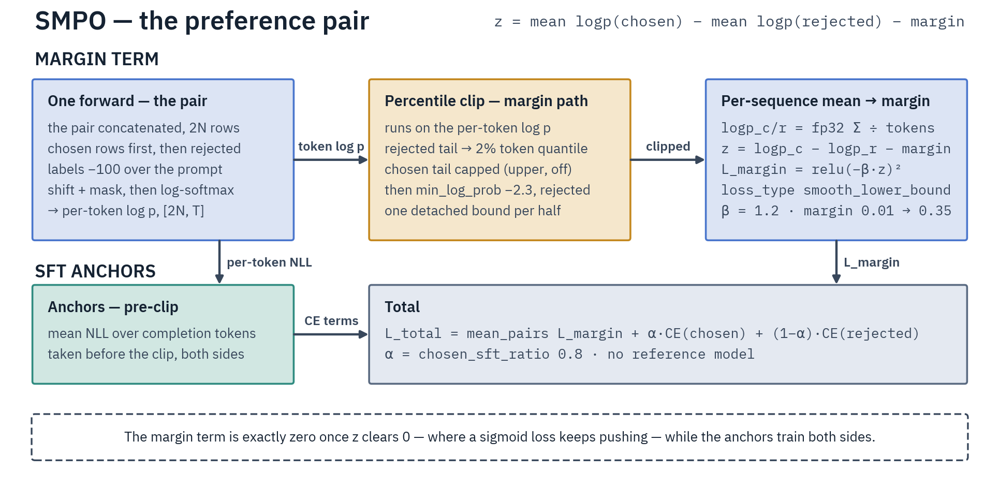

# SMPO: Smooth Margin Preference Optimization

Reference-model-free, dynamic-margin preference optimization: SMPO trains the policy directly on pairwise preferences with a scheduled margin objective plus a built-in SFT anchor, so it holds one model in memory instead of two.

The default `smooth_lower_bound` (squared hinge) loss falls to exactly zero once `log π(chosen) − log π(rejected) ≥ target_margin`, so a pair stops updating once it is separated. DPO's sigmoid loss never reaches zero and keeps driving chosen up and rejected down past separation — the source of DPO's log-prob collapse.

| Aspect | Value |
|--------|-------|
| Data format | Pairwise preferences (`prompt`, `chosen`, `rejected`, all `list[dict]`) |
| Reference model | Not required |
| Trainer | `SmoothMarginPOTrainer` (`src/trainers/preference/smpo.py`) |
| Config | `SmoothMarginPOConfig` (`src/configs/smpo_config.py`) |
| Script | `scripts/training/preference/smpo.py` |
| Parallelism | EP, CP, TP, pure ETP (`ep_size=1`), EP+CP, EP+TP, EP+ETP. Declares `_supports_pp` — [PP](../../parallelism/pipeline-parallelism.md) is not yet available in this release |

TP+CP and ETP+CP are rejected by `ParallelismConfig`. The trainer declares `_supports_pp`, but pipeline parallelism is [not yet available in this release](../../parallelism/pipeline-parallelism.md); its shipped gates additionally reject `padding_free`, PEFT, a [VLM run](#vision-language), a non-null `lower_clip_percentile` / `upper_clip_percentile`, and a `label_pad_token_id` other than `-100`.

`padding_free` needs a varlen Flash Attention kernel (FA2/FA3/FA4) and raises at construction on any other implementation. The SMPO script defaults `attn_implementation` to `sdpa` under the default `reset_sinks: true`, so set a Flash implementation explicitly to use it; under `reset_sinks: false` the script requests no default and the resolver auto-selects, accepting only a sink-carrying backend. `padding_free` is also incompatible with CP.



## Loss

```text
log_ratio = mean_token log π(y_c|x) - mean_token log π(y_r|x)
logits    = log_ratio - target_margin
L_total   = loss_fn(β · logits) + L_sft
L_sft     = chosen_sft_ratio · CE(chosen) + (1 - chosen_sft_ratio) · CE(rejected)
```

Per-sequence log prob is the mean of per-token log probs over completion tokens only.

`loss_type` (default `smooth_lower_bound`):

| Type | `loss_fn(z)` | Behavior |
|------|--------------|----------|
| `sigmoid` | `-log_sigmoid(z)` | Smooth, non-zero past margin (DPO-like) |
| `hinge` | `max(0, -z)` | Zero once margin satisfied; discontinuous gradient |
| `ipo` | `z²` | Symmetric squared penalty; targets the margin exactly (penalizes overshoot) |
| `smooth_lower_bound` | `max(0, -z)²` | Squared hinge: smooth gradient, zero once satisfied |

## Margin scheduling

With `use_margin_schedule=True` (default) the margin interpolates linearly from `initial_margin` (default `0.01`) to `target_margin` (default `0.35`) over training. `VariableSchedulerCallback` updates `model.target_margin` each step. `initial_margin` must be `< target_margin` or the config raises.

## Token-level clipping

Floors on per-token log probs keep outlier tokens from dominating the gradient:

- `lower_clip_percentile` (default `0.02`): clip the bottom percentile of rejected log probs.
- `upper_clip_percentile` (default `None`): clip the top percentile of chosen log probs.
- `min_log_prob` (default `-2.3`, ≈10% probability floor): absolute floor for rejected tokens.

## Configuration

`SmoothMarginPOConfig` extends `TrainingArguments`. Load-bearing defaults: `beta=1.2`, `target_margin=0.35`, `chosen_sft_ratio=0.8`, `loss_type="smooth_lower_bound"`, `learning_rate=1e-6`, `gradient_checkpointing=True`, `padding_free=False`. Full field list: [SmoothMarginPOConfig Reference](../../reference/configuration-reference.md#smoothmarginpoconfig).

`max_length` is the total budget; `resolve_length_budget()` splits it into a prompt and a completion share. Leave `max_prompt_length` null and it takes half of `max_length`, so the split scales when `max_length: null` resolves to the model's context window; leave `max_completion_length` null and it takes the remainder. The prompt truncates per `truncation_mode` (`keep_end` default), the completion from the end while keeping its terminal EOS. Shares that sum past `max_length` are rejected at construction — the two truncate independently, so such a split would build sequences longer than the stated budget.

Parallelism is passed as `ParallelismConfig(ep_size=, cp_size=, tp_size=, ep_scope=)` directly to the trainer; `save_sharded_ep` controls EP shard saving. See [Expert Parallelism](../../parallelism/expert-parallelism.md) and [Context Parallelism](../../parallelism/context-parallelism.md).

## Dataset format

Same pairwise format as [DPO](dpo.md): `prompt`, `chosen`, `rejected`, each a `list[dict]` message list. `DataCollatorForSMPO` left-pads prompts and right-pads completions per batch.

## Vision-language

`smpo.py` serves both modalities, and two verdicts decide it, not one.

The **model class follows the checkpoint**: a multimodal config loads through `AutoModelForImageTextToText` + processor, and that processor stays the trainer's `processing_class`, so every checkpoint the run saves carries a `processor_config.json`. The **data path follows the run** (`is_vlm_run`, passed to the trainer as `is_vlm`): the VLM path only when the checkpoint is multimodal **and** the dataset declares images with an `images`/`image` column (single image or list). A text preference run on a natively-multimodal checkpoint (Gemma 4, Qwen3.5/3.6) is a text run — CP and `padding_free` stay available on it, and its rows tokenize through the processor's inner tokenizer.

Image parts embedded in prompt messages are extracted on the VLM path but do not declare the run: a dataset carrying images only inside its messages reads as text, and the text renderer refuses it rather than training on pixel-less placeholder tokens.

A VLM run hands its rows to the trainer untouched — it normalizes and chat-templates them itself and auto-selects `DataCollatorForVLMSMPO`, which runs image processing at collation, since persisting pixel tensors per row would bloat the Arrow cache. Completions must be text-only; a completion carrying images raises. Prompts are never truncated: a prompt that expands past `max_prompt_length` raises, because cutting expanded image-placeholder tokens desyncs them from `pixel_values`. Vision tensors ride through the chosen|rejected concatenated forward duplicated row-major, and image tokens live in the prompt region (labels `-100`), so the loss math is unchanged. A VLM run rejects CP, `padding_free` and PP at construction.

## Usage

```bash
torchrun --nproc_per_node=8 scripts/training/preference/smpo.py \
    examples/preference/gptoss/smpo-gptoss-20b-tulu3-prefmix-ep.yaml \
    --expert_parallel_size=8
```

From Python, pass a `SmoothMarginPOConfig` as `args` and the tokenizer (or processor) as `processing_class`; `is_vlm` picks the data path and, omitted, follows the modality of `processing_class`. For EP/CP, load the model with `load_distributed_model(path, ParallelismConfig(ep_size=8), ...)` and hand the trainer the same `parallelism_config`; CP patching is applied automatically. LoRA: pass `peft_config=LoraConfig(...)`.

## Hyperparameters

Preference optimization refines an already-tuned model, so the LR sits below the SFT band: start at `5e-7` (the config default is `1e-6`), with `5e-6` as the band ceiling. LoRA raises it to `5e-5` (see [PEFT](../../optimization/peft.md#hyperparameters)). Effective batch size follows SFT (`per_device_train_batch_size × gradient_accumulation_steps × data_parallel_size`); the shipped Qwen3.5-9B config uses `1 × 8 × DP`. See [SFT — Learning rate and global batch size](../sft.md#learning-rate-and-global-batch-size).

## Troubleshooting

- `initial_margin must be < target_margin` — fix the schedule bounds.
- Loss NaN / exploding — set `min_log_prob=-2.3` and `lower_clip_percentile=0.02` to floor and clip extreme tokens.
- Outputs degrade — preference signal overpowering the SFT anchor: raise `chosen_sft_ratio` (e.g. `0.9`), lower LR or `beta`, enable margin scheduling.
- Margin not improving — `target_margin` too high or LR too low; lower the margin, raise the LR, or schedule from an easier `initial_margin`.
- OOM on long sequences — `gradient_checkpointing=True`, CP to split sequences, or a smaller batch.

Monitor `logps/chosen` (should rise), `logps/rejected` (should fall), `rewards/margins` (mean of `beta · (logps/chosen − logps/rejected)`, rising as the log-ratio approaches `target_margin`), and `rewards/accuracies` (fraction chosen > rejected, target > 0.6).
