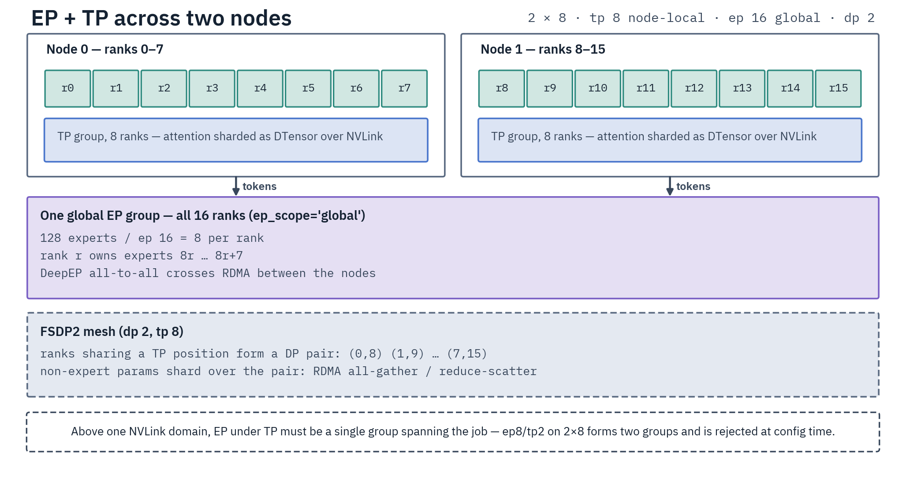
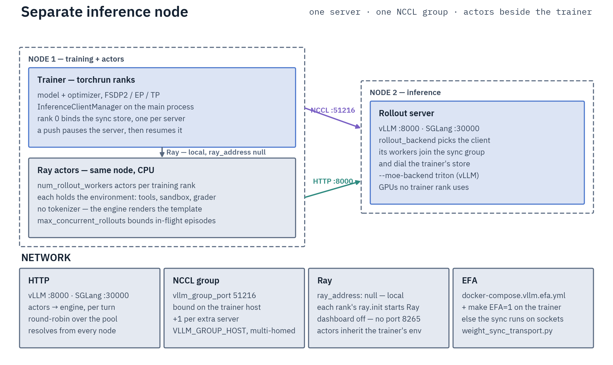
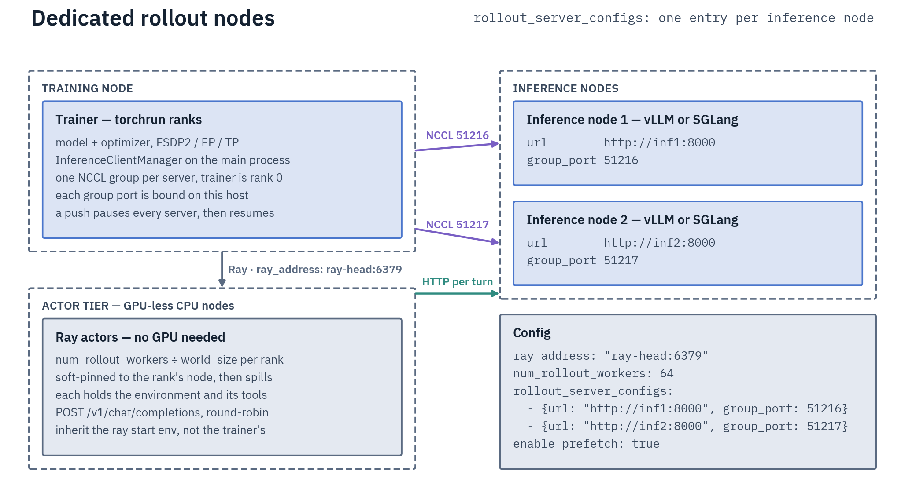

# Clusters and Multi-Node

Multi-node training is one `torchrun` per node, each inside its own container
running the same image. There is no in-repo scheduler; you bring one (SkyPilot
and Nomad templates are included) or start the processes yourself.

## The launch pattern

On every node, from a container started as in
[Installation](installation.md) plus `--network host`:

```bash
torchrun --nnodes=2 --node_rank=$NODE_RANK --nproc_per_node=8 \
    --master_addr=$MASTER_ADDR --master_port=29500 \
    scripts/training/sft.py examples/sft/gptoss/gptoss-20b-multinode-ep.yaml
```

Only `--node_rank` differs between nodes. Everything else — `--nnodes`,
`--nproc_per_node`, the master address and port, the config, every parallelism
flag — must be identical everywhere, or the job dies at startup with a
process-group error.

`MASTER_ADDR` has to be an IP the compute fabric can route (the InfiniBand or
private address, not the public SSH one), and port 29500 has to be reachable
node-to-node. The image must already be present on every node: Flash Attention
and DeepEP are compiled into it, and building from source on a bare node is not
supported.

On SLURM, launch with `--ntasks-per-node=1` and pass `$SLURM_NODEID` as the node
rank — one torchrun per node, not one per GPU.

## Storage: shared or not

`DIST_SHARED_FILESYSTEM=1` (the default) means nodes share a filesystem
(NFS/Lustre): only global rank 0 writes the model and downloads, and each rank
writes its own optimizer shard. On per-node local disk — RunPod pods, ephemeral
NVMe — set it to `0`: each node then saves its own copy, and resume needs no
copying as long as every node keeps its `--node_rank`, since the optimizer shards
stay on the node that wrote them. Resume on per-node storage is validated in CPU
simulations only. A multi-node run checks the output side against `output_dir` at
startup and refuses a contradicting declaration.

It is an umbrella over a read side (`DIST_INPUT_SHARED_FILESYSTEM`) and a write
side (`DIST_OUTPUT_SHARED_FILESYSTEM`), which want opposite settings on a flaky
NFS/EFS mount: rank 0 writing the HF cache while remote ranks read the same
inodes surfaces as `Stale file handle`. Set the input side to `0` and leave the
output shared, so checkpoints stay one authoritative copy
([Environment Variables](environment-variables.md)).

Either way, one rank going first is a bounded wait —
`DIST_STORE_TIMEOUT_HOURS`, default 4. Raise it when a 100B-scale download or a
whole-corpus pack outlasts that while the other ranks wait. That variable and
`DIST_NCCL_TIMEOUT_MINUTES` must be identical on every rank; the job refuses to
start otherwise.

Every node must also see the same model source at the same commit. A local
checkpoint missing on some nodes, or per-node Hub caches at different commits,
raises on every rank before the load. Put the checkpoint or `HF_HOME` on a shared
mount, or set `DIST_INPUT_SHARED_FILESYSTEM=0` so each node fetches its own Hub
copy (a local checkpoint then has to exist on every node), and pin
`model_revision` to one commit
([Troubleshooting](troubleshooting.md#multi-node-and-clusters)).

The FA4 kernel cache lives under `HF_HOME` and locks each file with `flock`. On a
shared `HF_HOME` whose mount has no cross-node `flock` (Lustre without `flock`, NFS
`nolock`), set `FLASH_ATTENTION_CUTE_DSL_CACHE_DIR` to node-local storage.

## Network fabric

InfiniBand and RoCE run on the NCCL defaults baked into the image, but only EFA
is validated by real multi-node runs. Three situations need extra environment:

- **AWS EFA**: add `NCCL_NET_PLUGIN=ofi NCCL_NET=Libfabric`, pass `--device
  /dev/infiniband`, and for cross-node expert parallelism also `NCCL_GIN_TYPE=2`
  plus `--device /dev/gdrdrv`. `NCCL_PROTO=simple` is optional; if you set it,
  set it on every rank, a rollout server on another node included. Don't set
  the env vars on an InfiniBand cluster — they make it slower.
- **Multiple NICs**: point `NCCL_SOCKET_IFNAME` at the fast interface so NCCL's
  bootstrap doesn't wander onto the management network.
- **Rollout server on another node** (RL): the server container needs the same
  fabric — start it with the compose EFA overlay after the base file
  (`-f docker-compose.vllm.yml -f docker-compose.vllm.efa.yml`, or the SGLang
  pair) and the trainer with `make ... EFA=1`.
  `halo run weight-sync-transport --server-url http://<server>:8000 --expect efa`
  confirms the sync formed on EFA before you train.

On an NVL72 rack, `NVLINK_DOMAIN_SIZE=72` tells Halo the NVLink domain is the
rack, not the node — but its Grace hosts (GB200/GB300) are aarch64, which the
images do not build for ([Installation](installation.md)).

Cross-node expert parallelism needs a real RDMA fabric; the default
`ep_scope: auto` goes global once the EP group outgrows the NVLink domain. The
ready-made template is `examples/sft/gptoss/gptoss-20b-multinode-ep.yaml`.



Above one NVLink domain, EP under TP must be a *single* group spanning the job:
`ep8 + tp2` on 2×8 forms two EP groups and is rejected at config time, while
`ep16 + tp2` with `ep_scope=global` is the shape that runs. Pure EP needs none of
this — node-local `ep8` on 2×8 is two DP replicas and runs as is.

## Rollout servers on other nodes

An RL job places three things: the trainer ranks, the Ray actors that drive the
environments, and one or more rollout servers. The actors are CPU-only and can
sit beside the trainer; the servers need their own GPUs, because a trainer rank
and an engine cannot share one.



The common two-node shape: actors stay local (`ray_address: null`), the server
gets a node to itself, and the trainer's rank 0 binds the weight-sync group the
server's workers dial back on `vllm_group_port`.



Scaling out, each extra server is another `rollout_server_configs` entry with its
own port, and the actors round-robin across them; a Ray head lets the actor tier
live on GPU-less nodes. Both shapes need the server container on the same fabric
as the trainer — see [Rollout Servers](rollout-servers.md).

## HSDP: fewer collectives over the fabric

Plain FSDP2 shards every parameter across the whole job, so each all-gather and
reduce-scatter crosses the fabric. `--use_hsdp` makes the mesh two-dimensional —
shard within an NVLink domain, replicate across domains — leaving the
cross-domain gradient all-reduce as the only collective that leaves the node. It
covers the standard data-parallel path only (pure DP or CP): EP, TP, and ETP are
rejected at startup, and on a single-domain job the flag is a no-op.

## SkyPilot

`launcher-configs/skypilot/` holds launchable task YAMLs for AWS and Nebius:
GPT-OSS 20B (node-local EP), plus GPT-OSS 120B and Qwen3.5-122B in node-local
and cross-node EP variants. They handle rendezvous, fabric setup, and storage
mounts:

```bash
pip install "skypilot-nightly[aws]"   # or [nebius]
sky launch -c oss-120b launcher-configs/skypilot/aws/gpt-oss-120b/crossnode-ep.yaml \
    --secret HF_TOKEN --secret WANDB_API_KEY
sky logs oss-120b --follow
```

Each YAML ships `resources.image_id` commented out, naming the prebuilt image for
its GPUs — uncomment it before launching, and repoint it only for your own
build. Details:
[SkyPilot](../agent-docs/infrastructure/skypilot.md) ↗.

## RunPod

No automation, but a manual runbook: pods in one datacenter on the same
InfiniBand fabric, `DIST_SHARED_FILESYSTEM=0`, and gathered (not sharded)
checkpoint saves. Follow [RunPod](../agent-docs/infrastructure/runpod.md) ↗.

## Nomad

`launcher-configs/nomad/` holds batch job specs for a Nomad cluster you already
run: a single-GPU LoRA job, 8-GPU node-local EP, and a two-node EP recipe. Nomad
provisions nothing — the GPU clients, the NVIDIA device plugin, and the scratch
disk are yours — so these sit closer to raw `docker run` than the SkyPilot tasks
do.

```bash
nomad job plan launcher-configs/nomad/qwen3.5-35b-a3b-8gpu-ep.nomad.hcl   # dry run
nomad job run  launcher-configs/nomad/qwen3.5-35b-a3b-8gpu-ep.nomad.hcl
```

One caveat before the two-node job: Nomad has no gang scheduling, so a job can
half-place, rank 0 holding 8 GPUs while rank 1 waits. The spec bounds that with a
rendezvous timeout rather than preventing it.
[Nomad](../agent-docs/infrastructure/nomad.md) ↗.

## When it hangs

NCCL timeouts, rendezvous mistakes, and stragglers have their own section in
[Troubleshooting](troubleshooting.md). Per-topology launch commands:
[Multi-Node](../agent-docs/parallelism/multi-node.md) ↗ ·
[Launch Recipes](../agent-docs/parallelism/launch-recipes.md) ↗.
