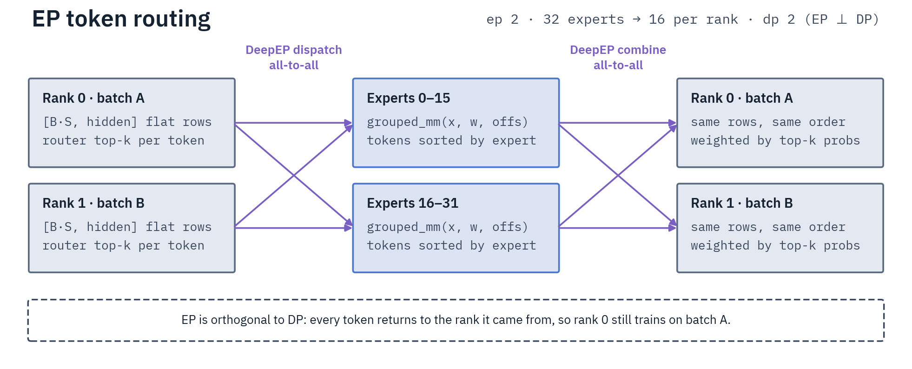
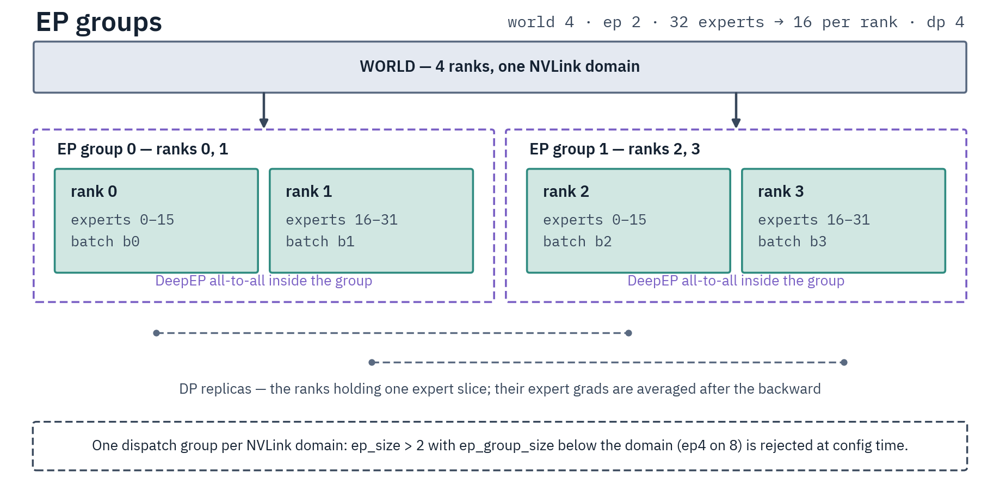
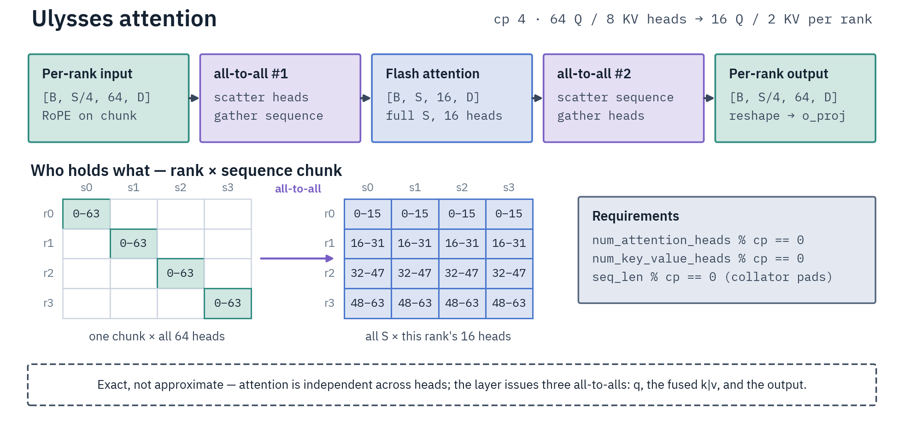

# Parallelism

Plain data parallelism needs no flags. `halo launch <method> <config> -n 8` (or
`torchrun --nproc_per_node=8`) shards the model across 8 GPUs with FSDP2. Add a
mode below only when the model or the sequence does not fit.

| Need | Mode | Flag |
| --- | --- | --- |
| Shard MoE experts across GPUs | EP | `--expert_parallel_size=N` |
| Shard each expert's FFN | ETP | `--expert_tensor_parallel_size=N` |
| Shard dense weights (attention and FFN) | TP | `--tensor_parallel_size=N` |
| Split a long sequence across GPUs | CP | `--context_parallel_size=N` |
| Cut cross-node FSDP traffic (DP or CP) | HSDP | `--use_hsdp=true` |

EP combines with one of TP, CP or ETP (EP+TP for MoE plus attention sharding,
EP+CP for MoE plus long context).

The data-parallel size is what is left:

```text
data_parallel_size = world_size / max(cp_size, tp_size, expert_tp_size)
```

EP does not reduce it, because an EP rank is also a data-parallel rank. The
divisor is a max, not a product, because no two of CP, TP and ETP may exceed 1
in the same run.

## How EP groups work



EP moves tokens, not batches. Each token goes to the rank that holds its expert
and comes back to the rank it came from.



Ranks form dispatch groups of `ep_size`. Ranks that hold the same expert slice
are DP replicas, and their expert gradients are averaged after the backward
pass. Most of the rules below are about how these groups may be shaped.

## Rules that save you a wasted run

Halo validates the layout at startup and rejects an invalid shape with a
message that names the rule. Most checks run at config time, before the model
loads; a few (LoRA with TP, CP head counts) fail at model load or trainer
construction.

- **Allowed combinations.** EP pairs with at most one of TP, CP or ETP. TP+CP,
  TP+ETP, ETP+CP and any three axes are rejected.
- **Within one NVLink domain, EP fills the domain or uses `ep_size=2`.** Sizes
  in between, such as EP=4 on 8 GPUs, are rejected: the MoE routing collectives
  race FSDP2's and the run faults or deadlocks. For a 4-way expert split on 8
  GPUs, use `ep4 + etp2`. The check compares `ep_size × expert_tp_size` with the
  domain size, so `ep4 + tp2` is rejected like plain `ep4`.
- **TP, ETP and node-local EP stay inside one NVLink domain.** On a typical
  8-GPU host that is the node; on NVL72, set `NVLINK_DOMAIN_SIZE=72` to make it
  the rack. `tp_size` and `expert_tp_size` must divide the domain size. EP spans
  domains with `--ep_scope=global` on an RDMA fabric ([Clusters](clusters.md)).
  EP+TP across domains needs one EP group that spans the whole job (`ep_size` =
  world size).
- **EP+CP needs node-local EP that fills the domain.** `ep_size` must equal the
  NVLink domain size, for example `ep8` on an 8-GPU node. Global-scope EP with
  CP is rejected.
- **HSDP is for pure DP or CP.** `--use_hsdp=true` shards within an NVLink
  domain and replicates across domains ([Clusters](clusters.md)). It is
  rejected with EP, TP and ETP, and does nothing on a single-domain job.
- **Replicated experts are FSDP-sharded by default.** With `ep_size` and
  `expert_tensor_parallel_size` both 1, `fsdp_shard_ep1_experts: true` shards
  them, which saves memory that otherwise grows with the DP size. Setting it to
  `false` is rejected under TP or CP.
- **LoRA does not combine with TP** (or EP+TP).
- **QLoRA runs on plain data parallelism and CP only.** Its 4-bit base is
  replicated, not FSDP-sharded, so FSDP knobs such as `use_hsdp` are refused
  under torchrun. EP, ETP and TP reject it, and a MoE model also needs
  `use_grouped_gemm: false`. Offline GRPO rejects it under CP, and both online
  RL methods reject it in every mode, because weight sync would ship packed
  4-bit tensors to the server.
- **CP covers SFT, SMPO and offline GRPO.** Offline GRPO under CP is full
  fine-tuning only. Online GRPO and async GRPO do not support CP.

## Context parallelism



CP splits the sequence across ranks and switches to a head split for the
attention itself, so the result is exact. The cost is three all-to-alls per
attention layer. The head counts must divide by `cp_size`; the collator pads the
sequence length to fit.

## Pipeline parallelism

Not yet available in this release. `pipeline_parallel_size` parses, but any
value above 1 is rejected at config time.

## Picking a shape

Sharding costs throughput, so use the least that fits
([Performance](performance.md)). Which family supports which mode is in the
[Supported Matrix](supported-matrix.md).

Deep dives:
[Expert](../agent-docs/parallelism/expert-parallelism.md) ↗ ·
[Context](../agent-docs/parallelism/context-parallelism.md) ↗ ·
[Tensor](../agent-docs/parallelism/tensor-parallelism.md) ↗ ·
[Expert-Tensor](../agent-docs/parallelism/expert-tensor-parallelism.md) ↗ ·
[Multi-Node](../agent-docs/parallelism/multi-node.md) ↗.
