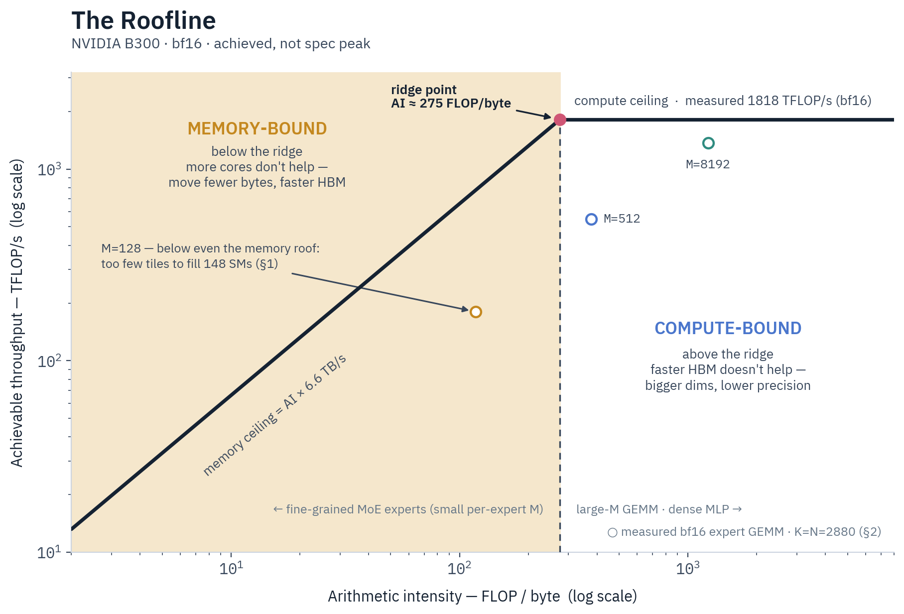

# Performance

What to expect from a run, which levers actually move it, and which famous ones
do nothing at MoE shapes.

## Rough numbers

Measured on B300 (Blackwell), bf16, Liger and grouped GEMM on, Flash Attention 4
where the family takes it (Qwen3.5 falls back to SDPA). Tokens per second per
GPU, so a number scales by the GPU count:

| Model | Shape | tok/s/GPU |
| --- | --- | --- |
| Qwen3-4B dense | 1 GPU, batch 8 × 2048, no checkpointing | 39,900 |
| GPT-OSS 20B | 8 GPUs, `ep1`, batch 4 × 4096, no checkpointing | 24,500 |
| Qwen3.5-35B-A3B | 8 GPUs, `ep2`, batch 4 × 4096, checkpointing on | 12,600 |
| GPT-OSS 20B | 8 GPUs, `ep8`, batch 4 × 4096, checkpointing on | 10,100 |
| GPT-OSS 20B, 32k context | 8 GPUs, `ep8 + cp8`, checkpointing on | 6,000 |

Two things to read out of that table. Expert parallelism costs throughput — at
matched settings `ep1` runs about 2× `ep8` on the same model — because it trades
local parameters for all-to-all traffic, so pick the *lowest* EP that fits rather
than the largest your GPUs allow. And context parallelism is a way to afford a
long sequence, not a way to go faster: it holds memory nearly flat from 16k to
64k tokens and buys no speed. Sharding buys capacity — a 119B MoE trains on four
GPUs at `ep2 + etp2` — and you pay for it in tokens per second.

One rule of thumb before you judge any number: `M = per_device_batch_size ×
sequence_length` should be at least ~8k on a B300 MoE run. Below that the step is
latency-bound and the GPUs are waiting, not computing. Turn on
`enable_efficiency_metrics: true` to get tokens/s/GPU in your own logs.

## Levers that help

| Lever | What it buys |
| --- | --- |
| Bigger `M` — raise `per_device_train_batch_size` or `max_length` | the single largest effect; batch 1 → 4 is 1.5–2.1× on MoE. Fill the global batch with `gradient_accumulation_steps`, not more parallelism |
| `gradient_checkpointing: false` when activations fit | +29% on GPT-OSS `ep8` at 4k, at roughly double the activation memory |
| `packing: true` (or `padding_free: true`) | 9.2× on a corpus averaging a quarter of `max_length`; nothing when rows already fill it |
| `use_grouped_gemm: true` (default on SM90+) | 2.1–3.4× end-to-end at `ep2` — one batched expert matmul instead of a loop |
| Flash Attention 4 (auto on Blackwell) | 1.1× at 4k rising to 2.3× at 32k on dense; ~+13% on MoE, where all-to-all dominates |
| `use_liger_kernel: true` (default) | +40% and 19 GB at MoE `ep2`; add `liger_kernel_config: {fused_linear_cross_entropy: true}` past ~16k tokens, which trades a few percent of speed for tens of GB |
| `AdamWBF16` (automatic with `bf16: true`) | weights and optimizer state in 6 bytes/param where fp32-state AdamW needs 12, and a 17% shorter step |

The defaults already have most of this on. The levers you actually set per run
are the first three.

## Levers that do not help here

| Lever | Why not |
| --- | --- |
| fp8 / fp4 **compute** (`lowp_precision`) | fine-grained experts are weight-bandwidth-bound, not FLOP-bound, so halving the matmul precision buys nothing — bf16 is already at the roofline |
| The simulated low-precision backend | it is an exact QAT oracle, not a fast path: roughly 8× a bf16 step at mxfp8, 17–19× at fp4 |
| Native DeepGEMM (`HALO_DEEPGEMM_NATIVE=1`) | 0.05–0.17× of bf16 at production shapes; the per-token activation quantization never amortizes. Never auto-selected |
| `torch_compile: true` on an EP MoE run | it works, but it targets the same spans Liger already fuses, so stacking adds ~2%, against 2–5 minutes of compile on the first step |

Low precision does earn its keep on the way out: `halo run quantize-to-lowp`
halves (fp8) or quarters (fp4) the expert-weight bytes of a checkpoint you are
about to serve. That is a memory lever, not a training one.

Fine-grained MoE experts sit in the shaded memory-bound region: with 128 token
rows against a 16 MB weight, the tensor cores finish and idle while HBM streams,
so the fix is a bigger `M`, not a faster kernel.

## Why not stock TRL

Halo trains GPT-OSS 20B at 2.3–2.8× stock TRL across every short and mid-length
config on the same 8 B300s, with the same kernels and the strongest stock options
enabled on both sides. Most of the gap is structural rather than kernel-level:
transformers' own expert-parallel path never moves tokens — every rank holds the
whole batch, zeroes the scores of experts it does not own, and all-reduces the
full MoE output — where Halo routes each token once to the rank owning its expert
over DeepEP, putting `top_k/num_experts` of the batch on the wire per layer.
Stock FSDP2 also re-gathers all 20.7B parameters every micro-step, a fixed cost a
short step cannot hide, and keeps fp32 optimizer masters where `AdamWBF16` keeps
6 bytes per parameter. The `ep8` shape trades some of that speed back for memory:
1.3–2.1× TRL at about half its footprint. None of it costs convergence — TRL,
dense Halo, `ep2` and `ep8` all land within ~1% of the same loss over 200 seeded
steps.

## Going deeper

[GPU Training Theory](../agent-docs/reference/gpu-training-theory.md) ↗ is the
long-form version of the roofline argument above: arithmetic intensity, the ridge
point, where a step's time actually goes. The measured tables behind every number
on this page are in
[Throughput Benchmarks](../agent-docs/optimization/throughput-benchmarks.md) ↗ ·
[Low-Precision MoE](../agent-docs/optimization/low-precision-moe-kernels.md) ↗ ·
[vs Stock TRL](../agent-docs/optimization/halo-vs-stock-trl.md) ↗.

For memory rather than speed, start at [Parallelism](parallelism.md); for a run
that is slower than these numbers without an obvious cause,
[Monitoring](monitoring.md) turns on the profiler.
