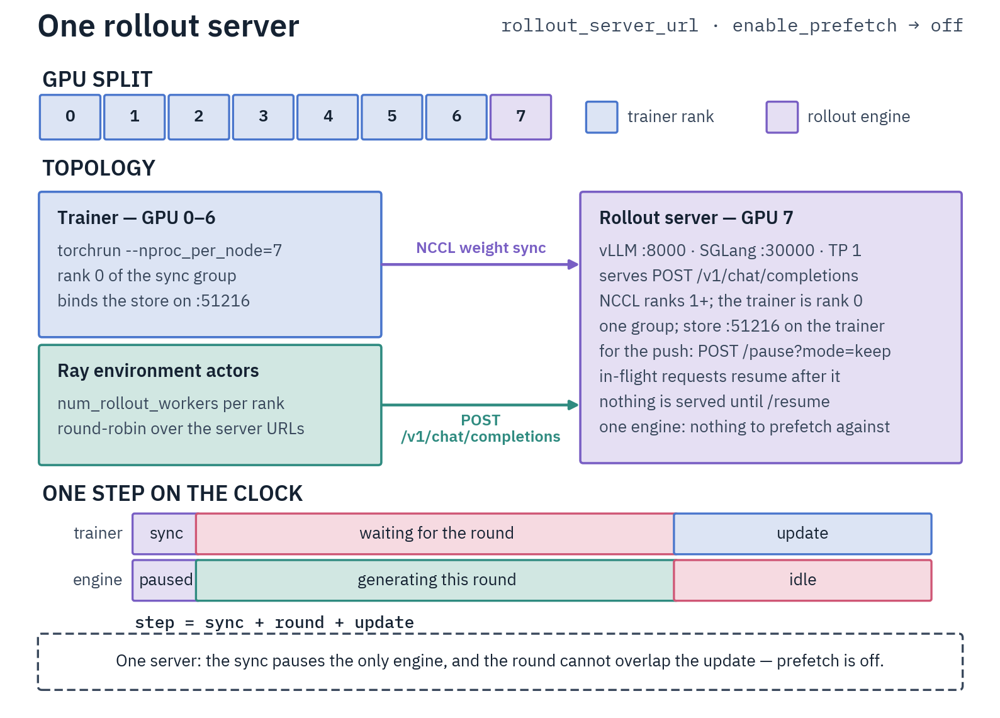
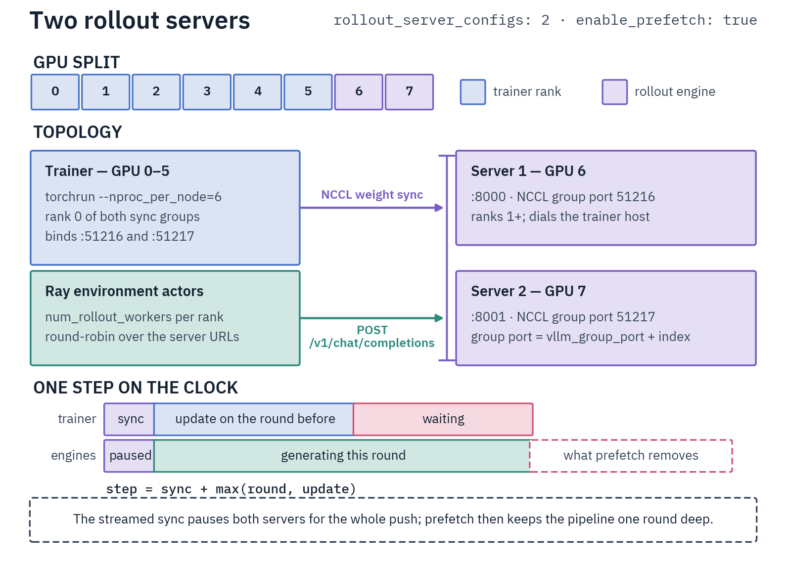

# Async GRPO with Environments

This is the multi-turn arm of GRPO: the model talks to an environment — calling tools, running code, searching,
editing a workspace — until the episode ends, the environment grades the whole trajectory, and GRPO trains on the
group of episodes that shared a prompt. Pick it when the reward comes from what the model *did*. Single-turn
verifiable rewards are cheaper on [Online GRPO (RLVR)](online-grpo.md), pre-scored data on
[Offline GRPO](offline-grpo.md).

Rollouts run on a **separate vLLM or SGLang container**, driven by **Ray actors** that hold the environments and
their tools. Ray configures itself on one node, so the only thing to start by hand is the server:
[Rollout Servers](../rollout-servers.md).


Each step pushes weights, collects a round of episodes, turns the sampled tokens into training rows and steps.

## The environments

`environment_type` picks one; the last column says whether it grades against your dataset's `answer` column.

| `environment_type` | The task | Needs `answer` |
| --- | --- | --- |
| `react_math`, `react_search` | ReAct: the model writes `Thought:` / `Action:` as plain text; calculator and Python, or web search | yes |
| `native_math`, `native_coding`, `native_combined` | the same tools as native function calls; grades the row's `answer` when there is one, otherwise finishing the episode | no |
| `qa_search` | factual question answering with a web-search tool | yes |
| `exam_qa` | multiple-choice and open exams, closed-book unless `open_book: true` | yes |
| `swe` | edit-run-test loop over a workspace that survives across turns | yes (unless judge-only) |
| `code_contests`, `codeforces` | write a program, try it in a scratchpad, submit it; scores 1 only when every hidden test passes | yes |
| `mcp` | whatever tools an MCP server advertises | no |

Where the answer is required, a dataset without that column is refused at startup. Actor hosts need what their
environment needs: a sandbox and a roomy `TMPDIR` for the code ones, outbound network and usually a search API key
for the search ones, the MCP server's launcher on `PATH`. Your own class registers alongside them
([Custom Environments](../../agent-docs/training-methods/grpo/environments/custom-environments.md) ↗).

> [!WARNING]
> The default `local` sandbox does not confine the program it runs: policy-written code can read the trainer's
> environment, `--env-file` secrets included. For RL on untrusted code, set `sandbox_backend: bubblewrap` (or
> `remote`) under `environment_kwargs`. `bubblewrap` needs the trainer to run as root, and its container needs `--init`,
> either `--privileged` or `--cap-add SYS_ADMIN --security-opt seccomp=unconfined --security-opt apparmor=unconfined`,
> and a clean `/proc` mounted before launch (`mkdir -p /run/fullproc && mount -t proc proc /run/fullproc`), which a GPU
> container needs whichever of the two options it uses. The training image already carries `bwrap` and `uidmap` with
> a subordinate id range
> ([Sandboxes](../../agent-docs/training-methods/grpo/environments/sandbox.md) ↗).

## Data

`prompt` is the task, `answer` the ground truth where the environment grades against it. Rename either with
`prompt_field` / `answer_field`, and pass extras an environment needs through `context_fields`.

```jsonl
{"prompt": "Solve: ...", "answer": "42"}
```

A `prompt` given as a message list is reduced to its **last user turn**: the environment owns the system prompt and
tool schema and builds the conversation itself, so this surface has no `system_prompt`.

## Rewards

The episode reward is the environment's grade priced by a term, plus its own shaping, plus any external term you add:

```yaml
rewards:
  - source: environment    # the env's grade in [0, 1]: a solved problem, an answer match, a passing test
```

The other two sources, `judge` and `reward_model`, take the same options as on the
[online arm](online-grpo.md#rewards). Only this arm accepts a **veto judge**: a `judge` that lists `checks` instead of
`requirements`. A fired `veto: true` check strips the episode of its credit, `reward/objective` included. A veto
judge's `weight` must be ≤ 0, and its `on_error` defaults to `neutral`, so a judge outage leaves the environment's
grade standing.

Every term logs under its own name (`reward/objective` for the environment term). The components sum exactly to the
reward the environment settled, so a rise in that reward always traces to the objective or to shaping. The
trainer's reasoning-length charges, when on, come on top of it
([Reward Terms](../../agent-docs/training-methods/grpo/rewards.md) ↗).

## Config

From `examples/grpo/environmental/qwen3_5/vllm/qwen3.6-35b-a3b-react-math-full-ep4.yaml` — four trainer GPUs, one
server on the other four. `examples/grpo/environmental/environmental-grpo-template.yaml` is the annotated starting
point; gpt-oss, Qwen3.5/3.6 and Gemma 4 ship recipes under
`examples/grpo/environmental/<family>/{vllm,sglang}/`, the SGLang ones in `ep1` form only.

```yaml
model_name_or_path: Qwen/Qwen3.6-35B-A3B
expert_parallel_size: 4
environment_type: react_math
max_turns: 10
num_rollout_workers: 16            # Ray environment actors per training rank
rollout_server_url: "http://localhost:8000"
vllm_group_port: 51216             # weight-sync port, bound on the trainer host
rollout_max_tokens: 8192           # budget for ONE turn, not the trajectory
enable_prefetch: false             # needs two or more servers
num_generations: 8                 # episodes per prompt
beta: 0.0                          # no KL anchor, so no second model in memory
scale_rewards: batch
per_device_train_batch_size: 1
gradient_accumulation_steps: 8
learning_rate: 1.0e-06
```

Sampling is `rollout_temperature` (`0.7`) and `rollout_top_p` (`0.95`); `rollout_top_k`, `rollout_min_p` and
`rollout_repetition_penalty` are off by default. Every rollout and eval request sends all five
([Rollout servers](../rollout-servers.md) explains why).

Three decisions matter more than the rest.

- **Turn budget.** `rollout_max_tokens` caps one turn and `max_turns` the turns. `rollout_max_episode_tokens` (off by
  default, `131072` in the code-contests recipes) caps what one episode samples across all its turns, reasoning
  included. The engine enforces it turn by turn and never tells the model, and an episode left without room for
  another turn ends truncated. The trajectory itself is never cut: a row longer than the context window fails the
  step. Watch `episode/turns`: pinned at the cap, raise it; far below, lower it, since turns are sequential and set
  step time. A turn cut at its cap, an empty turn, or one whose every call names a tool that does not exist or is
  refused unrun (code contests refuses a program whose comments carry its reasoning) is never rewarded: it trains
  only as a penalty, when its episode scored below the group's mean
  ([Objective](../../agent-docs/training-methods/grpo/async-grpo/objective.md#untrainable-turns) ↗).
- **Reasoning effort.** `environment_kwargs.reasoning_effort` (`low` / `medium` / `high` / `random`) sets how much the
  model should think, and `reasoning_effort_profiles` gives each level its own caps, as the code-contests recipes do
  (`{high: {thinking_tokens: 16384, max_submissions: 3, max_test_calls: 6}}`). A thinking budget applies per turn.
  `rollout_max_thinking_tokens`, `turn_overlong_penalty` and `carry_reasoning` are vLLM-only and refused under
  `rollout_backend: sglang`, where a level's `thinking_tokens` caps nothing. The model sees the level only through a
  chat template that renders it
  ([Reasoning budget](../../agent-docs/training-methods/grpo/async-grpo/rollouts.md#reasoning-budget) ↗). Pin such a
  template with `chat_template:` plus `force_chat_template: true` and serve the same file
  ([Chat template](../../agent-docs/training-methods/grpo/async-grpo/rollouts.md#chat-template) ↗). To price reasoning
  length, set any of `reasoning_price`, `reasoning_floor` and `turn_overlong_penalty`; the last two need a per-turn
  thinking cap, from a level's `thinking_tokens` or `rollout_max_thinking_tokens`
  ([Reasoning length reward](../../agent-docs/training-methods/grpo/async-grpo/rollouts.md#reasoning-length-reward) ↗).
- **Tool budgets.** An environment pays `tool_success_reward` per successful call, charges `tool_error_penalty` per
  failure, and caps what successful calls earn across the episode — not the episode reward — at `tool_reward_cap`
  (default `tool_success_reward × max_turns`). Keep them small beside the objective, or tool-calling beats finishing.

### One server or several



With one server the step is serial — sync, generate, train — the push pauses the only engine, so prefetch is off.



With two or more — `rollout_server_configs`, one entry per server, each with its own `group_port` —
`enable_prefetch: true` overlaps the next round's generation with the current update, which is the only way to stop
paying for generation and training one after the other.

## Run

```bash
VLLM_MODEL=Qwen/Qwen3.6-35B-A3B VLLM_CUDA_DEVICES=4,5,6,7 VLLM_TP=4 VLLM_REASONING_PARSER=qwen3 \
VLLM_TOOL_CALLING_FLAGS= \
    docker compose -f docker-compose.vllm.yml up -d vllm-server
CUDA_VISIBLE_DEVICES=0,1,2,3 DIST_NCCL_TIMEOUT_MINUTES=60 halo launch environmental-grpo \
    examples/grpo/environmental/qwen3_5/vllm/qwen3.6-35b-a3b-react-math-full-ep4.yaml -n 4
```

A native-tool environment needs the server started with the tool-call parser for the model family: without one vLLM
rejects every rollout, and with the wrong one the calls come back as text and every episode scores zero. ReAct
environments read their actions from the text and serve without one (`VLLM_TOOL_CALLING_FLAGS=`, as above). Before a
long run, put the config through a
few rows with `halo run run-env --training_config <config>.yaml --dataset <hub-id-or-path> --split train
--answer_field <column> --num_examples 20 --base_url http://localhost:8000/v1 --model <served-id>`: that exercises the
parser, the template and the sandbox or judge backend in a minute. `--training_config` carries the environment and
rollout settings, not the dataset fields, so `--split` (default `test`), `--answer_field` (default `answer`) and,
where needed, `--config` and `--prompt_field` must match the config's dataset.

Evaluation runs the same loop: set `eval_strategy`, plus `num_generations_eval: 1` for a fast pass@1 monitor.
`eval_rollout_batch_size` widens an eval round (rows per rank) so the servers do not idle — a multiple of
`num_generations_eval`, at most `max_concurrent_rollouts`, with `dataloader_drop_last: false`.

## What to watch

`reward/objective` says whether the task is being learned — a rising total reward with a flat objective is shaping,
not progress (code contests add `outcome/solve_rate` beside it). `episode/turns` and `episode/truncation_rate` say
whether episodes finish, and `sampling/logratio_mean` drifting steadily negative means the weight
sync is broken and the policy is training on stale rollouts, or, with `advantage/net_token_mass` staying negative and
`entropy` climbing after it, a KL-free run drifting, which `balance_token_mass` and the early stop address. With several servers, `async/prefetch_hit_rate` says which phase bounds the
step: it climbs toward 1 on a short single-turn environment (below ~0.8, add servers) and sits near 0 by construction
once a multi-turn round outlasts the update.

`reward/within_group_std` near zero is the quiet failure: every episode in a group scored the same, so that prompt
teaches nothing. Such groups are dropped from the loss by default (`drop_degenerate_groups`), and
`sampling/degenerate_group_frac` counts them. The tie is judged on the reward the environment settled (its grade, shaping and any judge or
reward-model score), without the trainer's reasoning-length terms (reasoning price, reasoning floor, overlong charge),
so a length price on top does not hide it. Rollouts land in `<output_dir>/completions/` as parquet.

Some signals appear only with their knob on. With the reasoning length reward on, `reward/reasoning_price`,
`reward/reasoning_floor` and `reward/turn_overlong` show what it charges. Under `rollout_max_episode_tokens`,
`episode/output_budget_exhausted` is the share of episodes the budget left without room for another turn. Each
`judge` or `reward_model` term logs `<source>/<name>/scored`, and `episode/reward_scored` is 1 only when every external
term reached a verdict: below 1, a scorer is failing. Under `on_error: invalid` (the default, except on a veto judge,
which defaults to `neutral`) such an episode leaves the group baseline; `neutral` prices the term at 0 and keeps it. A veto judge also logs `judge/<name>/veto`.

## Sizing a run

Rollouts in flight per server are at most `world_size × per_device_train_batch_size × steps_per_generation ÷
num_servers`, capped per rank by `max_concurrent_rollouts`. Under TP or ETP every rank rolls out and only each
group leader's rollouts are kept. Measure the engine's decode speed at about that
concurrency with the run's own prompts — nothing in the config predicts it — then set `request_timeout` to at least
twice one turn's budget at that speed, and `episode_timeout` to the time for the smaller of `max_turns` turns and
`rollout_max_episode_tokens` tokens at that speed, plus tool time. Keep `episode_timeout` below the NCCL watchdog
(`DIST_NCCL_TIMEOUT_MINUTES`), or startup raises. Start from one serving GPU per trainer GPU, one engine per serving
GPU while the model and its KV cache fit.

## Go deeper

- [Async GRPO with Environments](../../agent-docs/training-methods/grpo/async-grpo/README.md) ↗ ·
  [Environments](../../agent-docs/training-methods/grpo/environments/README.md) ↗ — servers, objective, metrics, knobs.
- [Code Contests](../../agent-docs/training-methods/grpo/environments/code-contests.md) ↗ · [SWE](../../agent-docs/training-methods/grpo/environments/swe-environment.md) ↗ — the two deepest environments.
- [Rollout Servers](../rollout-servers.md) · [Online GRPO (RLVR)](online-grpo.md) · [Training Methods](README.md)
