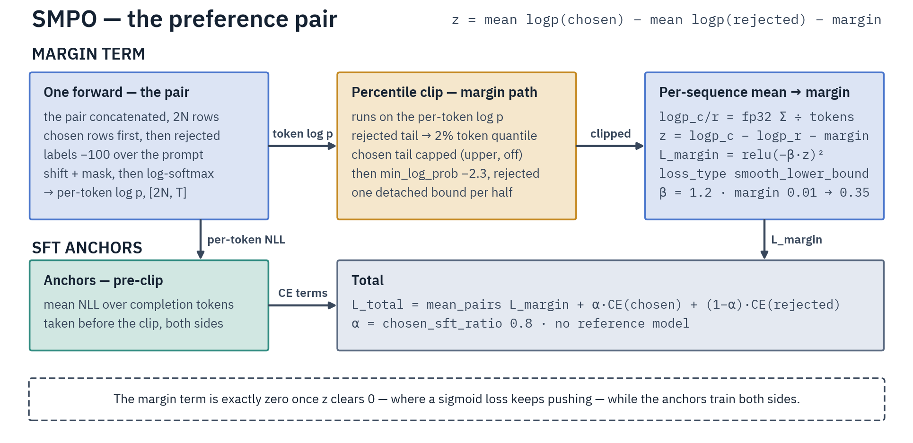

# Preference Tuning

Three methods learn from human or model judgments of which answer is better. SMPO and DPO read
`chosen`/`rejected` pairs; KTO reads unpaired thumbs-up/down labels. All three move the policy itself.
If you want a scorer to reuse later, train a [reward model](reward-and-classification.md) on the same
pairs instead.

## Which one

- **SMPO** holds no reference model, so one model sits in memory instead of two. Its margin loss reaches
  exactly zero once a pair is far enough apart, and a built-in SFT anchor keeps generation quality from
  drifting. Start here unless you have a reason not to.
- **DPO** keeps the policy close to a frozen reference through a KL term. Pick it when staying close to
  a specific checkpoint is the point, and budget for the second model.
- **KTO** takes one completion per row with a boolean label. Pick it when you never collected pairs.

## Data

SMPO and DPO read the same three columns, each a message list:

```jsonl
{"prompt": [{"role": "user", "content": "Capital of France?"}], "chosen": [{"role": "assistant", "content": "Paris."}], "rejected": [{"role": "assistant", "content": "It is in Europe."}]}
```

`prompt` is the conversation up to the point where the two answers diverge. KTO reads one completion and
a label:

```jsonl
{"prompt": [{"role": "user", "content": "What is 2+2?"}], "completion": [{"role": "assistant", "content": "4"}], "label": true}
```

Column names are fixed for SMPO and DPO. KTO renames its two with `completion_field` and `label_field`.

## SMPO



One forward covers both sides of the pair. The margin term compares the per-sequence mean log-probs
against a margin that ramps up over the run, and cross-entropy anchors keep training on the chosen and
rejected text directly.

From `examples/preference/qwen3_5/smpo-qwen3.5-9b-tulu3-prefmix.yaml`:

```yaml
model_name_or_path: Qwen/Qwen3.5-9B
dataset: allenai/llama-3.1-tulu-3-8b-preference-mixture
beta: 1.0
target_margin: 0.4
initial_margin: 0.2
chosen_sft_ratio: 0.75
loss_type: smooth_lower_bound
learning_rate: 5.0e-06
max_length: 4096
max_prompt_length: 2048
```

- `target_margin` is the log-probability gap a pair should reach, and `initial_margin` where the ramp
  starts.
- `chosen_sft_ratio` splits the anchor between the chosen and rejected sides. Raise it if outputs degrade
  while margins keep rising.
- `loss_type` sets the shape of the margin penalty: `smooth_lower_bound` (a squared hinge, the default),
  `hinge`, `sigmoid` (DPO-like, so it never reaches zero) or `ipo`.

## DPO

From `examples/preference/qwen3_5/dpo-qwen3.5-9b-tulu3-prefmix.yaml`:

```yaml
model_name_or_path: Qwen/Qwen3.5-9B
dataset: allenai/llama-3.1-tulu-3-8b-preference-mixture
beta: 0.1
loss_type: sigmoid
learning_rate: 5.0e-07
max_length: 4096
generation_max_prompt_length: 2048
```

`beta` scales the implicit-reward gap inside the loss. `loss_type` accepts fifteen TRL values, and a
list combines them: `[sigmoid, sft]` adds an SFT anchor to the preference term, which helps when
log-probs collapse.

**The reference model is where the memory goes.** DPO needs the frozen reference's log-probs:

- With `use_peft: true`, no second model loads. The reference is the base model with the adapter
  switched off. Expert-only EP LoRA has no adapter wrapper to switch off, so it needs
  `precompute_ref_log_probs: true`.
- Otherwise a second full model loads and stays resident for the whole run. Under expert or tensor
  parallelism that copy is not sharded: every rank holds a whole dense replica, experts included, and
  the run warns about its memory.
- Under expert or tensor parallelism, `precompute_ref_log_probs: true` avoids the copy. It takes the
  log-probs once from the untrained policy before step 1 and keeps them in the checkpoints for a resume.
  On plain data parallelism the copy stays resident even with precompute on.

SMPO never loads a reference. KTO follows DPO's rules.

## KTO

From `examples/preference/qwen3_5/kto-qwen3.5-9b-kto-mix-14k.yaml`:

```yaml
model_name_or_path: Qwen/Qwen3.5-9B
dataset: trl-lib/kto-mix-14k
beta: 0.1
desirable_weight: 1.0
undesirable_weight: 1.0
loss_type: kto
per_device_train_batch_size: 2    # the `kto` loss requires more than one row per device
max_length: 4096
```

The default `kto` loss builds each row's KL term from its neighbors in the batch, so batch size 1 raises
at construction. Only `apo_zero_unpaired`, which has no KL term, is exempt. When the two labels are
skewed, set `desirable_weight` and `undesirable_weight` to the inverse label ratio.

## Length budgets

SMPO splits `max_length` into a prompt share and a completion share. `max_prompt_length` defaults to
half of it and the completion takes the rest. Prompts are truncated from the start, keeping the end, and
shares that sum past `max_length` are rejected at construction.

DPO and KTO have no training-side prompt cap. They truncate prompt plus completion together from the
end, so an over-long prompt eats its own completion; filter those rows out of the dataset. DPO's
`generation_max_prompt_length` bounds eval-time generation only.

## Run

```bash
halo launch smpo examples/preference/qwen3_5/smpo-qwen3.5-9b-tulu3-prefmix.yaml -n 8
halo launch dpo  examples/preference/qwen3_5/dpo-qwen3.5-9b-tulu3-prefmix.yaml -n 8
halo launch kto  examples/preference/qwen3_5/kto-qwen3.5-9b-kto-mix-14k.yaml -n 8
```

These three recipes are dense, so they run FSDP2 data parallelism. The MoE recipes under
`examples/preference/gptoss/` and `examples/preference/gemma4/` pin `expert_parallel_size: 8`. SMPO is
the only one of the three that also takes context parallelism.

## What to watch

- `rewards/accuracies` (DPO and SMPO) is the share of pairs scored in the right order. 0.5 is chance,
  and it should climb early.
- `rewards/margins` is the separation being bought. KTO has no pairs, so it logs no accuracy, and logs
  `rewards/margins` only for a logging window that saw both labels.
- `logps/chosen` and `logps/rejected` falling together is the failure to watch for: the model makes both
  answers less likely, which degrades generation. Lower the learning rate or anchor harder. On SMPO,
  raise `chosen_sft_ratio` or lower `beta` (it scales the margin term). On DPO, add `[sigmoid, sft]` or
  raise `beta`.

On SMPO, a loss that goes NaN usually means the log-prob clips were turned off. Keep `min_log_prob` and
`lower_clip_percentile` at their defaults.

## Go deeper

- [Reward & classification](reward-and-classification.md) · [SFT](sft.md) · [Checkpoints & Export](../checkpoints.md)
- [SMPO](../../agent-docs/training-methods/preference/smpo.md) ↗ ·
  [DPO](../../agent-docs/training-methods/preference/dpo.md) ↗ ·
  [KTO](../../agent-docs/training-methods/preference/kto.md) ↗
